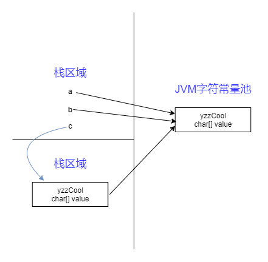

String的理解与应用
##前言
真的懂String么？真的懂String里面的==与equals的差别么？我想说原来可能我懂，但是后来就没有后来了。。。

想要了解一个类，最好的办法就是看这个类的实现源代码，自己去编译器里面去看吧。我就不粘贴代码了。
###一、String类
1）String类是final类，也即意味着String类不能被继承，并且它的成员方法都默认为final方法。在Java中，被final修饰的类是不允许被继承的，并且该类中的成员方法都默认为final方法。
2）String类其实是通过char数组来保存字符串的。
3）substring，concat，replace从源码中的这三个方法可以看出，无论是sub操、concat还是replace操作都不是在原有的字符串上进行的，而是重新生成了一个新的字符串对象。也就是说进行这些操作后，最原始的字符串并没有被改变。

在这里要永远记住一点：“String对象一旦被创建就是固定不变的了，对String对象的任何改变都不影响到原对象，相关的任何change操作都会生成新的对象”。
###二、字符串常量池

我们知道字符串的分配和其他对象分配一样，是需要消耗高昂的时间和空间的，而且字符串我们使用的非常多。JVM为了提高性能和减少内存的开销，在实例化字符串的时候进行了一些优化：使用字符串常量池。每当我们创建字符串常量时，JVM会首先检查字符串常量池，如果该字符串已经存在常量池中，那么就直接返回常量池中的实例引用。如果字符串不存在常量池中，就会实例化该字符串并且将其放到常量池中。由于String字符串的不可变性我们可以十分肯定常量池中一定不存在两个相同的字符串（这点对理解上面至关重要）。

Java中的常量池，实际上分为两种形态：<font color=#0099ff  face="黑体">静态常量池</font>和<font color=#0099ff  face="黑体">运行时常量池</font>。
所谓<font color=#0099ff  face="黑体">静态常量池</font>，即*.class文件中的常量池，class文件中的常量池不仅仅包含字符串(数字)字面量，还包含类、方法的信息，占用class文件绝大部分空间。
而<font color=#0099ff  face="黑体">运行时常量池</font>，则是jvm虚拟机在完成类装载操作后，将class文件中的常量池载入到内存中，并保存在方法区中，我们常说的常量池，就是指方法区中的运行时常量池。

来看下面的程序：
```groovy
String a = "abcdef";
String b = "abcdef";
```
a、b和字面上的abcdef都是指向JVM字符串常量池中的"abcdef"对象，他们指向同一个对象。
```groovy
String c = new String("abcdef");
```
new关键字一定会产生一个对象abcdef（注意这个abcdef和上面的abcdef不同），同时这个对象是存储在堆中。所以上面应该产生了两个对象：保存在栈中的c和保存堆中abcdef。但是在Java中根本就不存在两个完全一模一样的字符串对象。故堆中的abcdef应该是引用字符串常量池中abcdef。所以c、abcdef、池abcdef的关系应该是：c--->abcdef--->池abcdef。整个关系如下：

图确实是丑了点。努力看还是能看清楚的。
总结：虽然a、b、c、abcdef是不同的对象，但是从String的内部结构我们是可以理解上面的。String c = new String("abcdef");虽然c的内容是创建在堆中，但是他的内部value还是指向JVM常量池的abcdef的value，它构造abcdef时所用的参数依然是abcdef字符串常量。

###扩展1：String、StringBuffer、StringBuilder区别
StringBuffer、StringBuilder和String一样，也用来代表字符串。
- String类是不可变类，任何对String的改变都 会引发新的String对象的生成；
- StringBuffer则是可变类，任何对它所指代的字符串的改变都不会产生新的对象。既然可变和不可变都有了，为何还有一个StringBuilder呢？相信初期的你，在进行append时，一般都会选择StringBuffer吧！


先说一下集合的故事，**HashTable是线程安全的，很多方法都是synchronized方法，而HashMap不是线程安全的，但其在单线程程序中的性能比HashTable要高。**StringBuffer和StringBuilder类的区别也是如此，他们的原理和操作基本相同，区别在于StringBufferd支持并发操作，线性安全的，适 合多线程中使用。**StringBuilder不支持并发操作，线性不安全的，不适合多线程中使用。新引入的StringBuilder类不是线程安全的，但其在单线程中的性能比StringBuffer高。**
`适合多线程使用的是StringBuffer，性能就没有StringBuilder好，其他大致一样`。
####StringBuffer常用方法
`由于StringBuffer和StringBuilder在使用上几乎一样，所以只写一个，以下部分内容网络各处收集，不再标注出处`
1.初始化;

```groovy
StringBuffer s = new StringBuffer();
```
这样初始化出的StringBuffer对象是一个空的对象，
```groovy
 StringBuffer sb1=new StringBuffer(512);
 ```
分配了长度512字节的字符缓冲区。
```groovy
StringBuffer sb2=new StringBuffer(“how are you?”)
```
创建带有内容的StringBuffer对象，在字符缓冲区中存放字符串“how are you?”

2.append()追加
```groovy
public StringBuffer append(boolean b)
```
append里面的参数是多种多样啊！
该方法的作用是追加内容到当前StringBuffer对象的末尾，类似于字符串的连接，调用该方法以后，StringBuffer对象的内容也发生改 变，例如：
StringBuffer sb = new StringBuffer(“abc”);
sb.append(true);
则对象sb的值将变成”abctrue”
使用该方法进行字符串的连接，将比String更加节约内容，经常应用于数据库SQL语句的连接。
3.deleteCharAt(int index)删除
```groovy
public StringBuffer deleteCharAt(int index)
```
该方法的作用是删除指定位置的字符，然后将剩余的内容形成新的字符串。例如：
StringBuffer sb = new StringBuffer(“KMing”);
sb. deleteCharAt(1);
该代码的作用删除字符串对象sb中索引值为1的字符，也就是删除第二个字符，剩余的内容组成一个新的字符串。所以对象sb的值变 为”King”。
如果是这么写：
StringBuffer sb = new StringBuffer(“KMing”);
StringBuffer sb1 = sb. deleteCharAt(1);
你会发现sb和sb1的值是一样的。
还存在一个功能类似的delete方法：
```groovy
public StringBuffer delete(int start,int end)
```
该方法的作用是删除指定区间以内的所有字符，包含start，不包含end索引值的区间。例如：
StringBuffer sb = new StringBuffer(“TestString”);
sb. delete (1,4);
该代码的作用是删除索引值1(包括)到索引值4(不包括)之间的所有字符，剩余的字符形成新的字符串。则对象sb的值是”TString”。 
4.insert(int offset, Object obj)插入
```groovy
public StringBuffer insert(int offset, Object obj)
```
该方法的作用是在StringBuffer对象中插入内容，然后形成新的字符串。第二个参数可以是好多形式，下面以boolean为例子。
StringBuffer sb = new StringBuffer(“TestString”);
sb.insert(4,false);
该示例代码的作用是在对象sb的索引值4的位置插入false值，形成新的字符串，则执行以后对象sb的值是”TestfalseString”。
5.reverse()反转
```groovy
public StringBuffer reverse()
```
该方法的作用是将StringBuffer对象中的内容反转，然后形成新的字符串。例如：
StringBuffer sb = new StringBuffer(“abc”);
sb.reverse();
经过反转以后，对象sb中的内容将变为”cba”。 
6.setCharAt(int index, char ch)插入字符
```groovy
public void setCharAt(int index, char ch)
```
该方法的作用是修改对象中索引值为index位置的字符为新的字符ch。例如：
StringBuffer sb = new StringBuffer(“abc”);
sb.setCharAt(1,’D’);
则对象sb的值将变成”aDc”。
6.trimToSize()缩小存储空间
```groovy
public void trimToSize()
```
该方法的作用是将StringBuffer对象的中存储空间缩小到和字符串长度一样的长度，减少空间的浪费，和String的trim()是一样的作用，不在举例。
7.length()得到字符的长度
```groovy
 public  void setLength(int newLength)
```
该方法的作用是设置字符串缓冲区大小。
StringBuffer sb=new StringBuffer();
sb.setlength(100);
如果用小于当前字符串长度的值调用setlength()方法，则新长度后面的字符将丢失。
意思就是：我们现在的StringBuffer的长度是120，如果我们设置setLength(100),则我们的StringBuffer最终的长度是100，如果是提前运行setLength(100)，然后进行append()操作，则结果是是多少就是多少。
8.capacity()得到字符串容量的大小
```groovy
 public int capacity() 
```
该方法的作用是获取字符串的容量。
StringBuffer sb=new StringBuffer(“string”);
int i=sb.capacity(); 
9.ensureCapacity(int minimumCapacity)设置字符串的容量。
```groovy
 public void ensureCapacity(int minimumCapacity)
```
该方法的作用是重新设置字符串容量的大小。
StringBuffer sb=new StringBuffer();
sb.ensureCapacity(32); //预先设置sb的容量为32
注意：我们来分析一下capacity()和ensureCapacity(int minimumCapacity)，如果我们设置ensureCapacity(30)，但是我们得到的capacity()的值并不是30，这是什么玩意？？？下面自己的理解：这里设置容量就是提前告诉字符串，我会达到这个水平，有一个明显的现象就是字符串有一个默认的容量是16，当目前的容量小于16的时候，用capacity()得到的值都是16，当容量大于等于16时，要扩容了扩容的原则是“目前的容量+2”就是16+16+2=34，容量在16~34之间时，capacity()得到的值都是34..........以后根据这个原则扩容。
又有问题了，我的容量不是16,34,80.....这是什么情况？？嘿嘿，是这样的如果你在新建StringBuffer的时候是这样写的，如下：
```groovy
  StringBuffer buffer1 = new StringBuffer("1234567890");
```
那么他的初始容量不是16，是“16+字符串的长度”，也就是上面的容量是10+16=26；那么它的规则就是26,54,110.........
10.getChars(int srcBegin, int srcEnd, char[] dst, int dstBegin)处理字符串的子字符串复制给数组。
```groovy
 public  void getChars(int srcBegin, int srcEnd, char[] dst, int dstBegin)
```
该方法的作用是将字符串的子字符串复制给数组。
StringBuffer sb = new StringBuffer("I love You");
int begin = 0;
int end = 5;
//注意ch字符数组的长度一定要大于等于begin到end之间字符的长度
//小于的话会报ArrayIndexOutOfBoundsException
//如果大于的话，大于的字符会以空格补齐
char[] ch  = new char[end-begin];
sb.getChars(begin, end, ch, 0);
System.out.println(ch);
结果：I lov
参数的意义：srcBegin：从字符串的第几位开始，（包括这一位）；
srcEnd：从字符串的第几位开始，（不包括这一位）；
dst：要操作的字符串数组；
dstBegin：从数组的第几个下表开始处理。

####注意：
上面的解释如果感觉不是很详细可以看[Java中String的实现与应用](http://www.cnblogs.com/endlu/p/5159360.html)这篇博客。
本文大部分的内容是参考[深入理解Java中的String](http://www.cnblogs.com/xiaoxi/p/6036701.html)。


