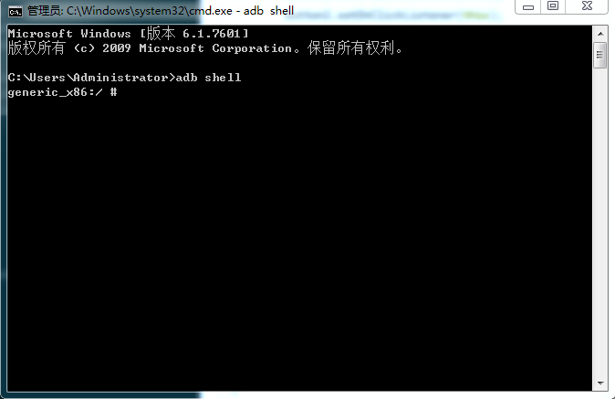
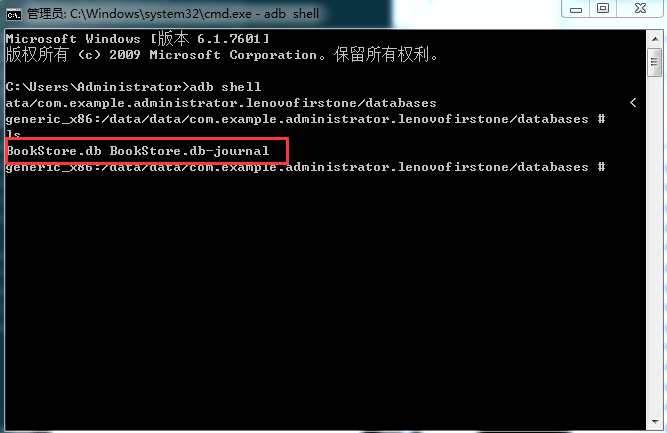
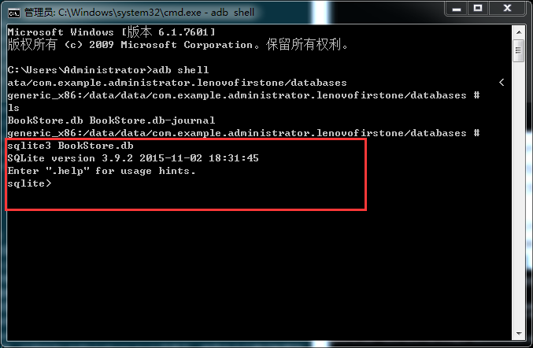
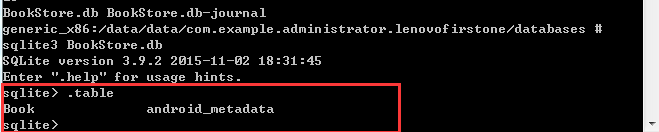
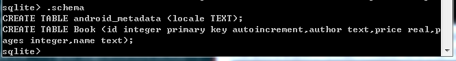
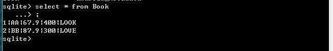
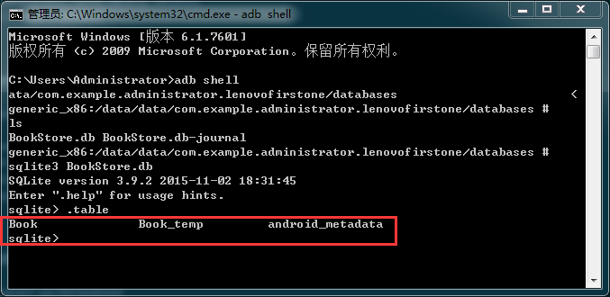
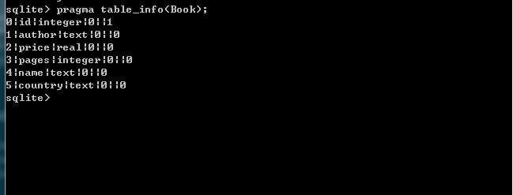
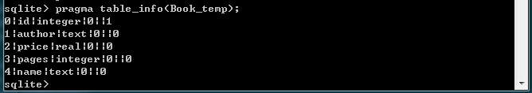
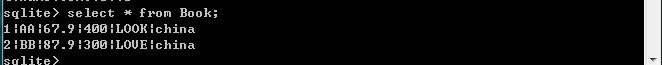

Android数据库，第一篇。
##前言
Android开发涉及到的数据库采用的是轻量级的SQLite3，但是里面的道道也是很深啊！今天主要就是处理一下数据库升级的思路
##任务
明白要怎样数据库升级，以及数据库升级的注意事项。还有就是手把手教学！！！嘿嘿。
##数据类型
SQLite的数据类型分为以下几种：
`null`: 表示该值为NULL值。
`integer`: 无符号整型值。
`real`:浮点值。
 `text`: 文本字符串，存储使用的编码方式为UTF-8、UTF-16BE、UTF-16LE。
 `blob`: 存储Blob数据，该类型数据和输入数据完全相同。
#####注意：
- 布尔数据类型：
    SQLite并没有提供专门的布尔存储类型，取而代之的是存储整型1表示true，0表示false
- 日期和时间数据类型：
    和布尔类型一样，SQLite也同样没有提供专门的日期时间存储类型，而是以TEXT、REAL和INTEGER类型分别不同的格式表示该类型，如：
    TEXT: "YYYY-MM-DD HH:MM:SS.SSS"
    REAL: 以Julian日期格式存储
    INTEGER: 以Unix时间形式保存数据值，即从1970-01-01 00:00:00到当前时间所流经的秒数。

##创建数据库
Android 不自动提供数据库。在 Android 应用程序中使用 SQLite，必须自己创建数据库，然后创建表、索引，填充数据。Android 提供了 SQLiteOpenHelper 帮助你创建一个数据库，你只要继承 SQLiteOpenHelper 类根据开发应用程序的需要，封装创建和更新数据库使用的逻辑就行了。
```java
public class DataBaseHelper extends SQLiteOpenHelper {

    public static final String CREATE_BOOK = "create table Book (" +
            "id integer primary key autoincrement," +
            "author text," +
            "price real," +
            "pages integer," +
            "name text)";
    private static final String TAG = "DataBaseHelper";
    private Context mContext;

    /**
     *
     * @param context 上下文环境
     * @param name    数据库的名称
     * @param factory   一个可选的游标工厂（通常是Null）
     * @param version   数据库的版本号
     */
    public DataBaseHelper(Context context, String name, SQLiteDatabase.CursorFactory factory, int version) {
        super(context, name, factory, version);
        mContext = context;
    }

    /**
     * 注意：在数据库第一次创建的时候会调用这个方法
     * @param sqLiteDatabase
     */
    @Override
    public void onCreate(SQLiteDatabase sqLiteDatabase) {
        sqLiteDatabase.execSQL(CREATE_BOOK);
        Log.e(TAG, "创建成功");
    }

    /**
     * 数据库升级的时候会调用这个方法。
     * @param sqLiteDatabase
     * @param oldVersion  旧的版本号
     * @param newVersion   新的版本号 
     */
    @Override
    public void onUpgrade(SQLiteDatabase sqLiteDatabase, int oldVersion, int newVersion) {

    }
}


```
可以看到我们把建表语句定义成了一个字符串常量，然后再onCreate()方法中又调用了SQLiteDatabase的execSQL()方法去执行这条建表语句，并且打印Log提示创建成功，这样就可以保证在数据库创建完成的同时还能成功创建Book表。
下面是创建的代码，布局的代码自己写一个就可以，就是放几个按钮就可以：
```groovy

public class SQLiteActivity extends AppCompatActivity implements View.OnClickListener {

    private static final String TAG = "SQLiteActivity";
    Button button1, button2, button3;


    private DataBaseHelper dataBaseHelper;
    private SQLiteDatabase db;

    @Override
    protected void onCreate(Bundle savedInstanceState) {
        super.onCreate(savedInstanceState);
        setContentView(R.layout.activity_sqlite);
        dataBaseHelper = new DataBaseHelper(this, "BookStore.db", null, 1);//建库的构造函数
        button1 = (Button) findViewById(R.id.button1);
        button2 = (Button) findViewById(R.id.button2);
        button3 = (Button) findViewById(R.id.button3);
        button1.setOnClickListener(this);
        button2.setOnClickListener(this);
        button3.setOnClickListener(this);
    }

    @Override
    public void onClick(View view) {
        switch (view.getId()) {
            case R.id.button1:
                db = dataBaseHelper.getWritableDatabase();//这才是真正的建数据库
                break;
            case R.id.button2:
                break;
            case R.id.button3:
                break;
        }
    }
}
```
######注意
运行上面的代码，但是不点击button1，会发现没有数据库。其实真正的建库是` dataBaseHelper.getWritableDatabase();`这行代码，当执行这行代码，才会建库，建库的时候发现这个库是没有的，是新的库才会调用onCreate()。就是建库的时候也会建表。
怎样查看建库是否成功呢？？？下面以studio自带模拟器处理的。
1.可以用DDMS查看里面的File Explorer-->data/data/包名/databases/里面是否有BookStore.db文件。
2.利用adb工具，它存放在sdk的platform-tools目录下，使用命令行最好配置到环境变量中，也可以到他所在的目录去开启它。
打开命令行，输入adb shell，就会进入到设备的控制台，如下图所示

注意#符号表示我们当前已经是超级用户了，如果显示的是$符号，表示当前只是普通用户而已，这时还需要输入su命令切换一下用户身份才行。有了超级用户权限之后，我们能做的事情就很多了。
然后使用 cd命令进行到/data/data/包名/databases/目录下，并使用ls命令查看该目录里的文件，如下图所示：

这个目录下出现了两个数据库文件，一个是我们创建的BookStore.db,而另一个BookStore.db-journal则是为了让数据库支持事务而产生的临时日志文件，通常情况下这个文件的大小是0字节。
下面我们需要借助sqlite命令来打开数据库了，只需要输入 `sqlite3 BookStore.db`就可以打开数据库了。我天。。好神奇！！！如下图所示：

这样数据库就打开了，现在就可以对这个数据库进行管理了，我们要是到有哪些表，可以输入`.table`命令，如下图所示：

可以看到我们有两张表，android_metadata表是每个数据库都会自动生成的，不用管理它，而另一张表就是我们自己建的表。我们还可以使用`.schema`命令来查看他们的建表语句，如下图所示:

##添加数据
我们有了数据库，所以开始向里面放入数据吧。下面就是插入数据，代码如下：我们用第二个按钮进行插入操作；
```groovy
public class SQLiteActivity extends AppCompatActivity implements View.OnClickListener {

    private static final String TAG = "SQLiteActivity";
    Button button1, button2, button3;
    private DataBaseHelper dataBaseHelper;
    private SQLiteDatabase db;

    @Override
    protected void onCreate(Bundle savedInstanceState) {
        super.onCreate(savedInstanceState);
        setContentView(R.layout.activity_sqlite);
        dataBaseHelper = new DataBaseHelper(this, "BookStore.db", null, 1);//建库的构造函数
        db = dataBaseHelper.getWritableDatabase();
        button1 = (Button) findViewById(R.id.button1);
        button2 = (Button) findViewById(R.id.button2);
        button3 = (Button) findViewById(R.id.button3);
        button1.setOnClickListener(this);
        button2.setOnClickListener(this);
        button3.setOnClickListener(this);
    }

    @Override
    public void onClick(View view) {
        switch (view.getId()) {
            case R.id.button1:
                break;
            case R.id.button2:
                //插入数据
                ContentValues values = new ContentValues();
                values.put("author", "AA");
                values.put("price", 67.9);
                values.put("pages", 400);
                values.put("name", "LOOK");
                long long1 = db.insert("book", null, values);
                Log.e(TAG, "第一次的长度" + long1);
                values.clear();
                values.put("author", "BB");
                values.put("price", 87.9);
                values.put("pages", 300);
                values.put("name", "LOVE");
                long long2 = db.insert("book", null, values);
                Log.e(TAG, "第二次的长度" + long2);
                break;
            case R.id.button3:
                break;
        }
    }
}
```
我们把SQLiteDatabase的初始化放在了onCreate()方法里面，避免button2点击的时候出现，db忘记生成的问题。
点击按钮会发现Log的打印。插入数据的时候不用汉语原因是查看数据库的时候会出现乱码。
查询表的指令是`select * from  表名`，查询出的内容如下图所示：

显示的是刚刚我们插入的两条数据。
上面数据库有了，数据也有了但是我们发现有却少一个列表，比如缺少出版时间time。我们要通过数据库的升级处理这个问题，并且原来的数据要保留。
##数据库升级
修改表定义
SQLite数库对ALTER TABLE命令支持非常有限，只能在表末尾添加列，不能修改列定义，不能删除已有的列。那么如果要修改表呢？我们可以采用临时表的办法。具体来说有四步：
1.将现有表重命名为临时表；
2.创建新表；
3.将临时表的数据导入新表（注意处理修改的列）；
4.删除临时表。
既然有了这个思路我们上代码：
```groovy

public class DataBaseHelper extends SQLiteOpenHelper {

    public static final String CREATE_BOOK = "create table Book (" +
            "id integer primary key autoincrement," +
            "author text," +
            "price real," +
            "pages integer," +
            "name text)";
    //添加字段的新表
    public static final String CREATE_BOOK_NEW = "create table Book (" +
            "id integer primary key autoincrement," +
            "author text," +
            "price real," +
            "pages integer," +
            "name text," +
            "country text)";


    private static final String TAG = "DataBaseHelper";
    private Context mContext;

    /**
     * @param context 上下文环境
     * @param name    数据库的名称
     * @param factory 一个可选的游标工厂（通常是Null）
     * @param version 数据库的版本号
     */
    public DataBaseHelper(Context context, String name, SQLiteDatabase.CursorFactory factory, int version) {
        super(context, name, factory, version);
        mContext = context;
    }

    /**
     * 注意：在数据库第一次创建的时候会调用这个方法
     *
     * @param sqLiteDatabase
     */
    @Override
    public void onCreate(SQLiteDatabase sqLiteDatabase) {
        sqLiteDatabase.execSQL(CREATE_BOOK);
        Log.e(TAG, "创建成功");
    }

    /**
     * 数据库升级的时候会调用这个方法。
     *
     * @param sqLiteDatabase
     * @param oldVersion     旧的版本号
     * @param newVersion     新的版本号
     */
    @Override
    public void onUpgrade(SQLiteDatabase sqLiteDatabase, int oldVersion, int newVersion) {
        switch (oldVersion) {
            case 1:
                sqLiteDatabase.execSQL("ALTER TABLE Book RENAME TO Book_temp");
                sqLiteDatabase.execSQL(CREATE_BOOK_NEW);
                sqLiteDatabase.execSQL("insert into Book(author, price, pages,name,country) "
                        + "select author, price,pages ,name, \"china\" from Book_temp");
//                sqLiteDatabase.execSQL("DROP TABLE Book_temp");

        }
    }
}

```
不要忘记在我们的Activity中的onCreate()方法中改为下面代码：最主要的是版本号是2。。
```groovy
  dataBaseHelper = new DataBaseHelper(this, "BookStore.db", null, 2);//建库的构造函数
```
注意：上面我们没有删除Book_temp表，如需要删除直接删除就可以了。
运行程序重新打开cmd.exe,查看我们有多少表，如下图所示：

出现了Book_temp表，这就是我们重命名的表。
怎样查看表的数据结构呢？？有下面的指令
`pragma table_info(表名)`
我们来看看Book的数据结构：

我们来看看Book_temp的数据结构：

还需要看看是否成功的到了过去：如下图所示
;
嗯，处理完成。可以成功的完成数据库的升级了。
