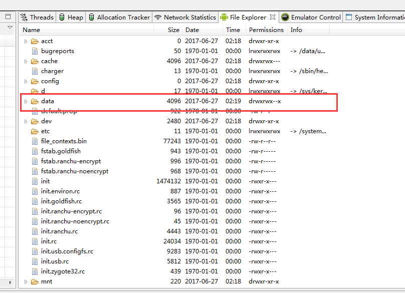

在查看数据库是否创建成功时，发现竟然打不开data目录:


为了查看安卓设备上某个应用的SQLite数据库内容，打开了DDMS，能看到data文件夹，但是打不开。
可是mnt文件夹却是可以打开的，然后仔细查看两个文件夹的不同：
**data   drwxrsw–x
mnt    drwxrwxr-x
mnt    drwxr-xr-x**
好像少了read权限。
权限，data的other user权限里没有r，不可读。

解决方法：
进入sdk platform-tool
```
adb shell
$ su
# chmod 755 /data
```
补充一点，怎样进入adb工具，adb.exe在你配置的sdk目录下，找到自己的sdk\platform-tools文件夹，直接双击是不行的。或者已经配置了adb的环境变量，直接在命令提示符里面进行adb的相应的操作就可以了。

运行完上面的指令就发现DDMS中data文件夹可以打开了，data里面还有个data，数据库文件就在里面这个data中，可是里面这个data仍然打不开，怎么办？答案是继续用“chmod 755 ”
输入：chmod 755 /data/data， 字面上就能看出来，就是对下一层目录继续修改权限,这下里面的data文件夹也能打开了,要继续看里面的文件，照着上面的步骤进行即可。
###注意
上面是保守的方法，在我做测试的时候是可以的，但是，是不是太慢，如果多做几个demo还不得疯了。
快捷方式：
```
adb root
```
用模拟器做测试的时候，我发现这一行代码就可以了。。