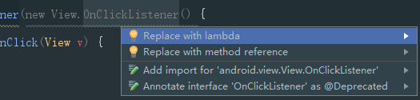

Android 中lambda的小使用
##前言
　Lambda表达式是在JDK 8中开始支持的一种函数式推导语言，能够大量减少匿名内部类那种冗余的代码。
##任务
明白怎样简单的使用和看懂lambda。
##AS配置使用环境
要想使用lambda最起码需要Studio支持吧，我使用的是**Studio 2.3.3 **，因为在2.1.1之后支持lambda插件，所以我的操作如下：
```groovy
 android {
      defaultConfig {
          jackOptions {
              // 打开jack编译器
              enabled true
          }
      }

      // 编译支持Java8
      compileOptions {
          sourceCompatibility JavaVersion.VERSION_1_8
          targetCompatibility JavaVersion.VERSION_1_8
      }
  }

```
最开始没有添加下列代码：
```groovy
          jackOptions {
              // 打开jack编译器
              enabled true
          }

```
报错：`Error:Jack is required to support java 8 language features. Either enable Jack or remove sourceCompatibility JavaVersion.VERSION_1_8.`
当时一脸懵逼的样子；
#####扩展:
- 2016 年 3 月 10 日， Google 向外界发布了 Android N 的预览版，并宣布了 Android N 的 Roadmap ，Android N 的最终版源代码将于今年 8 或 9 月份释出到 AOSP 项目。
- 在众多的 Android N 新特性中，有一项新工具链的出现与 Android 生态圈的所有开发者息息相关，即 Jack & Jill 编译器的引入。在依赖了 Sun/Oracle 的 Java 编译器十年之后，Jack 是 Java Android Compiler Kit 的缩写，它可以将 Java 代码直接编译为 Dalvik 字节码，并负责 Minification, Obfuscation, Repackaging, Multidexing, Incremental compilation。它试图取代 javac/dx/proguard/jarjar/multidex 库等工具。
- Android 终于有了自己的 Java 编译器。Android7.0（API24）在对JAVA8 语言功能的支持上，需要一个名为 Jack 的新编译。Jack 仅在 Android Studio 2.1 和更高版本上才受支持。因此，如果要使用 Java 8 语言功能，则需使用 Android Studio 2.1 开发应用。
- 支持 Java 8 语言功能需要一个名为 Jack 的新编译。Jack 仅在 Android Studio 2.1 和更高版本上才受支持。因此，如果要使用 Java 8 语言功能，则需使用 Android Studio 2.1 开发应用,还需使用新的 Jack 工具链。新的 Android 工具链将 Java 源语言编译成 Android 可读取的 Dalvik 可执行文件字节码，且有其自己的 .jack库格式，在一个工具中提供了大多数工具链功能：重新打包、压缩、模糊化以及 Dalvik 可执行文件分包。

以下是构建 Android Dalvik 可执行文件可用的两种工具链的对比：

- 旧版 javac 工具链：
javac (.java –> .class) –> dx (.class –> .dex)
- 新版 Jack 工具链：
Jack (.java –> .jack –> .dex)


 有小伙伴说了：我的不是2.1.1之前的怎么办？？？不要急，代码如下
 1. 在 Project 的 build.gradle 中添加如下代码
```groovy
  dependencies {
        classpath 'me.tatarka:gradle-retrolambda:3.2.0'
  }
```
 2. 在 Module 的 build.gradle 中添加如下代码
 ```groovy
  // 应用插件
  apply plugin: 'me.tatarka.retrolambda'
  // 支持Java8
  android {
      compileOptions {
          sourceCompatibility JavaVersion.VERSION_1_8
          targetCompatibility JavaVersion.VERSION_1_8
      }
  }
 ```
 配置完，编译一下就大功告成
 只可惜没有测试，有心的小伙伴可以测试一下。
 
 
 ##使用Lambda
lambda 表达式共有三种形式：函数式接口、方法引用和构造器引用。
**函数式接口**：是指有且只有一个抽象方法的接口，比如各种Listener接口和Runnable接口。lambda表达式就是对这类接口的匿名类进行简化。基本形式如下：
(参数列表...) ->{语句块...}
具体语法：
>语法一：()->{}
其中()和{}可以看情况去掉，()只有一个参数可去掉，{}里逻辑只有一行可去掉

- 无参数时，直接这么写
```groovy
    // 创建Runnable对象
    Runnable runnable = () -> {

     };
```
- 有一个参数，直接参数名 ->{}
```groovy
  View.OnClickListener listener = view -> {

  };
```
- 有多个参数，只需要在()里写上参数名字就可以
```groovy
View.OnFocusChangeListener listener = (view, b) -> {

  };
```
举例子：上一个简单的代码：
```groovy
     //定义一个接口
    interface Comparator<T> {
        int compare(T var1, T var2);
    }
    
    //老的实现方法
    Comparator comparator = new Comparator<String>() {
        @Override
        public int compare(String var1, String var2) {
            return 0;
        }
    };
    
    //lambda优化一下
    Comparator<String> comparator1 = (String s1, String s2) -> {
        return 0;
    };
    
    //lambda最后的优化，当编译器可以推导出具体的参数类型时
    Comparator<String> comparator2 = (s1, s2) -> {
        return 0;
    };
```
- 当语句块内的处理逻辑只有一句表达式时，其两侧的花括号也可省略，特别注意这句处理逻辑表达式后面也不带分号。
```groovy
button.setOnClickListener(view1 -> activity.finish());
```
同时，当只有一句去除花括号的表达式且接口方法需要返回值时，这个表达式不用（也不能）在表达式前加 return ，就可以当作返回语句。下面用 Java 的 Function 接口作为示例，这是一个用于转换类型的接口，在这里我们自己造一个使用：
```groovy
    interface Function<T, R> {
        R applay(T t);
    }
	//原来的写法
    Function<Integer, String> function = new Function<Integer, String>() {
        @Override
        public String applay(Integer integer) {
            return String.valueOf(integer);
        }
    };
    //lambda的写法
    Function<Integer, String> function1 = integer -> String.valueOf(integer);
```

**方法引用**：就是当逻辑实现只有一句且调用了已存在的方法进行处理( this 和 super 的方法也可包括在内)时，对函数式接口形式的 lambda 表达式进行进一步的简化。传入引用方法的参数就是原接口方法的参数。
接下来总结一下方法引用形式的三种格式：
- object :: instanceMethod

直接调用任意对象的实例方法，如 obj::equals 代表调用 obj 的 equals 方法与接口方法参数比较是否相等，效果等同 obj.equals(t);。

当前类的方法可用this::method进行调用，父类方法同理。

- ClassName :: staticMethod

直接调用某类的静态方法，并将接口方法参数传入，如上述 TextUtils::isEmpty，效果等同 TextUtils.isEmpty(s);
例子如下：
```groovy
  Predicate<String> predicate = new Predicate<String>() {
        @Override
        public boolean test(String s) {
            // 下面的代码和TextUtils.isEmpty(s)等价。
            return s == null || s.length() == 0;
        }
    };
    //进一步用lambda简化得到
    Predicate<String> predicate1 = s -> TextUtils.isEmpty(s);
    //但是还是可以继续简化的，我的天啊！！！
    Predicate<String> predicate2 = String::isEmpty;
```

- ClassName :: instanceMethod

较为特殊,将接口方法参数列表的第一个参数作为方法调用者，其余参数作为方法参数。由于此类接口较少，故选择 Java 提供的 BiFunction 接口作为示例，该接口方法接收一个 T1 类对象和一个 T2 类对象，通过处理后返回 R 类对象：
```groovy
    interface BitFunction<T1, T2, R> {
        R applay(T1 t1, T2 t2);
    }
    BitFunction<String, String, Boolean> bitFunction = new BitFunction<String, String, Boolean>() {
        @Override
        public Boolean applay(String s, String s2) {
            return s.endsWith(s2);
        }
    };
    //使用lambda得到下面的结果
    BitFunction<String, String, Boolean> bitFunction1 = String::endsWith;
    //ClassName 为接口方法的第一个参数的类名，同时利用接口方法的第一个参数作为方法调用者，其余参数作为方法参数，实现s1.endsWith(s2);
    //补充一个例子，
    BitFunction<List<String>,List<String>,Boolean> bitFunction3=List ::contains;
```
**构造器引用**
Lambda 表达式的第三种形式，其实和方法引用十分相似，只不过方法名替换为 new 。其格式为 ClassName :: new。这时编译器会通过上下文判断传入的参数的类型、顺序、数量等，来调用适合的构造器，返回对象。


##使用技巧
Android Studio 会在可以转化为 lambda 表达式的代码上进行如图的灰色标识，这时将光标移至灰色区域，按下 Alt + Enter ，选择第一项（方法引用和构造器引用在第二项），IDE 就会自动进行转换。如下图所示：


##特别注意
***this 关键字***
在匿名内部类中，this 关键字指向的是匿名类本身的对象，而在 lambda 中，this 指向的是 lambda 表达式的外部类。

***方法数量差异***
当前 Android Studio 对 Java 8 新特性编译时采用脱糖（desugar）处理，lambda 表达式经过编译器编译后，每一个 lambda 表达式都会增加 1~2 个方法数。而 Android 应用的方法数不能超过 65536 个。虽然一般应用较难触发，但仍需注意。

######我会不定时的对文章进行补充的哦！！！加油吧骚年。。。