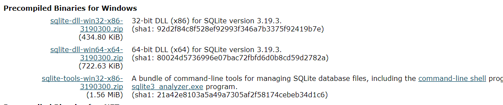
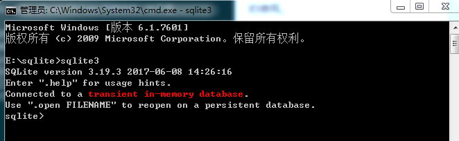

Android数据库，第二篇。（主要就是研究Sqlite数据库）
##前言
上一篇我们研究了，sqlite数据库在安卓中的使用，今天我们研究在window客户端的使用。
这篇文章是参考了[SQLite 教程](http://www.runoob.com/sqlite/sqlite-tutorial.html),读者小伙伴可以去这里看。
##任务
明白SQLite的一些具体操作，达到会用的目的。
##安装SQLite
在 Windows 上安装 SQLite
- 请访问 [SQLite 下载页面](http://www.sqlite.org/download.html)，从 Windows 区下载预编译的二进制文件。
- 您需要下载 sqlite-tools-win32-*.zip 和 sqlite-dll-win32-*.zip 压缩文件。如下图：

有点疑问怎么是两个x86，一个x64呢，保险起见，使用x86的。

- 创建文件夹E:\sqlite，并在此文件夹下解压上面两个压缩文件，将得到 sqlite3.def、sqlite3.dll、sqlite3.exe、sqldiff.exe、sqlite3_analyzer.exe文件。
- 添加 E:\sqlite 到 PATH 环境变量，最后在命令提示符下，使用 sqlite3 命令，将显示如下结果：


注意：环境变量可以不配值，直接到你放置的文件夹中运行命令提示符，也是可以的。

##SQLite的基本操作（就是上面网页的随笔和一些想法）

####SQlite的随笔的问题：

1).创建库：不打开SQlite ,直接在控制台输入
```groovy
SQLite3  test.db
```
就新建了一个test.db数据库并且打开了它，如果数据库存在就是打开数据库

2).附加数据库：当在同一时间有多个数据库可用，您想使用其中的任何一个。，已经运行sqlite   进行下列语法

		sqlite> ATTACH DATABASE 'testDB.db' as 'TEST';
数据库名称 main 和 temp 被保留用于主数据库和存储临时表及其他临时数据对象的数据库。这两个数据库名称可用于每个数据库连接，且不应该被用于附加，否则将得到一个警告消息

3).分离数据库：把命名数据库从一个数据库连接分离和游离出来，连接是之前使用 ATTACH 语句附加的。
如果同一个数据库文件已经被附加上多个别名，DETACH 命令将只断开给定名称的连接，而其余的仍然有效。您无法分离 main 或 temp 数据库。
如果数据库是在内存中或者是临时数据库，则该数据库将被摧毁，且内容将会丢失。
	
    DETACH DATABASE 'TEST';

4).格式化输出:
您可以使用下列的点命令来格式化输出(就是输出具有格式化)：

	sqlite>.header on
	sqlite>.mode column
	sqlite>.timer on

5).SQLite运算符：

	1.算术运算符
	假设变量 a=10，变量 b=20，
	+	加法 - 把运算符两边的值相加	a + b 将得到 30
	-	减法 - 左操作数减去右操作数	a - b 将得到 -10
	*	乘法 - 把运算符两边的值相乘	a * b 将得到 200
	/	除法 - 左操作数除以右操作数	b / a 将得到 2
	%	取模 - 左操作数除以右操作数后得到的余数	b % a will give 0

	2. 比较运算符
	假设变量 a=10，变量 b=20，则：
	运算符	·	描述	实例
	==	 	检查两个操作数的值是否相等，如果相等则条件为真。	        (a == b) 不为真。
	=	 	检查两个操作数的值是否相等，如果相等则条件为真。	        (a = b) 不为真。
	!=	 	检查两个操作数的值是否相等，如果不相等则条件为真。     		(a != b) 为真。
	<>	 	检查两个操作数的值是否相等，如果不相等则条件为真。      	(a <> b) 为真。
	>	 	检查左操作数的值是否大于右操作数的值，如果是则条件为真。	(a > b) 不为真。
	<	 	检查左操作数的值是否小于右操作数的值，如果是则条件为真。	(a < b) 为真。
	>=	 	检查左操作数的值是否大于等于右操作数的值，如果是则条件为真。(a >= b) 不为真。
	<=	 	检查左操作数的值是否小于等于右操作数的值，如果是则条件为真。(a <= b) 为真。
	!<	 	检查左操作数的值是否不小于右操作数的值，如果是则条件为真。	(a !< b) 为假。
	!>	 	检查左操作数的值是否不大于右操作数的值，如果是则条件为真。	(a !> b) 为真。

	3.逻辑运算符
	AND			AND 运算符允许在一个 SQL 语句的 WHERE 子句中的多个条件的存在。
	BETWEEN		BETWEEN 运算符用于在给定最小值和最大值范围内的一系列值中搜索值。
	EXISTS		EXISTS 运算符用于在满足一定条件的指定表中搜索行的存在。
	IN			IN 运算符用于把某个值与一系列指定列表的值进行比较。
	NOT IN		IN 运算符的对立面，用于把某个值与不在一系列指定列表的值进行比较。
	LIKE		LIKE 运算符用于把某个值与使用通配符运算符的相似值进行比较。
	GLOB		GLOB 运算符用于把某个值与使用通配符运算符的相似值进行比较。GLOB 与 LIKE 不同之处在于，它是大小写敏感的。
	NOT			NOT 运算符是所用的逻辑运算符的对立面。比如 NOT EXISTS、NOT BETWEEN、NOT IN，等等。它是否定运算符。
	OR			OR 运算符用于结合一个 SQL 语句的 WHERE 子句中的多个条件。
	IS NULL		NULL 运算符用于把某个值与 NULL 值进行比较。
	IS			IS 运算符与 = 相似。
	IS NOT		IS NOT 运算符与 != 相似。
	||			连接两个不同的字符串，得到一个新的字符串。
	UNIQUE		UNIQUE 运算符搜索指定表中的每一行，确保唯一性（无重复）。

	4.位运算符
	假设如果 A = 60，且 B = 13，现在以二进制格式，它们如下所示：
	A = 0011 1100
	B = 0000 1101
	-----------------
	A&B = 0000 1100
	A|B = 0011 1101
	~A  = 1100 0011
	A<<2 = 1111 0000
	A>>2 = 0000 1111
	运算符	描述	实例
	&		如果同时存在于两个操作数中，二进制 AND 运算符复制一位到结果中。		(A & B) 将得到 12，即为 0000 1100
	|		如果存在于任一操作数中，二进制 OR 运算符复制一位到结果中。			(A | B) 将得到 61，即为 0011 1101
	~		二进制补码运算符是一元运算符，具有"翻转"位效应，即0变成1，1变成0。	(~A ) 将得到 -61，即为 1100 0011，一个有符号二进制数的补码形式。
	<<		二进制左移运算符。左操作数的值向左移动右操作数指定的位数。			A << 2 将得到 240，即为 1111 0000
	>>		二进制右移运算符。左操作数的值向右移动右操作数指定的位数。			A >> 2 将得到 15，即为 0000 1111
6).update语句；修改
	修改的基本语法如下：
    
	UPDATE table_name
	SET column1 = value1, column2 = value2...., columnN = valueN
	WHERE [condition];
    
set 后面就是需要修改的值，where就是修改哪里的值。
	也可以不要Where，也就是全部修改
7).delete语句：删除
	用于删除表中已经存在的记录。基本语法如下：
    
	DELETE FROM table_name
	WHERE [condition];
   
从哪个表删除对应条件的条目。不需要where就是删除所有记录。
8).Like 子句,就是模糊匹配使用的。
	百分号 （%）
	下划线 （_）
	百分号（%）代表零个、一个或多个数字或字符。下划线（_）代表一个单一的数字或字符。这些符号可以被组合使用。

	下面一些实例演示了 带有 '%' 和 '_' 运算符的 LIKE 子句不同的地方：
	语句						描述
	WHERE SALARY LIKE '200%'	查找以 200 开头的任意值
	WHERE SALARY LIKE '%200%'	查找任意位置包含 200 的任意值
	WHERE SALARY LIKE '_00%'	查找第二位和第三位为 00 的任意值
	WHERE SALARY LIKE '2_%_%'	查找以 2 开头，且长度至少为 3 个字符的任意值
	WHERE SALARY LIKE '%2'		查找以 2 结尾的任意值
	WHERE SALARY LIKE '_2%3'	查找第二位为 2，且以 3 结尾的任意值
	WHERE SALARY LIKE '2___3'	查找长度为 5 位数，且以 2 开头以 3 结尾的任意值
9).Glob子句：用来匹配通配符指定模式的文本值（这个子句和上面的立刻子句有好多想象的地方）
	如果搜索表达式与模式表达式匹配，GLOB 运算符将返回真（true），也就是 1。与 LIKE 运算符不同的是，GLOB 是大小写敏感的，对于下面的通配符，它遵循 UNIX 的语法。

	星号 （*）
	问号 （?）
	星号（*）代表零个、一个或多个数字或字符。问号（?）代表一个单一的数字或字符。这些符号可以被组合使用。

	下面一些实例演示了 带有 '*' 和 '?' 运算符的 GLOB 子句不同的地方：
	语句						描述
	WHERE SALARY GLOB '200*'	查找以 200 开头的任意值
	WHERE SALARY GLOB '*200*'	查找任意位置包含 200 的任意值
	WHERE SALARY GLOB '?00*'	查找第二位和第三位为 00 的任意值
	WHERE SALARY GLOB '2??'		查找以 2 开头，且长度至少为 3 个字符的任意值
	WHERE SALARY GLOB '*2'		查找以 2 结尾的任意值
	WHERE SALARY GLOB '?2*3'	查找第二位为 2，且以 3 结尾的任意值
	WHERE SALARY GLOB '2???3'	查找长度为 5 位数，且以 2 开头以 3 结尾的任意值
10).Limit子句： LIMIT 子句用于限制由 SELECT 语句返回的数据数量。
	带有 LIMIT 子句的 SELECT 语句的基本语法如下：
	
    SELECT column1, column2, columnN 
	FROM table_name
	LIMIT [no of rows]

	下面是 LIMIT 子句与 OFFSET 子句一起使用时的语法：
	SELECT column1, column2, columnN 
	FROM table_name
	LIMIT [no of rows] OFFSET [row num]


	下面是具体的使用：
	下面是一个实例，它限制了您想要从表中提取的行数：（下面就是限制6行）
	sqlite> SELECT * FROM COMPANY LIMIT 6;
	但是，在某些情况下，可能需要从一个特定的偏移开始提取记录。下面是一个实例，从第三位开始提取 3 个记录：（Limite后面是限制几行，offset后面是从第几行后开始：下面的意思是从第二个的后面开始就是第三个开始，取3个值）
	sqlite> SELECT * FROM COMPANY LIMIT 3 OFFSET 2;
11).Order By:用来基于一个或多个列按升序或降序顺序排列数据。
	ORDER BY 子句的基本语法如下：
	
    SELECT column-list 
	FROM table_name 
	[WHERE condition] 
	[ORDER BY column1, column2, .. columnN] [ASC | DESC];

	ASC升序，DESC降序。可以有多个条件，那么实现就是先按照前面的排序，然后按照后面的排序。只是在上一次的结果上处理。
12).Group By子句：来对相同的数据进行分组。
	在 SELECT 语句中，GROUP BY 子句放在 WHERE 子句之后，放在 ORDER BY 子句之前。
	下面给出了 GROUP BY 子句的基本语法。GROUP BY 子句必须放在 WHERE 子句中的条件之后，必须放在 ORDER BY 子句之前。
	
    SELECT column-list
	FROM table_name
	WHERE [ conditions ]
	GROUP BY column1, column2....columnN
	ORDER BY column1, column2....columnN

	如果您想了解每个客户的工资总额，则可使用 GROUP BY 查询，如下所示：
	sqlite> SELECT NAME, SUM(SALARY) FROM COMPANY GROUP BY NAME;
	结果分析：
	group by是以名字为条件来处理问题。有可能是这些数据里面有相同名字的数据，但是只会选择第一个的数据显示。如果使用sum就是所有的数据相加就会出现数据相加的一条。
13).Having子句：允许指定条件来过滤将出现在最终结果中的分组结果。
	where子句在所选列上设置条件，而having子句则在由 GROUP BY 子句创建的分组上设置条件。
	在一个查询中，HAVING 子句必须放在 GROUP BY 子句之后，必须放在 ORDER BY 子句之前。下面是包含 HAVING 子句的 SELECT 语句的语法：
    
	SELECT column1, column2
	FROM table1, table2
	WHERE [ conditions ]
	GROUP BY column1, column2
	HAVING [ conditions ]
	ORDER BY column1, column2
    
	实际的例子:
	下面是一个实例，它将显示名称计数小于 2 的所有记录：
	sqlite > SELECT * FROM COMPANY GROUP BY name HAVING count(name) < 2;
	下面是一个实例，它将显示名称计数大于 2 的所有记录：
	sqlite > SELECT * FROM COMPANY GROUP BY name HAVING count(name) > 2;
	注意：输出条目是第一条大于2的条目。
	如果是下面的代码：
	sqlite > SELECT SUM(SALARY) FROM COMPANY GROUP BY name HAVING count(name) > 2;
	得到的结果是所有的数据的总和，而不会死打印出一个条目。
14).Distinct 关键字:SQLite 的 DISTINCT 关键字与 SELECT  语句一起使用，来消除所有重复的记录，并只获取唯一一次记录。
	有可能出现一种情况，在一个表中有多个重复的记录。当提取这样的记录时，DISTINCT 关键字就显得特别有意义，它只获取唯一一次记录，而不是获取重复记录。
	首先，让我们来看看下面的 SELECT 查询，它将返回重复的工资记录：
    
	sqlite> SELECT name FROM COMPANY;
    
这条指令会返回所有的数据。(就是名字会重复)
	首先，让我们来看看下面的 SELECT 查询，它将返回重复的工资记录：
	现在，让我们在上述的 SELECT 查询中使用 DISTINCT 关键字：
    
	sqlite> SELECT DISTINCT name FROM COMPANY;
	这条指令会把重复的数据滤掉，（就是名字不会重复）

####高级教程：
1).PRAGMA命令：（编译）一个好特殊的东西。
	SQLite 的 PRAGMA 命令是一个特殊的命令，可以用在 SQLite 环境内控制各种环境变量和状态标志。一个 PRAGMA 值可以被读取，也可以根据需求进行设置。
    
	没有看懂这是什么玩意？？？？？
	？？？？？？？？？？？
2).SQLite 约束
	约束是在表的数据列上强制执行的规则。这些是用来限制可以插入到表中的数据类型。这确保了数据库中数据的准确性和可靠性。
	约束可以是列级也可以是表级，列级约束仅适用于列，表约束被应用到整个表。
	以下是在SQlite中常用的约束。
    
	NOT NULL 约束：确保某列不能有 NULL 值。
	DEFAULT 约束： 当某列没有指定值时，为该列提供默认值。
	UNIQUE 约束：  确保某列中的所有值是不同的。
	PRIMARY Key 约束：唯一标识数据库表中的各行/记录。
	CHECK 约束：   CHECK 约束确保某列中的所有值满足一定条件。

	1.NOT NULL约束：（不能为null的约束。）
		默认情况下，列可以保存 NULL 值。如果您不想某列有 NULL 值，那么需要在该列上定义此约束，指定在该列上不允许 NULL 值。
		NULL与没有数据是不一样的，它代表未知的数据。
	实战：
	例如，下面的 SQLite 语句创建一个新的表 COMPANY，并增加了五列，其中 ID、NAME 和 AGE 三列指定不接受 NULL 值：
	CREATE TABLE COMPANY(
	   ID INT PRIMARY KEY     NOT NULL,
	   NAME           TEXT    NOT NULL,
	   AGE            INT     NOT NULL,
	   ADDRESS        CHAR(50),
	   SALARY         REAL
	);
	就是说在创建的时候已经做出了规定。
	2.DEFAULT 约束：（设置默认值的约束）
		DEFAULT 约束在 INSERT INTO 语句没有提供一个特定的值时，为列提供一个默认值。
	实战：
	例如，下面的 SQLite 语句创建一个新的表 COMPANY，并增加了五列。在这里，SALARY 列默认设置为 5000.00。所以当 INSERT INTO 语句没有为该列提供值时，该列将被设置为 5000.00。
	CREATE TABLE COMPANY(
	   ID INT PRIMARY KEY     NOT NULL,
	   NAME           TEXT    NOT NULL,
		   AGE            INT     NOT NULL,
	   ADDRESS        CHAR(50),
	   SALARY         REAL    DEFAULT 50000.00
	);
	3.UNIQUE 约束：（不可以有相同的值，独特的，独一无二的）
		UNIQUE约束防止在一个特定的列存在两个记录具有相同的值。在COMPANY表中，例如，您可能要防止两个或两个以上的人具有相同的年龄。
	实例
	例如，下面的 SQLite 语句创建一个新的表 COMPANY，并增加了五列。在这里，AGE 列设置为 UNIQUE，所以不能有两个相同年龄的记录：
	CREATE TABLE COMPANY(
	   ID INT PRIMARY KEY     NOT NULL,
	   NAME           TEXT    NOT NULL,
	   AGE            INT     NOT NULL UNIQUE,
	   ADDRESS        CHAR(50),
	   SALARY         REAL    DEFAULT 50000.00
	);
	4.PRIMARY KEY 约束：(主键是唯一的 ID)
		PRIMARY KEY 约束唯一标识数据库表中的每个记录。在一个表中可以有多个 UNIQUE 列，但只能有一个主键。在设计数据库表时，主键是很重要的。主键是唯一的 ID。
	我们使用主键来引用表中的行。可通过把主键设置为其他表的外键，来创建表之间的关系。由于"长期存在编码监督"，在 SQLite 中，主键可以是 NULL，这是与其他数据库不同的地方。
	主键是表中的一个字段，唯一标识数据库表中的各行/记录。主键必须包含唯一值。主键列不能有 NULL 值。
	一个表只能有一个主键，它可以由一个或多个字段组成。当多个字段作为主键，它们被称为复合键。
	如果一个表在任何字段上定义了一个主键，那么在这些字段上不能有两个记录具有相同的值。
	5.CHECK 约束:(创建表的时候，设置一个条件，如果满足这个条件，才能加入表中)
	启用输入一条记录要检查值的条件。如果条件值为 false，则记录违反了约束，且不能输入到表。
	实例
	例如，下面的 SQLite 创建一个新的表 COMPANY，并增加了五列。在这里，我们为 SALARY 列添加 CHECK，所以工资不能为零：
	CREATE TABLE COMPANY3(
	   ID INT PRIMARY KEY     NOT NULL,
	   NAME           TEXT    NOT NULL,
	   AGE            INT     NOT NULL,
	   ADDRESS        CHAR(50),
	   SALARY         REAL    CHECK(SALARY > 0)
	);

	注意：：：（可以重命名表，添加一个列，但是不能重命名和删除，也不能添加和删除约束）
	删除约束
	SQLite 支持 ALTER TABLE 的有限子集。在 SQLite 中，ALTER TABLE 命令允许用户重命名表，或向现有表添加一个新的列。
	重命名列，删除一列，或从一个表中添加或删除约束都是不可能的。
3).SQLite Joins:(多个表结合的问题)
	SQLite 的 Joins 子句用于结合两个或多个数据库中表的记录。JOIN 是一种通过共同值来结合两个表中字段的手段。
	SQL 定义了三种主要类型的连接：
	交叉连接 - CROSS JOIN
	内连接   - INNER JOIN
	外连接	 - OUTER JOIN

	？？？？？？？？？？？？？？？？？？？？？？？？
	问题：ON,USING,NATURAL是什么意思？
	可以使用 USING 表达式，是怎样的使用？？
	？？？？？？？？？？？？？？？？？？？？？？？？
    
先得到两个表：
COMPANY的表如下：
ID         | NAME        |AGE        | ADDRESS     |SALARY
-------- |  ----------| ---------- | ----------|  ----------
1          |    Paul    |    32    |      California | 20000.0
2     	  |    Allen    |   25   |      Texas       |15000.0
3   	   |     Teddy |      23|         Norway   |   20000.0
4  	     |    Mark    |    25|         Rich-Mond|   65000.0
5        |   David    |   27  |        Texas       |85000.0
6        |  Kim         |22     |     South-Hall  |45000.0
7        |  James      | 24    |      Houston    | 10000.0

DEPARTMENT的表如下：
ID        |  DEPT      |    EMP_ID
--------|      -------|---  ----------
1         |  IT Billing |  1
2        |   Engineerin | 2
3         |  Finance    | 7

	1.交叉连接 - CROSS JOIN：（两个表，每个结果跑一边）
	交叉连接（CROSS JOIN）把第一个表的每一行与第二个表的每一行进行匹配。如果两个输入表分别有 x 和 y 列，则结果表有 x+y 列。由于交叉连接（CROSS JOIN）有可能产生非常大的表，使用时必须谨慎，只在适当的时候使用它们。
	实战：
	基于上面的表，我们可以写一个交叉连接（CROSS JOIN），如下所示：
	sqlite> SELECT EMP_ID, NAME, DEPT FROM COMPANY CROSS JOIN DEPARTMENT;
上面的查询会产生以下结果：
EMP_ID    |  NAME     |   DEPT
---------- | ----------  |----------
1    |       Paul    |    IT Billing
2    |       Paul    |    Engineerin
7    |       Paul     |   Finance
1    |       Allen     |  IT Billing
2    |       Allen      | Engineerin
7    |       Allen    |   Finance
1    |       Teddy   |    IT Billing
2    |       Teddy    |   Engineerin
7    |       Teddy     |  Finance
1    |       Mark      |  IT Billing
2    |       Mark  |      Engineerin
7    |       Mark   |     Finance
1    |       David   |    IT Billing
2    |      David     |  Engineerin
7    |       David     |  Finance
1    |       Kim   |      IT Billing
2    |       Kim    |     Engineerin
7    |       Kim     |    Finance
1    |       James  |     IT Billing
2    |       James   |    Engineerin
7    |       James    |   Finance
可以看出值还是挺多的，两个好像都走了一边，有一种7x3=21的感觉。
	2.内连接 - INNER JOIN
	内连接（INNER JOIN）根据连接谓词结合两个表（table1 和 table2）的列值来创建一个新的结果表。查询会把 table1 中的每一行与 table2 中的每一行进行比较，找到所有满足连接谓词的行的匹配对。当满足连接谓词时，A 和 B 行的每个匹配对的列值会合并成一个结果行。
	内连接（INNER JOIN）是最常见的连接类型，是默认的连接类型。INNER 关键字是可选的。
	下面是语法：
    
	SELECT ... FROM table1 [INNER] JOIN table2 ON conditional_expression ...

	为了避免冗余，并保持较短的措辞，可以使用 USING 表达式声明内连接（INNER JOIN）条件。这个表达式指定一个或多个列的列表：
	SELECT ... FROM table1 JOIN table2 USING ( column1 ,... ) ...

	自然连接（NATURAL JOIN）类似于 JOIN...USING，只是它会自动测试存在两个表中的每一列的值之间相等值：
	SELECT ... FROM table1 NATURAL JOIN table2...
	实战：
	基于上面的表，我们可以写一个内连接（INNER JOIN），如下所示：
	sqlite> SELECT EMP_ID, NAME, DEPT FROM COMPANY INNER JOIN DEPARTMENT ON COMPANY.ID = DEPARTMENT.EMP_ID;
得到下面的结果：
EMP_ID  |    NAME   |     DEPT
---------- | ----------|  ----------
1  |         Paul      |  IT Billing
2   |        Allen    |   Engineerin
7    |       James  |     Finance
分许：上面的查询语句的主要意思就是从INNER JOIN DEPARTMENT ON COMPANY.ID = DEPARTMENT.EMP_ID这里分析，内连接表格DEPARTMENT，ON 后面是条件，条件就是COMPANY表格的ID和DEPARTMENT表格的EMP_ID相等。
	3.外连接 - OUTER JOIN（注意：只是支持左外链接）
	外连接（OUTER JOIN）是内连接（INNER JOIN）的扩展。虽然 SQL 标准定义了三种类型的外连接：LEFT、RIGHT、FULL，但 SQLite 只支持 左外连接（LEFT OUTER JOIN）。
	外连接（OUTER JOIN）声明条件的方法与内连接（INNER JOIN）是相同的，使用 ON、USING 或 NATURAL 关键字来表达。最初的结果表以相同的方式进行计算。一旦主连接计算完成，外连接（OUTER JOIN）将从一个或两个表中任何未连接的行合并进来，外连接的列使用 NULL 值，将它们附加到结果表中。
	
	基本语法：
	SELECT ... FROM table1 LEFT OUTER JOIN table2 ON conditional_expression ...
	为了避免冗余，并保持较短的措辞，可以使用 USING 表达式声明外连接（OUTER JOIN）条件。这个表达式指定一个或多个列的列表：
	SELECT ... FROM table1 LEFT OUTER JOIN table2 USING ( column1 ,... ) ...
	实战：
	sqlite> SELECT EMP_ID, NAME, DEPT FROM COMPANY LEFT OUTER JOIN DEPARTMENT ON COMPANY.ID = DEPARTMENT.EMP_ID;
查询结果如下：
EMP_ID |     NAME    |    DEPT
----------|  ----------|  ----------
1     |      Paul   |     IT Billing
2    |       Allen <br>Teddy <br>Mark<br> David <br>Kim|  Engineerin
7  |         James   |    Finance

4).SQLite Unions 子句（UNION ：联盟）
	SQLite的 UNION 子句/运算符用于合并两个或多个 SELECT 语句的结果，不返回任何重复的行。
	为了使用 UNION，每个 SELECT 被选择的列数必须是相同的，相同数目的列表达式，相同的数据类型，并确保它们有相同的顺序，但它们不必具有相同的长度。
	基本语法如下：
    
	SELECT column1 [, column2 ]
	FROM table1 [, table2 ]
	[WHERE condition]

	UNION

	SELECT column1 [, column2 ]
	FROM table1 [, table2 ]
	[WHERE condition] 
	这里给定的条件根据需要可以是任何表达式。
实战：
假设有下面两个表，（1）COMPANY 表如下所示：
sqlite> select * from COMPANY;
ID       |   NAME             |     AGE   |      ADDRESS   |  SALARY
--------|--  --------------------  ----------  ----------|  ----------
1       |    Paul           |       32    |      California | 20000.0
2     |      Allen          |       25       |   Texas   |    15000.0
3       |    Teddy        |         23   |       Norway    |  20000.0
4      |     Mark          |        25     |     Rich-Mond  | 65000.0
5    |       David          |       27     |     Texas   |    85000.0
6       |    Kim             |      22       |   South-Hall | 45000.0
7      |     James        |         24     |     Houston  |   10000.0
（2）另一个表是 DEPARTMENT，如下所示：
ID      |    DEPT   |               EMP_ID
-----|-----  --------------------  ----------
1     |      IT Billing    |        1
2     |      Engineering   |        2
3    |       Finance        |       7
4    |       Engineering |          3
5      |     Finance         |      4
6     |      Engineering   |        5
7   |        Finance          |     6
现在，让我们使用 SELECT 语句及 UNION 子句来连接两个表，如下所示：

	sqlite> SELECT EMP_ID, NAME, DEPT FROM COMPANY INNER JOIN DEPARTMENT
        ON COMPANY.ID = DEPARTMENT.EMP_ID
	    UNION
	    SELECT EMP_ID, NAME, DEPT FROM COMPANY LEFT OUTER JOIN DEPARTMENT
        ON COMPANY.ID = DEPARTMENT.EMP_ID;
这将产生以下结果：
EMP_ID  |    NAME           |       DEPT
---------|-  --------------------  ----------
1     |      Paul           |       IT Billing
2      |     Allen         |        Engineerin
3      |     Teddy       |          Engineerin
4    |       Mark         |         Finance
5   |        David        |         Engineerin
6      |     Kim           |        Finance
7   |        James       |          Finance

**UNION ALL 子句**
	UNION ALL 运算符用于结合两个 SELECT 语句的结果，包括重复行。
	适用于 UNION 的规则同样适用于 UNION ALL 运算符。
    
	基本语法：
	UNION ALL 的基本语法如下：
	SELECT column1 [, column2 ]
	FROM table1 [, table2 ]
	[WHERE condition]

	UNION ALL

	SELECT column1 [, column2 ]
	FROM table1 [, table2 ]
	[WHERE condition]
	这里给定的条件根据需要可以是任何表达式。
    
实战：
现在，让我们使用 SELECT 语句及 UNION ALL 子句来连接两个表，如下所示：

	sqlite> SELECT EMP_ID, NAME, DEPT FROM COMPANY INNER JOIN DEPARTMENT
        ON COMPANY.ID = DEPARTMENT.EMP_ID
	    UNION ALL
	    SELECT EMP_ID, NAME, DEPT FROM COMPANY LEFT OUTER JOIN DEPARTMENT
        ON COMPANY.ID = DEPARTMENT.EMP_ID;
这将产生以下结果：
EMP_ID |     NAME     |             DEPT
---------|-  --------------------  ----------
1       |    Paul            |      IT Billing
2        |   Allen          |       Engineerin
3       |    Teddy        |         Engineerin
4       |    Mark         |         Finance
5       |    David       |          Engineerin
6        |   Kim          |         Finance
7       |    James        |         Finance
1        |   Paul            |      IT Billing
2   |        Allen        |         Engineerin
3       |    Teddy       |          Engineerin
4        |   Mark       |           Finance
5    |       David           |      Engineerin
6     |      Kim            |       Finance
7       |    James         |        Finance	
分析：给人的感觉就是前面的表来一遍，后面的表来一遍，然后就是两遍。

5).NULL 值
	SQLite 的 NULL 是用来表示一个缺失值的项。表中的一个 NULL 值是在字段中显示为空白的一个值。
	带有 NULL 值的字段是一个不带有值的字段。NULL 值与零值或包含空格的字段是不同的，理解这点是非常重要的。
	基本语法：
	创建表时使用 NULL 的基本语法如下：
    
	SQLite> CREATE TABLE COMPANY(
	   ID INT PRIMARY KEY     NOT NULL,
	   NAME           TEXT    NOT NULL,
	   AGE            INT     NOT NULL,
	   ADDRESS        CHAR(50),
	   SALARY         REAL
	);
	在这里，NOT NULL 表示列总是接受给定数据类型的显式值。这里有两个列我们没有使用 NOT NULL，这意味着这两个列不能为 NULL。
	带有 NULL 值的字段在记录创建的时候可以保留为空。

实战：
	让我们使用 UPDATE 语句来设置一些允许空值的值为 NULL，如下所示：
	sqlite> UPDATE COMPANY SET ADDRESS = NULL, SALARY = NULL where ID IN(6,7);
现在，COMPANY 表的记录如下所示：
ID      |    NAME |       AGE   |      ADDRESS  |   SALARY
-------|---  ----------  ----------  -------|---  |----------
1       |    Paul      |  32     |     California  |20000.0
2      |     Allen  |     25    |      Texas   |    15000.0
3      |     Teddy  |     23   |       Norway     | 20000.0
4      |     Mark  |      25    |      Rich-Mond |  65000.0
5      |     David |      27     |     Texas   |    85000.0
6      |     Kim    |     22
7      |     James   |    24
	接下来，让我们看看 IS NOT NULL 运算符的用法，它用来列出所有 SALARY 不为 NULL 的记录：
	sqlite> SELECT  ID, NAME, AGE, ADDRESS, SALARY
	        FROM COMPANY
	        WHERE SALARY IS NOT NULL;
上面的 SQLite 语句将产生下面的结果：
ID      |    NAME    |    AGE   |      ADDRESS   |  SALARY
------|----  ----------  ----------  ----------  ----------
1      |     Paul     |   32       |   California | 20000.0
2      |     Allen    |   25     |     Texas    |   15000.0
3      |     Teddy    |   23    |      Norway    |  20000.0
4      |     Mark      |  25      |    Rich-Mond |  65000.0
5      |     David     |  27      |    Texas   |   85000.0
	下面是 IS NULL 运算符的用法，将列出所有 SALARY 为 NULL 的记录：
	sqlite> SELECT  ID, NAME, AGE, ADDRESS, SALARY
	        FROM COMPANY
	        WHERE SALARY IS NULL;
上面的 SQLite 语句将产生下面的结果：
ID      |    NAME      |  AGE  |       ADDRESS   |  SALARY
-------|---  ----------  ----------  ----------  ----------
6       |    Kim    |     22
7       |    James   |    24
	分析：就是可以填充的填充NULL，查询的时候可以查询是IS NULL和NOT NUll的条目。
6).SQLite 别名：（重命名,只是查询的时候名称被替换)
	您可以暂时把表或列重命名为另一个名字，这被称为别名。
	表别名是指在一个特定的 SQLite 语句中重命名表。重命名是临时的改变，在数据库中实际的表的名称不会改变。
	列别名用来为某个特定的 SQLite 语句重命名表中的列。
	基本语法：
	表 	别名的基本语法如下：
    
	SELECT column1, column2....
	FROM table_name AS alias_name
	WHERE [condition];
	列 	别名的基本语法如下：
	SELECT column_name AS alias_name
	FROM table_name
	WHERE [condition];
实战：
下面两个表：
（1）COMPANY 表如下所示：
sqlite> select * from COMPANY;
ID      |    NAME  |                AGE   |      ADDRESS |    SALARY
------|----  --------------------  ----------  ----------  ----------
1     |      Paul        |          32      |    California | 20000.0
2     |      Allen      |           25     |     Texas     |  15000.0
3     |      Teddy    |             23   |       Norway |     20000.0
4     |      Mark     |             25    |      Rich-Mond|   65000.0
5     |      David       |          27    |      Texas  |     85000.0
6      |     Kim       |            22   |       South-Hall|  45000.0
7     |      James   |              24  |        Houston   |  10000.0
（2）另一个表是 DEPARTMENT，如下所示：
ID|DEPT             |     EMP_ID
----|------  --------------------  ----------
1    |       IT Billing     |       1
2      |     Engineering      |     2
3     |      Finance           |    7
4     |      Engineering    |       3
5     |      Finance          |     4
6     |      Engineering   |        5
7    |       Finance        |       6
	现在，下面是
	(表别名) 的用法，在这里我们使用 C 和 D 分别作为 COMPANY 和 DEPARTMENT 表的别名：
	sqlite> SELECT C.ID, C.NAME, C.AGE, D.DEPT
	        FROM COMPANY AS C, DEPARTMENT AS D
	        WHERE  C.ID = D.EMP_ID;
上面的 SQLite 语句将产生下面的结果：
ID      |    NAME |       AGE     |    DEPT
-----|-----  ----------  ----------  ----------
1      |     Paul     |   32     |     IT Billing
2     |      Allen     |  25     |     Engineerin
3      |     Teddy   |    23    |      Engineerin
4      |     Mark    |    25     |     Finance
5     |      David   |    27     |     Engineerin
6     |      Kim       |  22     |     Finance
7     |      James   |    24    |      Finance
	
	(列别名) 的实例，在这里 COMPANY_ID 是 ID 列的别名，COMPANY_NAME 是 name 列的别名：
	sqlite> SELECT C.ID AS COMPANY_ID, C.NAME AS COMPANY_NAME, C.AGE, D.DEPT
        	FROM COMPANY AS C, DEPARTMENT AS D
        	WHERE  C.ID = D.EMP_ID;
上面的 SQLite 语句将产生下面的结果：
COMPANY_ID|  COMPANY_NAME | AGE    |     DEPT
----------|  ------------  ----------  ----------
1         |  Paul   |       32      |    IT Billing
2      |     Allen    |     25     |     Engineerin
3      |     Teddy  |       23|Engineerin
4     |      Mark    |      25    |      Finance
5     |      David   |      27   |       Engineerin
6      |     Kim      |     22    |      Finance
7     |      James|24     |     Finance
分析：表别名是表的名称被替换，表内的列名称还是和原来的保持一致。
		  列别名是列的名称被替换，就是被后面的名称替换，但是值还是原来的值。

7).SQLite 触发器（Trigger）
	SQLite 的触发器是数据库的回调函数，它会自动执行/指定的数据库事件发生时调用。
	以下是关于SQLite的触发器的要点： SQLite 触发器（Trigger）是数据库的回调函数，它会在指定的数据库事件发生时自动执行/调用。
	以下是关于 SQLite 的触发器（Trigger）的要点：
	1.SQLite 的触发器（Trigger）可以指定在特定的数据库表发生 DELETE、INSERT 或 UPDATE 时触发，或在一个或多个指定表的列发生更新时触发。
	2.SQLite 只支持 FOR EACH ROW 触发器（Trigger），没有 FOR EACH STATEMENT 触发器（Trigger）。因此，明确指定 FOR EACH ROW 是可选的。
	3.WHEN 子句和触发器（Trigger）动作可能访问使用表单 NEW.column-name 和 OLD.column-name 的引用插入、删除或更新的行元素，其中 column-name 是从与触发器关联的表的列的名称。
	4.如果提供 WHEN 子句，则只针对 WHEN 子句为真的指定行执行 SQL 语句。如果没有提供 WHEN 子句，则针对所有行执行 SQL 语句。
	5.BEFORE 或 AFTER 关键字决定何时执行触发器动作，决定是在关联行的插入、修改或删除之前或者之后执行触发器动作。
	6.当触发器相关联的表删除时，自动删除触发器（Trigger）。
	7.要修改的表必须存在于同一数据库中，作为触发器被附加的表或视图，且必须只使用 tablename，而不是 database.tablename。
	8.一个特殊的 SQL 函数 RAISE() 可用于触发器程序内抛出异常。

	基本语法：
	创建 触发器（Trigger） 的基本语法如下：
	CREATE  TRIGGER trigger_name [BEFORE|AFTER] event_name 
	ON table_name
	BEGIN
	 -- Trigger logic goes here....
	END;

	在这里，event_name 可以是在所提到的表 table_name 上的 INSERT、DELETE 和 UPDATE 数据库操作。您可以在表名后选择指定 FOR EACH ROW。
	以下是在 UPDATE 操作上在表的一个或多个指定列上创建触发器（Trigger）的语法：
	CREATE  TRIGGER trigger_name [BEFORE|AFTER] UPDATE OF column_name 
	ON table_name
	BEGIN
	 -- Trigger logic goes here....
	END;
实战：
	目的：为插入到新建的COMPANY表（如果已经存在，删除重建）中的每一个记录保持审计试验：
    
	sqlite> CREATE TABLE COMPANY(
	   ID INT PRIMARY KEY     NOT NULL,
	   NAME           TEXT    NOT NULL,
	   AGE            INT     NOT NULL,
	   ADDRESS        CHAR(50),
	   SALARY         REAL
	);
这是新建的COMPANY表，就是说现在的表是空空的。

为了保持审计试验，我们将创建一个名为 AUDIT 的新表。每当 COMPANY 表中有一个新的记录项时，日志消息将被插入其中：
    
	sqlite> CREATE TABLE AUDIT(
	    EMP_ID 		INT  	NOT NULL,
	    ENTRY_DATE  TEXT 	NOT NULL
	);
    
这是新建的AUDIT表。也就是说现在的表也是空空的。没有任何的值。

	下面开始进行操(上面的两个表已经建立)：
	ID 是 AUDIT 记录的 ID，
	EMP_ID 是来自 COMPANY 表的 ID，
	ENTRY_DATE 将保持 COMPANY 中记录被创建时的时间戳。
    
	上触发器，现在让我们在 COMPANY 表上创建一个触发器：
	sqlite> CREATE TRIGGER audit_log AFTER INSERT 
			ON COMPANY
			BEGIN
			   INSERT INTO AUDIT(EMP_ID, ENTRY_DATE) VALUES (new.ID, datetime('now'));
			END;
            
	目前我们的触发器已经建立了。现在进行操作：我们将开始在 COMPANY 表中插入记录，这将导致在 AUDIT 表中创建一个审计日志记录。因此，让我们在 COMPANY 表中创建一个记录，如下所示：
    
	sqlite> INSERT INTO COMPANY (ID,NAME,AGE,ADDRESS,SALARY)
			VALUES (1, 'Paul', 32, 'California', 20000.00 );
这将在 COMPANY 表中创建如下一个记录：
ID      |    NAME     |   AGE    |     ADDRESS|     SALARY
--------|--  ----------  ----------  ----------  ----------
1        |   Paul  |      32    |      California  |20000.0
那么效果来了：
	在AUDIT表中创建创建了一个记录，如下：
EMP_ID  |    ENTRY_DATE
----------|  -------------------
1      |     2013-04-05 06:26:00

这个记录是触发器的结果，这是我们在COMPANY表上的INSERT操作上创建的触发器（Trigger）。

类似的，可以根据需要在 UPDATE 和 DELETE 操作上创建触发器（Trigger）。
实际的应用就是：

	更新
	sqlite> CREATE TRIGGER audit_log AFTER UPDATE 
			ON COMPANY
			BEGIN
			   INSERT INTO AUDIT(EMP_ID, ENTRY_DATE) VALUES (new.ID, datetime('now'));
			END;
            
	删除
	sqlite> CREATE TRIGGER audit_log AFTER DELETE 
			ON COMPANY
			BEGIN
			   INSERT INTO AUDIT(EMP_ID, ENTRY_DATE) VALUES (new.ID, datetime('now'));
			END;	


**列出来 触发器（TRIGGERS）	有了触发器，肯定就是显示出来呗。**

您可以从 sqlite_master 表中列出所有触发器，如下所示：

	sqlite> SELECT name FROM sqlite_master
			WHERE type = 'trigger';
            
上面的 SQLite 语句只会列出一个条目，如下：
	name
	----------
	audit_log

还可以列出特定表格的触发器
如果您想要列出特定表上的触发器，则使用 AND 子句连接表名，如下所示：

	sqlite> SELECT name FROM sqlite_master
	WHERE type = 'trigger' AND tbl_name = 'COMPANY';
上面的 SQLite 语句只会列出一个条目，如下：
	name
	----------
	audit_log

**删除触发器（TRIGGERS）**
	下面是 DROP 命令，可用于删除已有的触发器：
    
	sqlite> DROP TRIGGER trigger_name;
8).SQLite 索引（Index）
	索引（Index）是一种特殊的查找表，数据库搜索引擎用来加快数据检索。简单地说，索引是一个指向表中数据的指针。一个数据库中的索引与一本书后边的索引是非常相似的。
	索引有助于加快 SELECT 查询和 WHERE 子句，但它会减慢使用 UPDATE 和 INSERT 语句时的数据输入。索引可以创建或删除，但不会影响数据。
	使用 CREATE INDEX 语句创建索引，它允许命名索引，指定表及要索引的一列或多列，并指示索引是升序排列还是降序排列。
	索引也可以是唯一的，与 UNIQUE 约束类似，在列上或列组合上防止重复条目。
	基本命令：
	CREATE INDEX 的基本语法如下：
    
	CREATE INDEX index_name ON table_name;
1.单例索引
	单列索引是一个只基于表的一个列上创建的索引。
    基本语法如下：
    
	CREATE INDEX index_name
	ON table_name (column_name);
2.唯一索引
	使用唯一索引不仅是为了性能，同时也为了数据的完整性。唯一索引不允许任何重复的值插入到表中。
    基本语法如下：
	
    CREATE UNIQUE INDEX index_name
	on table_name (column_name);
3.组合索引
	组合索引是一个基于表的两个或多个列上创建的索引。
    基本语法如下：
    
	CREATE INDEX index_name
	on table_name (column1,column2);
是否要创建一个单列索引还是组合索引，要考虑到您在作为查询过滤条件的 WHERE 子句中使用非常频繁的列。
	如果值使用到一个列，则选择使用单列索引。如果在作为过滤的 WHERE 子句中有两个或多个列经常使用，则选择使用组合索引。
	4.隐式索引
	隐式索引是在创建对象时，由数据库服务器自动创建的索引。索引自动创建为主键约束和唯一约束。

	实战：
	我们在COMPANY表的salary列上创建一个索引：（就是收入创建索引）
	sqlite> CREATE INDEX salary_index ON COMPANY (salary);

	列出索引：
	让我们使用 .indices 命令列出 COMPANY 表上所有可用的索引，如下所示：
	sqlite> .indices COMPANY
	得到的结果如下：
	salary_index
	sqlite_autoindex_COMPANY_1
	其中sqlite_autoindex_COMPANY_1是创建表时创建的隐士索引。
	还可以列出数据库范围的所有索引，如下所示：
	sqlite> SELECT * FROM sqlite_master WHERE type = 'index';

	删除索引：DROP INDEX命令
	一个索引可以使用SQLite的DROP命令删除。当删除索引时应特别注意，因为性能可能会下降或提高。
	基本语法：
	DROP INDEX  index_name；
	也可以用下面的语句来删除之前创建的索引。
	sqlite > DROP INDEX salary_index;

**什么情况下要避免使用索引？？**
	虽然索引的目的在于提高数据库的性能，但这里有几个情况需要避免使用索引。使用索引时，应重新考虑下列准则：
- 01.索引不应该使用在较小的表上。
- 02.索引不应该使用在有频繁的大批量的更新或插入操作的表上。
- 03.索引不应该使用在含有大量的 NULL 值的列上。
- 04.索引不应该使用在频繁操作的列上。

9).SQLite Indexed By（）
	？？？？？在实际的使用中有什么用？？？？
	"INDEXED BY index-name" 子句规定必须需要命名的索引来查找前面表中值。
	如果索引名 index-name 不存在或不能用于查询，然后 SQLite 语句的准备失败。
	"NOT INDEXED" 子句规定当访问前面的表（包括由 UNIQUE 和 PRIMARY KEY 约束创建的隐式索引）时，没有使用索引。
	然而，即使指定了 "NOT INDEXED"，INTEGER PRIMARY KEY 仍然可以被用于查找条目。
	基本语法：
	下面是 INDEXED BY 子句的语法，它可以与 DELETE、UPDATE 或 SELECT 语句一起使用：
	SELECT|DELETE|UPDATE column1, column2...
	INDEXED BY (index_name)
	table_name
	WHERE (CONDITION);

	实战：
	假设有表 COMPANY，我们将创建一个索引，并用它进行 INDEXED BY 操作。
	sqlite> CREATE INDEX salary_index ON COMPANY(salary);

	现在使用 INDEXED BY 子句从表 COMPANY 中选择数据，如下所示：
	sqlite> SELECT * FROM COMPANY INDEXED BY salary_index WHERE salary > 5000;
10).Alter 命令:(重命名表，或者添加列)
	SQLite 的 ALTER TABLE 命令不通过执行一个完整的转储和数据的重载来修改已有的表。您可以使用 ALTER TABLE 语句重命名表，使用 ALTER TABLE 语句还可以在已有的表中添加额外的列。
	在 SQLite 中，除了重命名表和在已有的表中添加列，ALTER TABLE 命令不支持其他操作。

	基本语法：
	重命名表：
	ALTER TABLE database_name.table_name RENAME TO new_table_name;
	添加新的列：
	ALTER TABLE database_name.table_name ADD COLUMN column_def...;
实战：
假设我们的 COMPANY 表有如下记录：
ID   |       NAME   |     AGE   |      ADDRESS |    SALARY
-----|-----  ----------  ----------  ----------  ----------
1     |      Paul     |   32       |   California | 20000.0
2    |       Allen    |   25     |     Texas     |  15000.0
3    |       Teddy  |     23   |       Norway  |    20000.0
4   |        Mark   |     25      |    Rich-Mond |  65000.0
5   |        David  |     27    |      Texas  |     85000.0
6   |        Kim     |    22     |     South-Hall | 45000.0
7  |         James |      24     |     Houston  |   10000.0

	现在，让我们尝试使用 ALTER TABLE 语句重命名该表，如下所示：
	sqlite> ALTER TABLE COMPANY RENAME TO OLD_COMPANY;
	上面的 SQLite 语句将重命名 COMPANY 表为 OLD_COMPANY。

	现在，让我们尝试在 OLD_COMPANY 表中添加一个新的列，如下所示：
	sqlite> ALTER TABLE OLD_COMPANY ADD COLUMN SEX char(1);
现在，COMPANY 表已经改变，使用 SELECT 语句输出如下：
ID    |      NAME     |   AGE  |       ADDRESS |    SALARY|      SEX
-----|-----  ----------  ----------  ----------  ----------  ---
1     |      Paul      |  32      |    California|  20000.0|
2     |      Allen   |    25       |   Texas   |    15000.0|
3     |      Teddy  |     23    |      Norway |     20000.0|
4     |      Mark   |     25    |      Rich-Mond |  65000.0|
5    |       David |     27     |     Texas    |   85000.0|
6    |       Kim   |      22   |       South-Hall|  45000.0|
7     |      James  |     24  |        Houston  |   10000.0|
请注意，新添加的列是以 NULL 值来填充的。

11).SQLite Truncate Table(!!!**这条命令是不存在的**！！！)
	在 SQLite 中，并没有 TRUNCATE TABLE 命令，但可以使用 SQLite 的 DELETE 命令从已有的表中删除全部的数据，但建议使用 DROP TABLE 命令删除整个表，然后再重新创建一遍。
    
	基本语法：
	DELETE 命令的基本语法如下（清空表）：
	sqlite> DELETE FROM table_name;
	DROP TABLE 的基本语法如下（直接干掉表）：
	sqlite> DROP TABLE table_name;
	如果您使用 DELETE TABLE 命令删除所有记录，建议使用 VACUUM 命令清除未使用的空间。
	注意：可以删除表，也可以清空表，但是清空表的时候要是用VACUUN（翻译为真空）指令清空未使用的空间；

	实战：
	下面为删除上表记录的实例：
	SQLite> DELETE FROM COMPANY;
	SQLite> VACUUM;
	VACUUM，只有这么一行代码。
    
12).SQLite 视图（View）(**是只读的无法在试图上，执行DELETE、INSERT和UPDATE语句**)
	视图（View）只不过是通过相关的名称存储在数据库中的一个 SQLite 语句。视图（View）实际上是一个以预定义的 SQLite 查询形式存在的表的组合。
	视图（View）可以包含一个表的所有行或从一个或多个表选定行。视图（View）可以从一个或多个表创建，这取决于要创建视图的 SQLite 查询。
	视图（View）是一种虚表，允许用户实现以下几点：
		1.用户或用户组查找结构数据的方式更自然或直观。
		2.限制数据访问，用户只能看到有限的数据，而不是完整的表。
		3.汇总各种表中的数据，用于生成报告。
	
SQLite 视图是只读的，因此可能无法在视图上执行 DELETE、INSERT 或 UPDATE 语句。但是可以在视图上创建一个触发器，当尝试 DELETE、INSERT 或 UPDATE 视图时触发，需要做的动作在触发器内容中定义。
	基本指令：
    
	创建视图
	SQLite 的视图是使用 CREATE VIEW 语句创建的。SQLite 视图可以从一个单一的表、多个表或其他视图创建。
	CREATE VIEW 的基本语法如下：
	CREATE [TEMP | TEMPORARY] VIEW view_name AS
	SELECT column1, column2.....
	FROM table_name
	WHERE [condition];
	您可以在 SELECT 语句中包含多个表，这与在正常的 SQL SELECT 查询中的方式非常相似。如果使用了可选的 TEMP 或 TEMPORARY 关键字，则将在临时数据库中创建视图。

创建视图：：
	假设 COMPANY 表有以下记录：
ID      |    NAME     |   AGE    |     ADDRESS   |  SALARY
-----|-----  ----------  ----------  ----------  ----------
1     |      Paul     |   32      |    California | 20000.0
2    |       Allen   |    25     |     Texas    |   15000.0
3    |       Teddy    |   23    |      Norway  |    20000.0
4    |       Mark    |    25     |     Rich-Mond  | 65000.0
5    |       David  |     27    |      Texas   |    85000.0
6   |        Kim     |    22     |     South-Hall|  45000.0
7   |        James  |     24   |       Houston   |  10000.0
	现在，下面是一个从 COMPANY 表创建视图的实例。视图只从 COMPANY 表中选取几列：

	sqlite> CREATE VIEW COMPANY_VIEW AS
	SELECT ID, NAME, AGE
	FROM  COMPANY;
	现在，可以查询 COMPANY_VIEW，与查询实际表的方式类似。下面是实例：
	sqlite> SELECT * FROM COMPANY_VIEW;
这将产生以下结果:
ID    |      NAME     |   AGE
----|------  ----------  ----------
1      |     Paul     |   32
2      |     Allen    |   25
3     |      Teddy  |     23
4     |      Mark    |   25
5     |      David   |    27
6     |      Kim      |   22
7     |      James  |     24
分析：上面给人的感觉就好像是表的一个影子，只能查询，不能做其他的操作。

	删除视图：
	要删除视图，只需使用带有 view_name 的 DROP VIEW 语句。DROP VIEW 的基本语法如下：
	sqlite> DROP VIEW view_name;
	下面的命令将删除我们在前面创建的 COMPANY_VIEW 视图：
	sqlite> DROP VIEW COMPANY_VIEW;
13).SQLite 事务（Transaction）
	事务（Transaction）是一个对数据库执行工作单元。事务（Transaction）是以逻辑顺序完成的工作单位或序列，可以是由用户手动操作完成，也可以是由某种数据库程序自动完成。
	事务（Transaction）是指一个或多个更改数据库的扩展。例如，如果您正在创建一个记录或者更新一个记录或者从表中删除一个记录，那么您正在该表上执行事务。重要的是要控制事务以确保数据的完整性和处理数据库错误。
	实际上，您可以把许多的 SQLite 查询联合成一组，把所有这些放在一起作为事务的一部分进行执行。
	>>事务的属性
	事务（Transaction）具有以下四个标准属性，通常根据首字母缩写为 ACID：
	 >原子性（Atomicity）：确保工作单位内的所有操作都成功完成，否则，事务会在出现故障时终止，之前的操作也会回滚到以前的状态。
	 >一致性（Consistency)：确保数据库在成功提交的事务上正确地改变状态。
	 >隔离性（Isolation）：使事务操作相互独立和透明。
	 >持久性（Durability）：确保已提交事务的结果或效果在系统发生故障的情况下仍然存在。
	 

>事务控制
	使用下面的命令来控制事务：
	 >BEGIN TRANSACTION：开始事务处理。
	 >COMMIT：保存更改，或者可以使用 END TRANSACTION 命令。
	 >ROLLBACK：回滚所做的更改。
	事务控制命令只与 DML 命令 INSERT、UPDATE 和 DELETE 一起使用。他们不能在创建表或删除表时使用，因为这些操作在数据库中是自动提交的。
    
>BEGIN TRANSACTION 命令
	事务（Transaction）可以使用 BEGIN TRANSACTION 命令或简单的 BEGIN 命令来启动。此类事务通常会持续执行下去，直到遇到下一个 COMMIT 或 ROLLBACK 命令。不过在数据库关闭或发生错误时，事务处理也会回滚。以下是启动一个事务的简单语法：
	BEGIN;或者是（ BEGIN TRANSACTION;）这样就开启事务了。

	>COMMIT 命令
	COMMIT 命令是用于把事务调用的更改保存到数据库中的事务命令。
	COMMIT 命令把自上次 COMMIT 或 ROLLBACK 命令以来的所有事务保存到数据库。
	COMMIT 命令的语法如下：
	COMMIT;（END TRANSACTION;）结束或者是提交命令。

	>ROLLBACK 命令
	ROLLBACK 命令是用于撤消尚未保存到数据库的事务的事务命令。
	ROLLBACK 命令只能用于撤销自上次发出 COMMIT 或 ROLLBACK 命令以来的事务。
	ROLLBACK 命令的语法如下：
	ROLLBACK;  只有这么一种表现形式。

实战：
假设 COMPANY 表有以下记录：
ID   |       NAME     |   AGE    |     ADDRESS  |   SALARY
-----|-----  ----------  ----------  ----------  ----------
1     |      Paul    |    32      |    California |  20000.0
2      |     Allen  |     25     |     Texas    |   15000.0
3      |     Teddy   |    23    |      Norway  |    20000.0
4      |     Mark   |     25    |      Rich-Mond |  65000.0
5     |      David  |     27    |      Texas   |    85000.0
6    |       Kim     |    22     |     South-Hall | 45000.0
7     |      James  |     24   |       Houston  |   10000.0
现在，让我们开始一个事务，并从表中删除 age = 25 的记录，最后，我们使用 ROLLBACK 命令撤消所有的更改。

	sqlite> BEGIN;
	sqlite> DELETE FROM COMPANY WHERE AGE = 25;
	sqlite> ROLLBACK;
检查 COMPANY 表，仍然有以下记录：
ID    |      NAME   |     AGE |        ADDRESS|     SALARY
-----|-----  ----------  ----------  ----------  ----------
1      |     Paul    |    32       |   California|  20000.0
2      |     Allen  |     25      |    Texas     |  15000.0
3     |      Teddy   |    23    |      Norway   |   20000.0
4     |      Mark    |    25    |      Rich-Mond |  65000.0
5     |      David   |    27    |      Texas     |  85000.0
6     |      Kim      |   22     |     South-Hall | 45000.0
7     |      James |      24   |       Houston    | 10000.0
现在，让我们开始另一个事务，从表中删除 age = 25 的记录，最后我们使用 COMMIT 命令提交所有的更改。

	sqlite> BEGIN;
	sqlite> DELETE FROM COMPANY WHERE AGE = 25;
	sqlite> COMMIT;
检查 COMPANY 表，有以下记录：
ID   |       NAME     |   AGE      |   ADDRESS  |   SALARY
-----|-----  ----------  ----------  ----------  ----------
1     |      Paul      |  32       |   California|  20000.0
3     |      Teddy   |    23    |      Norway  |    20000.0
5     |      David    |   27    |      Texas    |   85000.0
6     |      Kim      |   22     |     South-Hall|  45000.0
7     |      James  |     24   |       Houston  |   10000.0
	注意：最后的生效还是commit好用。
14).SQLite 子查询
	子查询或内部查询或嵌套查询是在另一个 SQLite 查询内嵌入在 WHERE 子句中的查询。
	使用子查询返回的数据将被用在主查询中作为条件，以进一步限制要检索的数据。
	子查询可以与 SELECT、INSERT、UPDATE 和 DELETE 语句一起使用，可伴随着使用运算符如 =、<、>、>=、<=、IN、BETWEEN 等。
	必须遵循的几个规则：
	>子查询必须用括号括起来。
	>子查询在 SELECT 子句中只能有一个列，除非在主查询中有多列，与子查询的所选列进行比较。
	>ORDER BY 不能用在子查询中，虽然主查询可以使用 ORDER BY。可以在子查询中使用 GROUP BY，功能与 ORDER BY 相同。
	>子查询返回多于一行，只能与多值运算符一起使用，如 IN 运算符。
	>BETWEEN 运算符不能与子查询一起使用，但是，BETWEEN 可在子查询内使用。
	
	SELECT语句中的子查询使用：
	子查询通常与 SELECT 语句一起使用。基本语法如下：
	SELECT column_name [, column_name ]
	FROM   table1 [, table2 ]
	WHERE  column_name OPERATOR
      (SELECT column_name [, column_name ]
      FROM table1 [, table2 ]
      [WHERE])

    实战：sqlite> SELECT * 
     		FROM COMPANY 
     		WHERE ID IN (SELECT ID 
                  		FROM COMPANY 
                  		WHERE SALARY > 45000) ;
     最后的结果就是打印出所有大于45000的数据。

 INSERT 语句中的子查询使用：（**这就是复制表格啊！！**）
 
    子查询也可以与 INSERT 语句一起使用。INSERT 语句使用子查询返回的数据插入到另一个表中。在子查询中所选择的数据可以用任何字符、日期或数字函数修改。
	基本语法如下：
	INSERT INTO table_name [ (column1 [, column2 ]) ]
	           SELECT [ *|column1 [, column2 ]
	           FROM table1 [, table2 ]
	           [ WHERE VALUE OPERATOR ]
	实战：
	假设 COMPANY_BKP 的结构与 COMPANY 表相似，且可使用相同的 CREATE TABLE 进行创建，只是表名改为 COMPANY_BKP。现在把整个 COMPANY 表复制到 COMPANY_BKP，语法如下：
	sqlite> INSERT INTO COMPANY_BKP
	     SELECT * FROM COMPANY 
	     WHERE ID IN (SELECT ID 
	                  FROM COMPANY) ;

UPDATE 语句中的子查询使用

	子查询可以与 UPDATE 语句结合使用。当通过 UPDATE 语句使用子查询时，表中单个或多个列被更新。
	基本语法如下：
	UPDATE table
	SET column_name = new_value
	[ WHERE OPERATOR [ VALUE ]
	   (SELECT COLUMN_NAME
	   FROM TABLE_NAME)
	   [ WHERE) ]
	需要上面的表辅助，意思就是两个表格是一样的。哪个数值进行操作放到这个表里面。
	实战：
	我们有 COMPANY_BKP 表，是 COMPANY 表的备份。
	下面的实例把 COMPANY 表中所有 AGE 大于或等于 27 的客户的 SALARY 更新为原来的 0.50 倍：
	sqlite> UPDATE COMPANY
	     SET SALARY = SALARY * 0.50
	     WHERE AGE IN (SELECT AGE FROM COMPANY_BKP
	                   WHERE AGE >= 27 );

DELETE语句中的子查询使用：

	基本语法如下：
	DELETE FROM TABLE_NAME
	[ WHERE OPERATOR [ VALUE ]
	   (SELECT COLUMN_NAME
	   FROM TABLE_NAME)
	   [ WHERE) ]
	实战：
	假设，我们有 COMPANY_BKP 表，是 COMPANY 表的备份。
	下面的实例删除 COMPANY 表中所有 AGE 大于或等于 27 的客户记录：
	sqlite> DELETE FROM COMPANY
     	WHERE AGE IN (SELECT AGE FROM COMPANY_BKP
                   WHERE AGE > 27 );
这将影响两行，最后 COMPANY 表中的记录如下：
ID    |      NAME   |     AGE    |     ADDRESS  |   SALARY
-----|-----  ----------  ----------  ----------  ----------
2     |      Allen    |   25     |     Texas     |  15000.0
3     |      Teddy  |     23   |       Norway  |    20000.0
4     |      Mark    |    25     |     Rich-Mond  | 65000.0
5      |     David   |    27    |      Texas      | 42500.0
6      |     Kim      |   22      |    South-Hall  |45000.0
7      |     James   |    24    |      Houston   |  10000.0
15).SQLite Autoincrement（自动递增）
	SQLite 的 AUTOINCREMENT 是一个关键字，用于表中的字段值自动递增。我们可以在创建表时在特定的列名称上使用 AUTOINCREMENT 关键字实现该字段值的自动增加。
    
	关键字 AUTOINCREMENT 只能用于整型（INTEGER）字段。
	基本语法：
	就是在在建表的时候使用：
	CREATE TABLE table_name(
	   column1 INTEGER AUTOINCREMENT,
	   column2 datatype,
	   column3 datatype,
	   .....
	   columnN datatype,
	);
	实战就是：向表格里面添加值，有一个字段是自己增长的，并且理论上这个值是不用插入的。
16).SQLite 注入(安卓数据目前没有用到过)
	######作为了解内容吧！
	注入通常在请求用户输入时发生，比如需要用户输入姓名，但用户却输入了一个 SQLite 语句，而这语句就会在不知不觉中在数据库上运行。
	永远不要相信用户提供的数据，所以只处理通过验证的数据，这项规则是通过模式匹配来完成的。在下面的实例中，用户名 username 被限制为字母数字字符或者下划线，长度必须在 8 到 20 个字符之间 - 请根据需要修改这些规则。
	if (preg_match("/^\w{8,20}$/", $_GET['username'], $matches)){
	   $db = new SQLiteDatabase('filename');
	   $result = @$db->query("SELECT * FROM users WHERE username=$matches[0]");
	}else{
	   echo "username not accepted";
	}
	为了演示这个问题，假设考虑此摘录：To demonstrate the problem, consider this excerpt:
	$name = "Qadir'; DELETE FROM users;";
	@$db->query("SELECT * FROM users WHERE username='{$name}'");
	函数调用是为了从用户表中检索 name 列与用户指定的名称相匹配的记录。正常情况下，$name 只包含字母数字字符或者空格，比如字符串 ilia。但在这里，向 $name 追加了一个全新的查询，这个对数据库的调用将会造成灾难性的问题：注入的 DELETE 查询会删除 users 的所有记录。
	虽然已经存在有不允许查询堆叠或在单个函数调用中执行多个查询的数据库接口，如果尝试堆叠查询，则会调用失败，但 SQLite 和 PostgreSQL 里仍进行堆叠查询，即执行在一个字符串中提供的所有查询，这会导致严重的安全问题。
	防止 SQL 注入
	在脚本语言中，比如 PERL 和 PHP，您可以巧妙地处理所有的转义字符。编程语言 PHP 提供了字符串函数 sqlite_escape_string() 来转义对于 SQLite 来说比较特殊的输入字符。
	if (get_magic_quotes_gpc()) 
	{
	  $name = sqlite_escape_string($name);
	}
	$result = @$db->query("SELECT * FROM users WHERE username='{$name}'");
	虽然编码使得插入数据变得安全，但是它会呈现简单的文本比较，在查询中，对于包含二进制数据的列，LIKE 子句是不可用的。
	请注意，addslashes() 不应该被用在 SQLite 查询中引用字符串，它会在检索数据时导致奇怪的结果。
17).SQLite Explain（解释）
	在 SQLite 语句之前，可以使用 "EXPLAIN" 关键字或 "EXPLAIN QUERY PLAN" 短语，用于描述表的细节。
	如果省略了 EXPLAIN 关键字或短语，任何的修改都会引起 SQLite 语句的查询行为，并返回有关 SQLite 语句如何操作的信息。
	> 来自 EXPLAIN 和 EXPLAIN QUERY PLAN 的输出只用于交互式分析和排除故障。
	> 输出格式的细节可能会随着 SQLite 版本的不同而有所变化。
	> 应用程序不应该使用 EXPLAIN 或 EXPLAIN QUERY PLAN，因为其确切的行为是可变的且只有部分会被记录。
	基本语法：
	EXPLAIN 的语法如下：
	EXPLAIN [SQLite Query]

	EXPLAIN QUERY PLAN 的语法如下：
	EXPLAIN  QUERY PLAN [SQLite Query]
实战：：
	假设 COMPANY 表有以下记录：
ID      |    NAME    |    AGE     |    ADDRESS   |  SALARY
------|----  ----------  ----------  ----------  ----------
1     |      Paul   |     32     |     California | 20000.0
2     |      Allen    |   25      |    Texas   |    15000.0
3     |      Teddy   |    23    |      Norway  |    20000.0
4     |      Mark    |    25    |      Rich-Mond |  65000.0
5     |      David  |     27    |      Texas    |   85000.0
6      |     Kim     |    22     |     South-Hall|  45000.0
7      |     James |      24   |       Houston  |   10000.0

	现在，让我们检查 SELECT 语句中的 Explain 使用：
	sqlite> EXPLAIN SELECT *  FROM COMPANY  WHERE Salary &gt= 20000;
这将产生以下结果：
addr  |      opcode |     p1    |      p2       |   p3
-------|---  ----------  ----------  ----------  ----------
0       |    Goto    |    0        |   19
1       |    Integer  |   0        |   0
2      |     OpenRead  |  0      |     8
3      |     SetNumColu | 0      |     5
4      |     Rewind    |  0         |  17
5      |     Column    |  0        |   4
6     |      RealAffini | 0         |  0
7     |      Integer   |  20000   |    0
8     |      Lt          |357      |   16    |      collseq(BI
9      |     Rowid   |    0        |   0
10   |       Column   |   0      |     1
11    |      Column   |   0       |    2
12     |     Column    |  0      |     3
13     |     Column    |  0      |     4
14     |     RealAffini | 0       |    0
15     |     Callback  |  5      |     0
16     |     Next     |   0        |   5
17     |     Close     |  0       |    0
18    |      Halt     |   0       |    0
19    |      Transactio | 0     |      0
20    |      VerifyCook | 0    |       38
21   |       Goto       | 0        |   1
22   |       Noop     |   0     |      0

	现在，让我们检查 SELECT 语句中的 Explain Query Plan 使用：
	SQLite> EXPLAIN QUERY PLAN SELECT * FROM COMPANY WHERE Salary &gt= 20000;
order|       from    |    detail
-------|---  ----------  -------------
0       |    0      |     TABLE COMPANY
18).SQLite Vacuum(真空)
	VACUUM 命令通过复制主数据库中的内容到一个临时数据库文件，然后清空主数据库，并从副本中重新载入原始的数据库文件。这消除了空闲页，把表中的数据排列为连续的，另外会清理数据库文件结构。
	如果表中没有明确的整型主键（INTEGER PRIMARY KEY），VACUUM 命令可能会改变表中条目的行 ID（ROWID）。VACUUM 命令只适用于主数据库，附加的数据库文件是不可能使用 VACUUM 命令。
	如果有一个活动的事务，VACUUM 命令就会失败。VACUUM 命令是一个用于内存数据库的任何操作。由于 VACUUM 命令从头开始重新创建数据库文件，所以 VACUUM 也可以用于修改许多数据库特定的配置参数。
    
**手动VACUUM**
    
	下面是在命令提示符中对整个数据库发出VACUUM命令的语法：
	$sqlite3 database_name "VACUUM;"
	您也可以在SQLite提示符中运行VACUUM，如下所示：
	sqlite > VACUUM;
	您也可以在特定的表上运行VACUUM，如下所示：
	sqlite > VACUUM table_name;
**自动VACUUM（Auto-VACUUM）**

	SQLite 的 Auto-VACUUM 与 VACUUM 不大一样，它只是把空闲页移到数据库末尾，从而减小数据库大小。通过这样做，它可以明显地把数据库碎片化，而 VACUUM 则是反碎片化。所以 Auto-VACUUM 只会让数据库更小。
	在 SQLite 提示符中，您可以通过下面的编译运行，启用/禁用 SQLite 的 Auto-VACUUM：
	sqlite> PRAGMA auto_vacuum = NONE;  -- 0 means disable auto vacuum
	sqlite> PRAGMA auto_vacuum = INCREMENTAL;  -- 1 means enable incremental vacuum
	sqlite> PRAGMA auto_vacuum = FULL;  -- 2 means enable full auto vacuum
	您可以从命令提示符中运行下面的命令来检查 auto-vacuum 设置：
	$sqlite3 database_name "PRAGMA auto_vacuum;"
    
19).SQLite 日期 & 时间
	SQLite 支持以下五个日期和时间函数：

序号|	函数					|							实例
    -----|
	1	|	date(timestring, modifier, modifier, ...)		|		以 YYYY-MM-DD 格式返回日期。
	2	|	time(timestring, modifier, modifier, ...)			|	以 HH:MM:SS 格式返回时间。
	3	|	datetime(timestring, modifier, modifier, ...)	|		以 YYYY-MM-DD HH:MM:SS 格式返回。
	4	|	julianday(timestring, modifier, modifier, ...)		|	这将返回从格林尼治时间的公元前 4714 年 11 月 24 日正午算起的天数。
	5	|	strftime(format, timestring, modifier, modifier, ...)|	这将根据第一个参数指定的格式字符串返回格式化的日期。具体格式见下边讲解。

上述五个日期和时间函数把时间字符串作为参数。时间字符串后跟零个或多个 modifier 修饰符。strftime() 函数也可以把格式字符串 format 作为其第一个参数。下面将为您详细讲解不同类型的时间字符串和修饰符。

时间字符串：
一个时间字符串可以采用下面任何一种格式：
序号|	时间字符串	|		实例
----|
1|	YYYY-MM-DD			|	2010-12-30
2|	YYYY-MM-DD HH:MM	|	2010-12-30 12:10
3|	YYYY-MM-DD HH:MM:SS.SSS|	2010-12-30 12:10:04.100
4|	MM-DD-YYYY HH:MM		|30-12-2010 12:10
5|	HH:MM				|	12:10
6|	YYYY-MM-DDTHH:MM	|	2010-12-30 12:10
7|	HH:MM:SS				|12:10:01
8|	YYYYMMDD HHMMSS		|	20101230 121001
9|	now					|	2013-05-07
您可以使用 "T" 作为分隔日期和时间的文字字符。

修饰符（Modifier）
时间字符串后边可跟着零个或多个的修饰符，这将改变有上述五个函数返回的日期和/或时间。任何上述五大功能返回时间。修饰符应从左到右使用，下面列出了可在 SQLite 中使用的修饰符：
NNN days
NNN hours
NNN minutes
NNN.NNNN seconds
NNN months
NNN years
start of month
start of year
start of day
weekday N
unixepoch
localtime
utc

格式化
SQLite 提供了非常方便的函数 strftime() 来格式化任何日期和时间。您可以使用以下的替换来格式化日期和时间：
替换	|描述
----|
%d	|一月中的第几天，01-31
%f	|带小数部分的秒，SS.SSS
%H	|小时，00-23
%j	|一年中的第几天，001-366
%J	|儒略日数，DDDD.DDDD
%m	|月，00-12
%M	|分，00-59
%s	|从 1970-01-01 算起的秒数
%S	|秒，00-59
%w|	一周中的第几天，0-6 (0 is Sunday)
%W|	一年中的第几周，01-53
%Y	|年，YYYY
%% |	% symbol
	
实战：：

现在让我们使用 SQLite 提示符尝试不同的实例。下面是计算当前日期：

	sqlite> SELECT date('now');
	2013-05-07

下面是计算当前月份的最后一天：

	sqlite> SELECT date('now','start of month','+1 month','-1 day');
	2013-05-31

下面是计算给定 UNIX 时间戳 1092941466 的日期和时间：

	sqlite> SELECT datetime(1092941466, 'unixepoch');
	2004-08-19 18:51:06

下面是计算给定 UNIX 时间戳 1092941466 相对本地时区的日期和时间：

	sqlite> SELECT datetime(1092941466, 'unixepoch', 'localtime');
	2004-08-19 11:51:06

下面是计算当前的 UNIX 时间戳：

	sqlite> SELECT strftime('%s','now');
	1367926057

下面是计算美国"独立宣言"签署以来的天数：
sqlite> SELECT julianday('now') - julianday('1776-07-04');
86504.4775830326

下面是计算从 2004 年某一特定时刻以来的秒数：

	sqlite> SELECT strftime('%s','now') - strftime('%s','2004-01-01 02:34:56');
	295001572

下面是计算当年 10 月的第一个星期二的日期：

	sqlite> SELECT date('now','start of year','+9 months','weekday 2');
	2013-10-01

下面是计算从 UNIX 纪元算起的以秒为单位的时间（类似 strftime('%s','now') ，不同的是这里有包括小数部分）：

	sqlite> SELECT (julianday('now') - 2440587.5)*86400.0;
	1367926077.12598

在 UTC 与本地时间值之间进行转换，当格式化日期时，使用 utc 或 localtime 修饰符，如下所示：

	sqlite> SELECT time('12:00', 'localtime');
	05:00:00
	sqlite>  SELECT time('12:00', 'utc');
	19:00:00
20).SQLite 常用函数
序号	|函数 & 描述
----|
1	|	SQLite COUNT 函数<br>SQLite COUNT 聚集函数是用来计算一个数据库表中的行数。
2	|	SQLite MAX 函数<br>SQLite MAX 聚合函数允许我们选择某列的最大值。
3	|	SQLite MIN 函数<br>SQLite MIN 聚合函数允许我们选择某列的最小值。
4	|	SQLite AVG 函数<br>SQLite AVG 聚合函数计算某列的平均值。
5	|	SQLite SUM 函数<br>SQLite SUM 聚合函数允许为一个数值列计算总和。
6	|	SQLite RANDOM 函数<br>SQLite RANDOM 函数返回一个介于 -9223372036854775808 和 +9223372036854775807 之间的伪随机整数。
7	|	SQLite ABS 函数<br>SQLite ABS 函数返回数值参数的绝对值。
8	|	SQLite UPPER 函数<br>SQLite UPPER 函数把字符串转换为大写字母。
9	|	SQLite LOWER 函数<br>SQLite LOWER 函数把字符串转换为小写字母。
10	|	SQLite LENGTH 函数<br>SQLite LENGTH 函数返回字符串的长度。
11	|	SQLite sqlite_version 函数<br>SQLite sqlite_version 函数返回 SQLite 库的版本。

实战：
在我们开始讲解这些函数实例之前，先假设 COMPANY 表有以下记录：
ID    |      NAME    |    AGE    |     ADDRESS   |  SALARY
-----|-----  ----------  ----------  ----------  ----------
1    |       Paul      |  32     |     California | 20000.0
2    |       Allen    |   25     |     Texas    |   15000.0
3   |        Teddy  |     23   |       Norway  |    20000.0
4     |      Mark   |     25    |      Rich-Mond |  65000.0
5     |      David  |     27   |       Texas      | 85000.0
6     |      Kim     |    22    |      South-Hall  |45000.0
7    |       James    |   24   |       Houston  |   10000.0

**SQLite COUNT 函数**

	SQLite COUNT 聚集函数是用来计算一个数据库表中的行数。下面是实例：
	sqlite> SELECT count(*) FROM COMPANY;
	上面的 SQLite SQL 语句将产生以下结果：
    
	count(*)
	----------
	7

**SQLite MAX 函数**

	SQLite MAX 聚合函数允许我们选择某列的最大值。下面是实例：
	sqlite> SELECT max(salary) FROM COMPANY;
	上面的 SQLite SQL 语句将产生以下结果：

	max(salary)
	-----------
	85000.0

SQLite MIN 函数
SQLite MIN 聚合函数允许我们选择某列的最小值。下面是实例：
sqlite> SELECT min(salary) FROM COMPANY;
上面的 SQLite SQL 语句将产生以下结果：
min(salary)
-----------
10000.0

**SQLite AVG 函数**

	SQLite AVG 聚合函数计算某列的平均值。下面是实例：
	sqlite> SELECT avg(salary) FROM COMPANY;
	上面的 SQLite SQL 语句将产生以下结果：

	avg(salary)
	----------------
	37142.8571428572

**SQLite SUM 函数**

	SQLite SUM 聚合函数允许为一个数值列计算总和。下面是实例：
	sqlite> SELECT sum(salary) FROM COMPANY;
	上面的 SQLite SQL 语句将产生以下结果：
    
	sum(salary)
	-----------
    260000.0

**SQLite RANDOM 函数**

	SQLite RANDOM 函数返回一个介于 -9223372036854775808 和 +9223372036854775807 之间的伪随机整数。下面是实例：
	sqlite> SELECT random() AS Random;
	上面的 SQLite SQL 语句将产生以下结果：

	Random
	-------------------
	5876796417670984050

**SQLite ABS 函数**

	SQLite ABS 函数返回数值参数的绝对值。下面是实例：
	sqlite> SELECT abs(5), abs(-15), abs(NULL), abs(0), abs("ABC");
	上面的 SQLite SQL 语句将产生以下结果：
	abs(5)      abs(-15)    abs(NULL)   abs(0)      abs("ABC")
	----------  ----------  ----------  ----------  ----------
	5           15                      0           0.0

**SQLite UPPER 函数**

	SQLite UPPER 函数把字符串转换为大写字母。下面是实例：
	sqlite> SELECT upper(name) FROM COMPANY;
	上面的 SQLite SQL 语句将产生以下结果：
	upper(name)
	-----------
	PAUL
	ALLEN
	TEDDY
	MARK
	DAVID
	KIM
	JAMES

**SQLite LOWER 函数**

	SQLite LOWER 函数把字符串转换为小写字母。下面是实例：
	sqlite> SELECT lower(name) FROM COMPANY;
	上面的 SQLite SQL 语句将产生以下结果：

	lower(name)
	-----------
	paul
	allen
	teddy
	mark
	david
	kim
	james

**SQLite LENGTH 函数**

	SQLite LENGTH 函数返回字符串的长度。下面是实例：
	sqlite> SELECT name, length(name) FROM COMPANY;
	上面的 SQLite SQL 语句将产生以下结果：

	NAME        length(name)
	----------  ------------
	Paul        4
	Allen       5
	Teddy       5
	Mark        4
	David       5
	Kim         3
	James       5

**SQLite sqlite_version 函数**

	SQLite sqlite_version 函数返回 SQLite 库的版本。下面是实例：
	sqlite> SELECT sqlite_version() AS 'SQLite Version';
	上面的 SQLite SQL 语句将产生以下结果：
	SQLite Version
	--------------
	3.6.20
