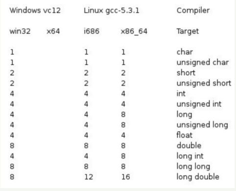

C语言教程(简单的学习c语言)
##前言
今天来看看c语言。大学的时候不好好学习。毕业了就得努力了。哇咔咔。。。
人家都是上大学，我怀疑我是被大学上了。。
今天的文章是在[C 教程](http://www.runoob.com/cprogramming/c-tutorial.html)的基础上编写的，只是添加了自己的想法。
##任务
能够简单的看懂c语言的代码。。
##C语言简介
C 语言是一种通用的、面向过程式的计算机程序设计语言。1972 年，为了移植与开发 UNIX 操作系统，丹尼斯·里奇在贝尔电话实验室设计开发了 C 语言。
C 语言是一种广泛使用的计算机语言，它与 Java 编程语言一样普及，二者在现代软件程序员之间都得到广泛使用。
当前最新的C语言标准为 C11 ，在它之前的C语言标准为 C99。
#####C 简介
C 语言是一种通用的高级语言，最初是由丹尼斯·里奇在贝尔实验室为开发 UNIX 操作系统而设计的。C 语言最开始是于 1972 年在 DEC PDP-11 计算机上被首次实现。
在 1978 年，布莱恩·柯林汉（Brian Kernighan）和丹尼斯·里奇（Dennis Ritchie）制作了 C 的第一个公开可用的描述，现在被称为 K&R 标准。
UNIX 操作系统，C编译器，和几乎所有的 UNIX 应用程序都是用 C 语言编写的。由于各种原因，C 语言现在已经成为一种广泛使用的专业语言。
- 易于学习。
- 结构化语言。
- 它产生高效率的程序。
- 它可以处理底层的活动。
- 它可以在多种计算机平台上编译。

#####关于 C
- C 语言是为了编写 UNIX 操作系统而被发明的。
- C 语言是以 B 语言为基础的，B 语言大概是在 1970 年被引进的。
- C 语言标准是于 1988 年由美国国家标准协会（ANSI，全称 American National Standard Institute）制定的。
- 截至 1973 年，UNIX 操作系统完全使用 C 语言编写。
- 目前，C 语言是最广泛使用的系统程序设计语言。
- 大多数先进的软件都是使用 C 语言实现的。
- 当今最流行的 Linux 操作系统和 RDBMS（Relational Database Management System：关系数据库管理系统） MySQL 都是使用 C 语言编写的。

#####为什么要使用 C？
C 语言最初是用于系统开发工作，特别是组成操作系统的程序。由于 C 语言所产生的代码运行速度与汇编语言编写的代码运行速度几乎一样，所以采用 C 语言作为系统开发语言。下面列举几个使用 C 的实例：
- 操作系统
- 语言编译器
- 汇编器
- 文本编辑器
- 打印机
- 网络驱动器
- 现代程序
- 数据库
- 语言解释器
- 实体工具

#####C 程序
一个 C 语言程序，可以是 3 行，也可以是数百万行，它可以写在一个或多个扩展名为 ".c" 的文本文件中，例如，hello.c。您可以使用 "vi"、"vim" 或任何其他文本编辑器来编写您的 C 语言程序。
本教程假定您已经知道如何编辑一个文本文件，以及如何在程序文件中编写源代码。
#####C11
C11（也被称为C1X）指ISO标准ISO/IEC 9899:2011，是当前最新的C语言标准。在它之前的C语言标准为C99。
新特性
- 对齐处理（Alignment）的标准化（包括_Alignas标志符，alignof运算符，aligned_alloc函数以及<stdalign.h>头文件）。
- _Noreturn 函数标记，类似于 gcc 的 __attribute__((noreturn))。
- _Generic 关键字。
- 多线程（Multithreading）支持，包括：
_Thread_local存储类型标识符，<threads.h>头文件，里面包含了线程的创建和管理函数。
_Atomic类型修饰符和<stdatomic.h>头文件。
- 增强的Unicode的支持。基于C Unicode技术报告ISO/IEC TR 19769:2004，增强了对Unicode的支持。包括为UTF-16/UTF-32编码增加了char16_t和char32_t数据类型，提供了包含unicode字符串转换函数的头文件<uchar.h>。
- 删除了 gets() 函数，使用一个新的更安全的函数gets_s()替代。
- 增加了边界检查函数接口，定义了新的安全的函数，例如 fopen_s()，strcat_s() 等等。
- 增加了更多浮点处理宏(宏)。
- 匿名结构体/联合体支持。这个在gcc早已存在，C11将其引入标准。
- 静态断言（Static assertions），_Static_assert()，在解释 #if 和 #error 之后被处理。
- 新的 fopen() 模式，("…x")。类似 POSIX 中的 O_CREAT|O_EXCL，在文件锁中比较常用。
- 新增 quick_exit() 函数作为第三种终止程序的方式。当 exit()失败时可以做最少的清理工作。


##C 程序结构
#####c Hello World实例
c 程序主要包括以下部分：
- 预处理器指令
- 函数
- 变量
- 语句&表达式
- 注释


让我们看一下简单的代码：
```groovy
#include <stdio.h>
int main()
{
   /* 我的第一个 C 程序 */
   printf("Hello, World! \n");
   return 0;
}
```
接下来我们讲解一下上面这段程序：
1.程序的第一行 #include <stdio.h> 是预处理器指令，告诉 C 编译器在实际编译之前要包含 stdio.h 文件。
2.下一行 int main() 是主函数，程序从这里开始执行。
3.下一行 /*...*/ 将会被编译器忽略，这里放置程序的注释内容。它们被称为程序的注释。
4.下一行 printf(...) 是 C 中另一个可用的函数，会在屏幕上显示消息 "Hello, World!"。
5.下一行 return 0; 终止 main() 函数，并返回值 0。

#####编译 & 执行 C 程序
接下来让我们看看如何把源代码保存在一个文件中，以及如何编译并运行它。下面是简单的步骤：
1.打开一个文本编辑器，添加上述代码。
2.保存文件为 hello.c。
3.打开命令提示符，进入到保存文件所在的目录。
4.键入 gcc hello.c，输入回车，编译代码。
5.如果代码中没有错误，命令提示符会跳到下一行，并生成 a.exe 可执行文件。
6.现在，键入 a.exe 来执行程序。
7.您可以看到屏幕上显示 "Hello World"。

注意：请确保您的路径中已包含 gcc 编译器，并确保在包含源文件 hello.c 的目录中运行它。
##C基本语法
#####C的令牌（Tokens）
C 程序由各种令牌组成，令牌可以是关键字、标识符、常量、字符串值，或者是一个符号。
例如下面的c语句包括五个令牌：
```groovy
printf("Hello, World! \n");
```
这五个令牌分别是：
```groovy
printf
(
"Hello, World! \n"
)
;
```
#####分号；
在 C 程序中，分号是语句结束符。也就是说，每个语句必须以分号结束。它表明一个逻辑实体的结束。
例如，下面是两个不同的语句：
```groovy
printf("Hello, World! \n");
return 0;
```
#####注释
注释就像是 C 程序中的帮助文本，它们会被编译器忽略。它们以 /\* 开始，以字符 \*/ 终止，如下所示：
```groovy
/* 我的第一个 C 程序 */
```
您不能在注释内嵌套注释，注释也不能出现在字符串或字符值中。
#####标识符
C 标识符是用来标识变量、函数，或任何其他用户自定义项目的名称。一个标识符以字母 A-Z 或 a-z 或下划线 _ 开始，后跟零个或多个字母、下划线和数字（0-9）。
C 标识符内不允许出现标点字符，比如 @、$ 和 %。C 是区分大小写的编程语言。因此，在 C 中，Manpower 和 manpower 是两个不同的标识符。下面列出几个有效的标识符：
```groovy
mohd       zara    abc   move_name  a_123
myname50   _temp   j     a23b9      retVal
```
#####关键字
下表列出了 C 中的保留字。这些保留字不能作为常量名、变量名或其他标识符名称。
下表列出了 C 中的保留字。这些保留字不能作为常量名、变量名或其他标识符名称。
auto  |	else  |	long  |	switch
------  |
break  |	enum  |	register  |	typedef
case  |	extern  |	return  |	union
char  |	float  |	short  |	unsigned
const  |	for	  |	signed  |	void
continue  |	goto  |	sizeof  |	volatile
default  |	if  |	static  |	while
do  |	int  |	struct  |	_Packed
double  |	
#####C 中的空格
只包含空格的行，被称为空白行，可能带有注释，C 编译器会完全忽略它。
在 C 中，空格用于描述空白符、制表符、换行符和注释。空格分隔语句的各个部分，让编译器能识别语句中的某个元素（比如 int）在哪里结束，下一个元素在哪里开始。因此，在下面的语句中：
```groovy
int age;
```
在这里，int 和 age 之间必须至少有一个空格字符（通常是一个空白符），这样编译器才能够区分它们。另一方面，在下面的语句中：
```groovy
fruit = apples + oranges;   // 获取水果的总数
```
fruit 和 =，或者 = 和 apples 之间的空格字符不是必需的，但是为了增强可读性，您可以根据需要适当增加一些空格。

##C数据类型
在 C 语言中，数据类型指的是用于声明不同类型的变量或函数的一个广泛的系统。变量的类型决定了变量存储占用的空间，以及如何解释存储的位模式。
c中的类型可分为以下几种：
序号 | 类型与描述
-----|
   1  |基本类型：<br>它们是算术类型，包括两种类型：整数类型和浮点类型。
   2|枚举类型：<br>它们也是算术类型，被用来定义在程序中只能赋予其一定的离散整数值的变量。
   3|void 类型：<br>类型说明符 void 表明没有可用的值。
   4|派生类型：<br>它们包括：指针类型、数组类型、结构类型、共用体类型和函数类型。
数据类型和结构类型统称为聚合类型。函数的类型指的是函数返回值的类型。接下来的部分我们将介绍基本类型，其他几种类型会在后边进行讲解。
#####整数类型
下表列出了关于标准整数类型的存储大小和值范围的细节：
类型|	存储大小|		值范围
----|	-
char	|	1 字节|		-128 到 127 或 0 到 255
unsigned char|		1 字节|		0 到 255
signed char	  |	1 字节	|	-128 到 127
int	 |	2 或 4 字节|		-32,768 到 32,767 或 -2,147,483,648 到 2,147,483,647
unsigned int|		2 或 4 字节	|	0 到 65,535 或 0 到 4,294,967,295
short|		2 字节	|	-32,768 到 32,767
unsigned short|		2 字节	|	0 到 65,535
long	|	4 字节	|	-2,147,483,648 到 2,147,483,647
unsigned long|		4 字节	|	0 到 4,294,967,295
**注意**各种类型的存储大小与系统位数有关，但目前通用的以64位系统为主。
以下列出了32位系统与64位系统的存储大小的区别（Windows相同）

为了得到某个类型或某个变量在特定平台上的准确大小，您可以使用 sizeof 运算符。表达式` sizeof(type) `得到对象或类型的存储字节大小。比如下面：
```groovy
#include <stdio.h>
 
int main()
{
   printf("int 存储大小 : %lu \n", sizeof(int));
   return 0;
}
```
当在Windows上编译并执行上面的程序时，它会产生下列结果：
> int 存储大小 : 4 

#####浮点类型
下表列出了关于标准浮点类型的存储大小、值范围和精度的细节：
下表列出了关于标准浮点类型的存储大小、值范围和精度的细节：
类型|	存储大小|	值范围	  |	精度
------|
float  |	4 字节  |		1.2E-38 到 3.4E+38	  |	6 位小数
double  |		8 字节  |		2.3E-308 到 1.7E+308	  |	15 位小数
long double	  |	16 字节	  |	3.4E-4932 到 1.1E+4932	  |	19 位小数
头文件 float.h 定义了宏，在程序中可以使用这些值和其他有关实数二进制表示的细节。
#####void类型
void 类型指定没有可用的值。它通常用于以下三种情况下：
序号	|   类型与描述
----|
1	|   函数返回为空<br>C 中有各种函数都不返回值，或者您可以说它们返回空。不返回值的函数的返回类型为空。<br>例如 void exit (int status);
2	|	函数参数为空<br>C 中有各种函数不接受任何参数。不带参数的函数可以接受一个 void。<br>例如 int rand(void);
3	|	指针指向 void<br>类型为 void * 的指针代表对象的地址，而不是类型。<br>例如，内存分配函数 void *malloc( size_t size ); 返回指向 void 的指针，可以转换为任何数据类型。

##C变量
变量其实只不过是程序可操作的存储区的名称。C 中每个变量都有特定的类型，类型决定了变量存储的大小和布局，该范围内的值都可以存储在内存中，运算符可应用于变量上。
变量的名称可以由字母、数字和下划线字符组成。它必须以字母或下划线开头。大写字母和小写字母是不同的，因为 C 是大小写敏感的。基于前一章讲解的基本类型，有以下几种基本的变量类型：
类型   |	描述
----|
char  |	通常是一个字节（八位）。这是一个整数类型。
int  |	对机器而言，整数的最自然的大小。
float |	单精度浮点值。
double |	双精度浮点值。
void |	表示类型的缺失。

C 语言也允许定义各种其他类型的变量，比如枚举、指针、数组、结构、共用体等等，这将会在后续的章节中进行讲解，本章节我们先讲解基本变量类型。
#####C 中的变量定义
变量定义就是告诉编译器在何处创建变量的存储，以及如何创建变量的存储。变量定义指定一个数据类型，并包含了该类型的一个或多个变量的列表，如下所示：
> type variable_list;


在这里，type 必须是一个有效的 C 数据类型，可以是 char、w_char、int、float、double、bool 或任何用户自定义的对象，variable_list 可以由一个或多个标识符名称组成，多个标识符之间用逗号分隔。下面列出几个有效的声明：
```groovy
int    i, j, k;
char   c, ch;
float  f, salary;
double d;
```
行 int i, j, k; 声明并定义了变量 i、j 和 k，这指示编译器创建类型为 int 的名为 i、j、k 的变量。
变量可以在声明的时候被初始化（指定一个初始值）。初始化器由一个等号，后跟一个常量表达式组成，如下所示：
> type variable_name = value;


下面列举几个实例：
```groovy
extern int d = 3, f = 5;    // d 和 f 的声明, 这就是单纯的声明
int d = 3, f = 5;           // 定义并初始化 d 和 f
byte z = 22;                // 定义并初始化 z
char x = 'x';               // 变量 x 的值为 'x'
```
不带初始化的定义：带有静态存储持续时间的变量会被隐式初始化为 NULL（所有字节的值都是 0），其他所有变量的初始值是未定义的。
#####c中的变量声明
变量声明向编译器保证变量以指定的类型和名称存在，这样编译器在不需要知道变量完整细节的情况下也能继续进一步的编译。变量声明只在编译时有它的意义，在程序连接时编译器需要实际的变量声明。
变量的声明有两种情况：
1.一种是需要建立存储空间的。例如：int a 在声明的时候就已经建立了存储空间。
2.另一种是不需要建立存储空间的，通过使用extern关键字声明变量名而不定义它。 例如：extern int a 其中变量 a 可以在别的文件中定义的。
注意：除非有extern关键字，否则都是变量的定义。
```groovy
extern int i; //声明，不是定义
int i; //声明，也是定义
```
实战：
尝试下面的实例，其中，变量在头部就已经被声明，但是定义与初始化在主函数内：
```groovy
#include <stdio.h>

// 变量声明
extern int a, b;
extern int c;
extern float f;

int main ()
{
  /* 变量定义 */
  int a, b;
  int c;
  float f;

  /* 初始化 */
  a = 10;
  b = 20;

  c = a + b;
  printf("value of c : %d \n", c);

  f = 70.0/3.0;
  printf("value of f : %f \n", f);

  return 0;
}
```
当上面的代码被编译和执行时，它会产生下列结果：
```groovy
value of c : 30
value of f : 23.333334
```
#####C 中的左值（Lvalues）和右值（Rvalues）
C 中有两种类型的表达式：
1.**左值（lvalue）**：指向内存位置的表达式被称为左值（lvalue）表达式。左值可以出现在赋值号的左边或右边。
2.**右值（rvalue）**：术语右值（rvalue）指的是存储在内存中某些地址的数值。右值是不能对其进行赋值的表达式，也就是说，右值可以出现在赋值号的右边，但不能出现在赋值号的左边。
变量是左值，因此可以出现在赋值号的左边。数值型的字面值是右值，因此不能被赋值，不能出现在赋值号的左边。下面是一个有效的语句：
```groovy
int g = 20;
```
但是下面这个就不是一个有效的语句，会生成编译时错误：
```groovy
10 = 20;
```
##C常量
常量是固定值，在程序执行期间不会改变。这些固定的值，又叫做字面量。
常量可以是任何的基本数据类型，比如整数常量、浮点常量、字符常量，或字符串字面值，也有枚举常量。
常量就像是常规的变量，只不过常量的值在定义后不能进行修改。
#####整数常量
整数常量可以是十进制、八进制或十六进制的常量。前缀指定基数：0x或0X表示十六进制，0表示八进制，不带前缀则默认表示十进制。
整数常量也可以带一个后缀，后缀是U和L的组合，U表示无符号整数（unsigned），L表示长整数（Long）。后缀可以是大写，也可以是小写，U和L的顺序任意。
下面列举几个整数常量的实例：
```
212         /* 合法的 */
215u        /* 合法的 */
0xFeeL      /* 合法的 */
078         /* 非法的：8 不是八进制的数字 */
032UU       /* 非法的：不能重复后缀 */
```
以下是各种类型的整数常量的实例：
```
85         /* 十进制 */
0213       /* 八进制 */
0x4b       /* 十六进制 */
30         /* 整数 */
30u        /* 无符号整数 */
30l        /* 长整数 */
30ul       /* 无符号长整数 */
```
#####浮点常量
浮点常量由整数部分、小数点、小数部分和指数部分组成。您可以使用小数形式或者指数形式来表示浮点常量。
当使用小数形式表示时，必须包含整数部分、小数部分，或同时包含两者。当使用指数形式表示时， 必须包含小数点、指数，或同时包含两者。带符号的指数是用 e 或 E 引入的。
下面列举几个浮点常量的实例：
```
3.14159       /* 合法的 */
314159E-5L    /* 合法的 */
510E          /* 非法的：不完整的指数 */
210f          /* 非法的：没有小数或指数 */
.e55          /* 非法的：缺少整数或分数 */
```
#####字符常量
字符常量是括在单引号中，例如，'x' 可以存储在 char 类型的简单变量中。
字符常量可以是一个普通的字符（例如 'x'）、一个转义序列（例如 '\t'），或一个通用的字符（例如 '\u02C0'）。
在 C 中，有一些特定的字符，当它们前面有反斜杠时，它们就具有特殊的含义，被用来表示如换行符（\n）或制表符（\t）等。下表列出了一些这样的转义序列码：
转义序列	| 含义
---|
\\\\	|\ 字符
\'	|	' 字符
\"	|	" 字符
\?	|	? 字符
\a	|	警报铃声
\b	|	退格键
\f	|	换页符
\n	|	换行符
\r	|	回车
\t	|	水平制表符
\v	|	垂直制表符
\ooo	|	一到三位的八进制数
\xhh . . .	|	一个或多个数字的十六进制数
#####字符串常量
字符串字面值或常量是括在双引号 "" 中的。一个字符串包含类似于字符常量的字符：普通的字符、转义序列和通用的字符。
您可以使用空格做分隔符，把一个很长的字符串常量进行分行。
下面的实例显示了一些字符串常量。下面这三种形式所显示的字符串是相同的。
```groovy
"hello, dear"

"hello, \
dear"

"hello, " "d" "ear"
```
#####定义常量
在c中，有两种简单的定义常量的方式：
1.使用**#define**预处理器。
2.使用**const**关键字。
#######define 预处理器
下面是使用#define预处理器定义常量的形式：
`#define identifier value`
具体的实战：
```groovy
#include <stdio.h>

#define LENGTH 10
#define WIDTH  5
#define NEWLINE '\n'

int main()
{
   int area;
   area = LENGTH * WIDTH;
   printf("value of area : %d", area);
   printf("%c", NEWLINE);
   return 0;
}
```
######const关键字
您可以使用 const 前缀声明指定类型的常量，如下所示：
`const type variable = value;`
具体请看下面的实例：
```groovy
#include <stdio.h>

int main()
{
   const int  LENGTH = 10;
   const int  WIDTH  = 5;
   const char NEWLINE = '\n';
   int area;
   area = LENGTH * WIDTH;
   printf("value of area : %d", area);
   printf("%c", NEWLINE);
   return 0;
}
```
请注意，把常量定义为大写字母形式，是一个很好的编程实践。
##C存储类
存储类定义C程序中变量/函数的范围（可见性）和生命周期。这些说明符放置在它们所修饰的类型之前。下面列出C程序中可用的存储类：
- auto
- register
- static
- extern

#####auto存储类
**auto**存储类是所有局部变量默认的存储类。
```groovy
{
   int mount;
   auto int month;
}
```
#####register 存储类(寄存器)????
register 存储类用于定义存储在寄存器中而不是 RAM 中的局部变量。这意味着变量的最大尺寸等于寄存器的大小（通常是一个词），且不能对它应用一元的 '&' 运算符（因为它没有内存位置）。
```groovy
{
   register int  miles;
}
```
寄存器只用于需要快速访问的变量，比如计数器。还应注意的是，定义 'register' 并不意味着变量将被存储在寄存器中，它意味着变量可能存储在寄存器中，这取决于硬件和实现的限制。
#####static 存储类
**static** 存储类指示编译器在程序的生命周期内保持局部变量的存在，而不需要在每次它进入和离开作用域时进行创建和销毁。因此，使用 static 修饰局部变量可以在函数调用之间保持局部变量的值。
static 修饰符也可以应用于全局变量。当 static 修饰全局变量时，会使变量的作用域限制在声明它的文件内。
**static 是全局变量的默认存储类，以下两个变量 (count 和 road) 都有一个 static 存储类。**
```groovy
static int Count;
int Road;

main()
{
    printf("%d\n", Count);
    printf("%d\n", Road);
 }
```
实战：：
```groovy
#include <stdio.h>

/* 函数声明 */
void func1(void);

static int count=10;        /* 全局变量 - static 是默认的 */

int main()
{
  while (count--) {
      func1();
  }
  return 0;
}

void func1(void)
{
/* 'thingy' 是 'func1' 的局部变量 - 只初始化一次
 * 每次调用函数 'func1' 'thingy' 值不会被重置。
 */
  static int thingy=5;
  thingy++;
  printf(" thingy 为 %d ， count 为 %d\n", thingy, count);
}
```
实例中count作为全局变量可以在函数内使用，thingy使用static修饰后，不会再每次调用时重置。结果如下：
```groovy
 thingy 为 6 ， count 为 9
 thingy 为 7 ， count 为 8
 thingy 为 8 ， count 为 7
 thingy 为 9 ， count 为 6
 thingy 为 10 ， count 为 5
 thingy 为 11 ， count 为 4
 thingy 为 12 ， count 为 3
 thingy 为 13 ， count 为 2
 thingy 为 14 ， count 为 1
 thingy 为 15 ， count 为 0
```
##extern存储类
**extern** 存储类用于提供一个全局变量的引用，全局变量对所有的程序文件都是可见的。当您使用 'extern' 时，对于无法初始化的变量，会把变量名指向一个之前定义过的存储位置。
当您有多个文件且定义了一个可以在其他文件中使用的全局变量或函数时，可以在其他文件中使用 extern 来得到已定义的变量或函数的引用。可以这么理解，**extern 是用来在另一个文件中声明一个全局变量或函数。**
extern 修饰符通常用于当有两个或多个文件共享相同的全局变量或函数的时候，如下所示：
**第一个文件：main.c**
```groovy
#include <stdio.h>

int count ;
extern void write_extern();

main()
{
   count = 5;
   write_extern();
}
```
**第二个文件：support.c**
```groovy
#include <stdio.h>

extern int count;

void write_extern(void)
{
   printf("count is %d\n", count);
}
```
在这里，第二个文件中的 extern 关键字用于声明已经在第一个文件 main.c 中定义的 count。现在 ，编译这两个文件，如下所示：
 > $ gcc main.c support.c


这会产生 a.out 可执行程序，当程序被执行时，它会产生下列结果：
> count is 5


