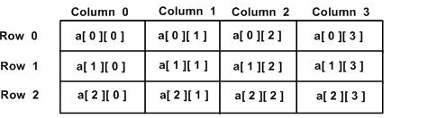

C语言教程(简单的学习c语言,第二篇)
##前言
上一篇，写的是简单的概念问题，这一篇主要是写有关运算的问题。
##任务
理解C语言的相关的运算。
##C运算符
运算符是一种告诉编译器执行特定的数学或逻辑操作的符号。C语言内置了丰富的运算符，并提供了以下类型的运算符：
- 算术运算符
- 关系运算符
- 逻辑运算符
- 位运算符
- 赋值运算符
- 杂项运算符
本文将逐一介绍算术运算符、关系运算符、逻辑运算符、位运算符、赋值运算符和其他运算符。
#####算术运算符
下表显示了C语言支持的所有算术运算符。假设变量A的值为10，变量B的值是20，则：
运算符	|描述	|实例
----|
+|	把两个操作数相加	|A + B 将得到 30
\-	|从第一个操作数中减去第二个操作数	|A - B 将得到 -10
\*	|把两个操作数相乘	|A * B 将得到 200
/	|分子除以分母	|B / A 将得到 2
%	|取模运算符，整除后的余数	|B % A 将得到 0
++|	自增运算符，整数值增加 1	|A++ 将得到 11
--	|自减运算符，整数值减少 1	|A-- 将得到 9
注意 a++ 与 ++a 的区别：

```groovy
#include <stdio.h>
int main()
{
   int c;
   int a = 10;
   c = a++;
   printf("先赋值后运算：\n");
   printf("Line 1 - c 的值是 %d\n", c );
   printf("Line 2 - a 的值是 %d\n", a );
   a = 10;
   c = a--;
   printf("Line 3 - c 的值是 %d\n", c );
   printf("Line 4 - a 的值是 %d\n", a );

   printf("先运算后赋值：\n");
   a = 10;
   c = ++a;
   printf("Line 5 - c 的值是 %d\n", c );
   printf("Line 6 - a 的值是 %d\n", a );
   a = 10;
   c = --a;
   printf("Line 7 - c 的值是 %d\n", c );
   printf("Line 8 - a 的值是 %d\n", a );
}
```

以上程序执行输出结果为：
```groovy
先赋值后运算：
Line 1 - c 的值是 10
Line 2 - a 的值是 11
Line 3 - c 的值是 10
Line 4 - a 的值是 9
先运算后赋值：
Line 5 - c 的值是 11
Line 6 - a 的值是 11
Line 7 - c 的值是 9
Line 8 - a 的值是 9
```
#####关系运算符
下表显示了 C 语言支持的所有关系运算符。假设变量 A 的值为 10，变量 B 的值为 20，则：
运算符|	描述|	实例
----|
==|	检查两个操作数的值是否相等，如果相等则条件为真。|	(A == B) 不为真。
!=	|检查两个操作数的值是否相等，如果不相等则条件为真。|	(A != B) 为真。
>	|检查左操作数的值是否大于右操作数的值，如果是则条件为真。|	(A > B) 不为真。
<	|检查左操作数的值是否小于右操作数的值，如果是则条件为真。|	(A < B) 为真。
>=	|检查左操作数的值是否大于或等于右操作数的值，如果是则条件为真。	|(A >= B) 不为真。
<=|	检查左操作数的值是否小于或等于右操作数的值，如果是则条件为真。|A <= B) 为真。
#####逻辑运算符
下表显示了 C 语言支持的所有关系逻辑运算符。假设变量 A 的值为 1，变量 B 的值为 0，则：
运算符	|描述	|实例
---|
&&|	称为逻辑与运算符。如果两个操作数都非零，则条件为真。	|(A && B) 为假。
&#124;&#124;  |	称为逻辑或运算符。如果两个操作数中有任意一个非零，则条件为真。|	(A  &#124;&#124;B) 为真。
!	|称为逻辑非运算符。用来逆转操作数的逻辑状态。如果条件为真则逻辑非运算符将使其为假。|	!(A && B) 为真。
##位运算符
位运算符作用于位，并逐位执行操作。&、 | 和 ^ 的真值表如下所示：
p|	q	|p & q	|p &#124;q	|p ^ q
----|
0	|0	|0	|0	|0
0	|1	|0	|1	|1
1	|1	|1	|1	|0
1	|0	|0	|1	|1

假设如果 A = 60，且 B = 13，现在以二进制格式表示，它们如下所示：
A = 0011 1100
B = 0000 1101
>A&B = 0000 1100
A|B = 0011 1101
A^B = 0011 0001
~A  = 1100 0011

运算符|	描述	|实例
-----|
&	|如果同时存在于两个操作数中，二进制 AND 运算符复制一位到结果中。|	(A & B) 将得到 12，即为 0000 1100
&#124;|	如果存在于任一操作数中，二进制 OR 运算符复制一位到结果中。|	(A &#124;B) 将得到 61，即为 0011 1101
^	|如果存在于其中一个操作数中但不同时存在于两个操作数中，二进制异或运算符复制一位到结果中。	|(A ^ B) 将得到 49，即为 0011 0001
~	|二进制补码运算符是一元运算符，具有"翻转"位效果，即0变成1，1变成0。	|(~A ) 将得到 -61，即为 1100 0011，一个有符号二进制数的补码形式。
<<	|二进制左移运算符。左操作数的值向左移动右操作数指定的位数。|	A << 2 将得到 240，即为 1111 0000
\>\>|	二进制右移运算符。左操作数的值向右移动右操作数指定的位数。|A \>\> 2 将得到 15，即为 0000 1111
##赋值运算符
下表列出了 C 语言支持的赋值运算符：
运算符	  |描述	  |实例
----|
=	|简单的赋值运算符，把右边操作数的值赋给左边操作数	|C = A + B 将把 A + B 的值赋给 C
+=	|加且赋值运算符，把右边操作数加上左边操作数的结果赋值给左边操作数	|C += A 相当于 C = C + A
-=	|减且赋值运算符，把左边操作数减去右边操作数的结果赋值给左边操作数	|C -= A 相当于 C = C - A
*=	|乘且赋值运算符，把右边操作数乘以左边操作数的结果赋值给左边操作数	|C *= A 相当于 C = C * A
/=	|除且赋值运算符，把左边操作数除以右边操作数的结果赋值给左边操作数	|C /= A 相当于 C = C / A
%=	|求模且赋值运算符，求两个操作数的模赋值给左边操作数	|C %= A 相当于 C = C % A
<<=	|左移且赋值运算符	|C <<= 2 等同于 C = C << 2
>>=	|右移且赋值运算符	|C >>= 2 等同于 C = C >> 2
&=	|按位与且赋值运算符	|C &= 2 等同于 C = C & 2
^=	|按位异或且赋值运算符	|C ^= 2 等同于 C = C ^ 2
&#124; =	|按位或且赋值运算符	|C&#124; = 2 等同于 C = C&#124;  2
##杂项运算符 ↦ sizeof & 三元
下表列出了 C 语言支持的其他一些重要的运算符，包括 sizeof 和 ? :。
运算符   |	描述	  |实例
-----|
sizeof()	|返回变量的大小。|	sizeof(a) 将返回 4，其中 a 是整数。
&	|返回变量的地址。	|&a; 将给出变量的实际地址。
*	|指向一个变量。	|*a; 将指向一个变量。
? :	|条件表达式	|如果条件为真 ? 则值为 X : 否则值为 Y
实例：
```groovy
#include <stdio.h>

int main()
{
   int a = 4;
   short b;
   double c;
   int* ptr;

   /* sizeof 运算符实例 */
   printf("Line 1 - 变量 a 的大小 = %lu\n", sizeof(a) );
   printf("Line 2 - 变量 b 的大小 = %lu\n", sizeof(b) );
   printf("Line 3 - 变量 c 的大小 = %lu\n", sizeof(c) );

   /* & 和 * 运算符实例 */
   ptr = &a;    /* 'ptr' 现在包含 'a' 的地址 */
   printf("a 的值是 %d\n", a);
   printf("*ptr 是 %d\n", *ptr);

   /* 三元运算符实例 */
   a = 10;
   b = (a == 1) ? 20: 30;
   printf( "b 的值是 %d\n", b );

   b = (a == 10) ? 20: 30;
   printf( "b 的值是 %d\n", b );
}
```
当上面的代码被编译和执行时，它会产生下列结果：
```groovy
Line 1 - 变量 a 的大小 = 4
Line 2 - 变量 b 的大小 = 2
Line 3 - 变量 c 的大小 = 8
a 的值是 4
*ptr 是 4
b 的值是 30
b 的值是 20
```
#####C 中的运算符优先级
运算符的优先级确定表达式中项的组合。这会影响到一个表达式如何计算。某些运算符比其他运算符有更高的优先级，例如，乘除运算符具有比加减运算符更高的优先级。
例如 x = 7 + 3 * 2，在这里，x 被赋值为 13，而不是 20，因为运算符 * 具有比 + 更高的优先级，所以首先计算乘法 3*2，然后再加上 7。
下表将按运算符优先级从高到低列出各个运算符，具有较高优先级的运算符出现在表格的上面，具有较低优先级的运算符出现在表格的下面。在表达式中，较高优先级的运算符会优先被计算。
类别 |	运算符 |	结合性
----|
后缀 |	() [] -> . ++ - -  	|从左到右 
一元 | 	+ - ! ~ ++ - - (type)* & sizeof 	|从右到左 
乘除 |	* / % 	|从左到右 
加减 |	+ - 	|从左到右 
移位 	|<< >> |	从左到右 
关系 	|< <= > >= |	从左到右 
相等 	|== != 	|从左到右 
位与 AND 	|& 	|从左到右 
位异或 XOR 	|^ 	|从左到右 
位或 OR | &#124;	| 	从左到右 
逻辑与 AND 	|&& 	|从左到右 
逻辑或 OR |	&#124;&#124;| 	从左到右 
条件 	|?: 	|从右到左 
赋值 	|=  +=  -=  *= /= %=>>= <<= &= ^= &#124;= 	|从右到左 
逗号 	|, 	|从左到右 
实战：请看下面的实例，了解 C 语言中运算符的优先级：
```groovy
#include <stdio.h>

main()
{
   int a = 20;
   int b = 10;
   int c = 15;
   int d = 5;
   int e;

   e = (a + b) * c / d;      // ( 30 * 15 ) / 5
   printf("(a + b) * c / d 的值是 %d\n",  e );

   e = ((a + b) * c) / d;    // (30 * 15 ) / 5
   printf("((a + b) * c) / d 的值是 %d\n" ,  e );

   e = (a + b) * (c / d);   // (30) * (15/5)
   printf("(a + b) * (c / d) 的值是 %d\n",  e );

   e = a + (b * c) / d;     //  20 + (150/5)
   printf("a + (b * c) / d 的值是 %d\n" ,  e );

   return 0;
}
```
当上面的代码被编译和执行时，它会产生下列结果：
> (a + b) * c / d 的值是 90
((a + b) * c) / d 的值是 90
(a + b) * (c / d) 的值是 90
a + (b * c) / d 的值是 50

##C 判断
判断语句
C 语言提供了以下类型的判断语句。点击链接查看每个语句的细节。
语句		|描述
-----|
if 语句	|一个 if 语句 由一个布尔表达式后跟一个或多个语句组成。
if...else 语句	|一个 if 语句 后可跟一个可选的 else 语句，else 语句在布尔表达式为假时执行。
嵌套 if 语句	|您可以在一个 if 或 else if 语句内使用另一个 if 或 else if 语句。
switch 语句	|一个 switch 语句允许测试一个变量等于多个值时的情况。
嵌套 switch 语句	|您可以在一个 switch 语句内使用另一个 switch 语句。
注意还有三目运算符`**? : 运算符(三元运算符)**`
##C循环
#####循环类型
C 语言提供了以下几种循环类型。点击链接查看每个类型的细节。
循环类型	|描述
-----|
while 循环	|当给定条件为真时，重复语句或语句组。它会在执行循环主体之前测试条件。
for 循环	|多次执行一个语句序列，简化管理循环变量的代码。
do...while 循环	|除了它是在循环主体结尾测试条件外，其他与 while 语句类似。
嵌套循环	|您可以在 while、for 或 do..while 循环内使用一个或多个循环。

#####循环控制语句
循环控制语句改变你代码的执行顺序。通过它你可以实现代码的跳转。
C 提供了下列的循环控制语句。点击链接查看每个语句的细节。
控制语句	|描述
----|
break 语句	|终止循环或 switch 语句，程序流将继续执行紧接着循环或 switch 的下一条语句。
continue 语句	|告诉一个循环体立刻停止本次循环迭代，重新开始下次循环迭代。
goto 语句	|将控制转移到被标记的语句。但是不建议在程序中使用 goto 语句。

#####无限循环
如果条件永远不为假，则循环将变成无限循环。for 循环在传统意义上可用于实现无限循环。由于构成循环的三个表达式中任何一个都不是必需的，您可以将某些条件表达式留空来构成一个无限循环。
```groovy
#include <stdio.h>
int main ()
{

   for( ; ; )
   {
      printf("This loop will run forever.\n");
   }

   return 0;
}
```
当条件表达式不存在时，它被假设为真。您也可以设置一个初始值和增量表达式，但是一般情况下，C 程序员偏向于使用 for(;;) 结构来表示一个无限循环。
**注意：您可以按 Ctrl + C 键终止一个无限循环。**
##C函数
函数是一组一起执行一个任务的语句。函数声明告诉编译器函数的名称、返回类型和参数。函数定义提供了函数的实际主体。
C标准库提供了大量的程序可以调用的内置函数。例如，函数**strcat()**来连接两个字符串，函数memcpy()用来复制内存到另一个位置。
函数还有很多叫法，比如方法、子例程或程序。
#####定义函数
C语言中的函数定义的一般形式如下：
```groovy
return_type function_name( parameter list )
{
   body of the function
}
```
在c语言中，函数由一个函数头和一个函数主体组成。下面列出一个函数的所有组成部分：
- **返回类型**：一个函数可以返回一个值。**return_type** 是函数返回的值的数据类型。有些函数执行所需的操作而不返回值，在这种情况下，return_type 是关键字** void**。
-** 函数名称**：这是函数的实际名称。函数名和参数列表一起构成了函数签名。
- **参数**：参数就像是占位符。当函数被调用时，您向参数传递一个值，这个值被称为实际参数。参数列表包括函数参数的类型、顺序、数量。参数是可选的，也就是说，函数可能不包含参数。
- **函数主体**：函数主体包含一组定义函数执行任务的语句。

实战：以下是 max() 函数的源代码。该函数有两个参数 num1 和 num2，会返回这两个数中较大的那个数：
```groovy
/* 函数返回两个数中较大的那个数 */
int max(int num1, int num2) 
{
   /* 局部变量声明 */
   int result;

   if (num1 > num2)
      result = num1;
   else
      result = num2;

   return result; 
}
```
#####函数声明
函数声明会告诉编译器函数名称及如何调用函数。函数的实际主体可以单独定义。
函数声明包括以下几个部分：
```groovy
return_type function_name( parameter list );
```
针对上面定义的函数 max()，以下是函数声明：
```groovy
int max(int num1, int num2);
```
在函数声明中，参数的名称并不重要，只有参数的类型是必需的，因此下面也是有效的声明：
```groovy
int max(int, int);
```
当您在一个源文件中定义函数且在另一个文件中调用函数时，函数声明是必需的。在这种情况下，您应该在调用函数的文件顶部声明函数。
#####调用函数
创建 C 函数时，会定义函数做什么，然后通过调用函数来完成已定义的任务。
当程序调用函数时，程序控制权会转移给被调用的函数。被调用的函数执行已定义的任务，当函数的返回语句被执行时，或到达函数的结束括号时，会把程序控制权交还给主程序。
#####函数参数
如果函数要使用参数，则必须声明接受参数值的变量。这些变量称为函数的形式参数。
形式参数就像函数内的其他局部变量，在进入函数时被创建，退出函数时被销毁。
当调用函数时，有两种向函数传递参数的方式：
调用类型	|描述
-----|
传值调用|	该方法把参数的实际值复制给函数的形式参数。在这种情况下，修改函数内的形式参数不会影响实际参数。
引用调用|	通过指针传递方式，形参为指向实参地址的指针，当对形参的指向操作时，就相当于对实参本身进行的操作。
默认情况下，C 使用传值调用来传递参数。一般来说，这意味着函数内的代码不能改变用于调用函数的实际参数。

详细解析：
######传值方式调用函数
向函数传递参数的传值调用方法，把参数的实际值复制给函数的形式参数。在这种情况下，修改函数内的形式参数不会影响实际参数。
默认情况下，C 语言使用传值调用方法来传递参数。一般来说，这意味着函数内的代码不会改变用于调用函数的实际参数。函数 swap() 定义如下：
```groovy
/* 函数定义 */
void swap(int x, int y)
{
   int temp;

   temp = x; /* 保存 x 的值 */
   x = y;    /* 把 y 赋值给 x */
   y = temp; /* 把 temp 赋值给 y */
  
   return;
}
```
现在，让我们通过传递实际参数来调用函数 swap()：
```groovy
#include <stdio.h>
/* 函数声明 */
void swap(int x, int y);

int main ()
{
   /* 局部变量定义 */
   int a = 100;
   int b = 200;

   printf("交换前，a 的值： %d\n", a );
   printf("交换前，b 的值： %d\n", b );

   /* 调用函数来交换值 */
   swap(a, b);

   printf("交换后，a 的值： %d\n", a );
   printf("交换后，b 的值： %d\n", b );

   return 0;
}
```
当上面的代码被编译和执行时，它会产生下列结果：
```groovy
交换前，a 的值： 100
交换前，b 的值： 200
交换后，a 的值： 100
交换后，b 的值： 200
```
上面的实例表明了，虽然在函数内改变了 a 和 b 的值，但是实际上 a 和 b 的值没有发生变化。

######引用方式调用函数
通过引用传递方式，形参为指向实参地址的指针，当对形参的指向操作时，就相当于对实参本身进行的操作。
传递指针可以让多个函数访问指针所引用的对象，而不用把对象声明为全局可访问。
```groovy
/* 函数定义 */
void swap(int *x, int *y)
{
   int temp;
   temp = *x;    /* 保存地址 x 的值 */
   *x = *y;      /* 把 y 赋值给 x */
   *y = temp;    /* 把 temp 赋值给 y */

   return;
}
```
如需了解 C 中指针的更多细节，请访问 C - 指针 章节。
现在，让我们通过引用传值来调用函数 swap()：
```groovy
#include <stdio.h>

/* 函数声明 */
void swap(int *x, int *y);

int main ()
{
   /* 局部变量定义 */
   int a = 100;
   int b = 200;

   printf("交换前，a 的值： %d\n", a );
   printf("交换前，b 的值： %d\n", b );

   /* 调用函数来交换值
    * &a 表示指向 a 的指针，即变量 a 的地址 
    * &b 表示指向 b 的指针，即变量 b 的地址 
   */
   swap(&a, &b);

   printf("交换后，a 的值： %d\n", a );
   printf("交换后，b 的值： %d\n", b );

   return 0;
}
```
当上面的代码被编译和执行时，它会产生下列结果：
```groovy
交换前，a 的值： 100
交换前，b 的值： 200
交换后，a 的值： 200
交换后，b 的值： 100
```
上面的实例表明了，与传值调用不同，引用调用在函数内改变了 a 和 b 的值，实际上也改变了函数外 a 和 b 的值。

####内部函数和外部函数
根据函数能否被其他源文件调用，将函数区分为内部函数和外部函数。
######内部函数
如果一个函数只能被本文件中其他函数所调用，它称为内部函数。在定义内部函数时，在函数名和函数类型的前面加 static，即
> static 类型名 函数名 （形参表）

例如，函数的首行：
> static int max(int a,intb)

内部函数又称静态函数。使用内部函数，可以使函数的作用域只局限于所在文件。即使在不同的文件中有同名的内部函数，也互不干扰。提高了程序的可靠性。
######外部函数
如果在定义函数时，在函数的首部的最左端加关键字 extern，则此函数是外部函数，可供其它文件调用。
如函数首部可以为
> extern int max (int a,intb)

C 语言规定，如果在定义函数时省略 extern，则默认为外部函数。
在需要调用此函数的其他文件中，需要对此函数作声明（不要忘记，即使在本文件中调用一个函数，也要用函数原型来声明）。在对此函数作声明时，要加关键字 extern，表示该函数是在其他文件中定义的外部函数。
实例
以下实例通过多个文件的函数实现输入一串字符串，然后删除指定的字符：
file1.c(文件1)
```groovy
#include <stdio.h>

static void delete_string(char str[],char ch);
int main()
{
	extern void enter(char str[]); // 对函数的声明
	extern void print(char str[]); // 对函数的声明
	char c,str[100];
	enter(str);
	scanf("%c",&c);
	delete_string(str,c);
	print(str);
	return 0;
}

static void delete_string(char str[],char ch)//内部函数
{
	int i,j;
	for(i=j=0;str[i]!='\0';i++)
	if(str[i]!=ch)
	str[j++]=str[i];
	str[j]='\0';
}
```
file2.c(文件2)
```groovy
#include <stdio.h>

void enter(char str[100]) // 定义外部函数 enter
{
    fgets(str, 100, stdin); // 向字符数组输入字符串
}
```
file3.c(文件3)
```groovy
#include <stdio.h>

void print(char str[]) // 定义外部函数 print
{
	printf("%s\n",str);
}
```
输入字符串"abcdef"，给字符数组 str，在输入要删去的字符'd'。
运行结果:
```groovy
$ gcc file1.c file2.c file3.c 
$ ./a.out
abcdef                   # 输入的字符串
d                        # 要删除的字符
abcef                    # 删除后的字符串
```
##C作用域
任何一种编程中，作用域是程序中定义的变量所存在的区域，超过该区域变量就不能被访问。C 语言中有三个地方可以声明变量：
1.在函数或块内部的局部变量
2.在所有函数外部的全局变量
3.在形式参数的函数参数定义中
让我们来看看什么是局部变量、全局变量和形式参数。

#####局部变量和全局变量
在某个函数或块的内部声明的变量称为局部变量。它们只能被该函数或该代码块内部的语句使用。局部变量在函数外部是不可知的。
全局变量是定义在函数外部，通常是在程序的顶部。全局变量在整个程序生命周期内都是有效的，在任意的函数内部能访问全局变量。
全局变量可以被任何函数访问。也就是说，全局变量在声明后整个程序中都是可用的。
下面是使用全局变量和局部变量的实例：
```groovy
#include <stdio.h>

/* 全局变量声明 */
int g;

int main ()
{
  /* 局部变量声明 */
  int a, b;

  /* 实际初始化 */
  a = 10;
  b = 20;
  g = a + b;

  printf ("value of a = %d, b = %d and g = %d\n", a, b, g);

  return 0;
}
```
在程序中，局部变量和全局变量的名称可以相同，但是在函数内，局部变量的值会覆盖全局变量的值。下面是一个实例：
```groovy
#include <stdio.h>

/* 全局变量声明 */
int g = 20;

int main ()
{
  /* 局部变量声明 */
  int g = 10;

  printf ("value of g = %d\n",  g);

  return 0;
}
```
当上面的代码被编译和执行时，它会产生下列结果：
```groovy
value of g = 10
```
#####形式参数
函数的参数，形式参数，被当作该函数内的局部变量，它们会优先覆盖全局变量。下面是一个实例：
```groovy
#include <stdio.h>
 
/* 全局变量声明 */
int a = 20;
 
int main ()
{
  /* 在主函数中的局部变量声明 */
  int a = 10;
  int b = 20;
  int c = 0;
  int sum(int, int);

  printf ("value of a in main() = %d\n",  a);
  c = sum( a, b);
  printf ("value of c in main() = %d\n",  c);

  return 0;
}

/* 添加两个整数的函数 */
int sum(int a, int b)
{
    printf ("value of a in sum() = %d\n",  a);
    printf ("value of b in sum() = %d\n",  b);

    return a + b;
}
```
当上面的代码被编译和执行时，它会产生下列结果：
```groovy
value of a in main() = 10
value of a in sum() = 10
value of b in sum() = 20
value of c in main() = 30
```
#####初始化局部变量和全局变量
当局部变量被定义时，系统不会对其初始化，您必须自行对其初始化。定义全局变量时，系统会自动对其初始化，如下所示：
数据类型 |	初始化默认值
----|
int		|	0
char	|	'\0'
float	|	0
double	|	0
pointer	|	NULL
正确地初始化变量是一个良好的编程习惯，否则有时候程序可能会产生意想不到的结果，因为未初始化的变量会导致一些在内存位置中已经可用的垃圾值。
##C数组
C 语言支持数组数据结构，它可以存储一个固定大小的相同类型元素的顺序集合。数组是用来存储一系列数据，但它往往被认为是一系列相同类型的变量。
数组的声明并不是声明一个个单独的变量，比如 number0、number1、...、number99，而是声明一个数组变量，比如 numbers，然后使用 numbers[0]、numbers[1]、...、numbers[99] 来代表一个个单独的变量。数组中的特定元素可以通过索引访问。
所有的数组都是由连续的内存位置组成。最低的地址对应第一个元素，最高的地址对应最后一个元素。
#####声明数组
在 C 中要声明一个数组，需要指定元素的类型和元素的数量，如下所示：
> type arrayName [ arraySize ];

这叫做一维数组。**arraySize** 必须是一个大于零的整数常量，**type** 可以是任意有效的 C 数据类型。例如，要声明一个类型为 double 的包含 10 个元素的数组 balance，声明语句如下：
> double balance[10];

现在 balance 是一个可用的数组，可以容纳 10 个类型为 double 的数字。
#####初始化数组
在 C 中，您可以逐个初始化数组，也可以使用一个初始化语句，如下所示：
> double balance[5] = {1000.0, 2.0, 3.4, 7.0, 50.0};

大括号 { } 之间的值的数目不能大于我们在数组声明时在方括号 [ ] 中指定的元素数目。
如果您省略掉了数组的大小，数组的大小则为初始化时元素的个数。因此，如果：
> double balance[] = {1000.0, 2.0, 3.4, 7.0, 50.0};

您将创建一个数组，它与前一个实例中所创建的数组是完全相同的。下面是一个为数组中某个元素赋值的实例：
> balance[4] = 50.0;

上述的语句把数组中第五个元素的值赋为 50.0。所有的数组都是以 0 作为它们第一个元素的索引，也被称为基索引，数组的最后一个索引是数组的总大小减去 1。
#####访问数组元素
数组元素可以通过数组名称加索引进行访问。元素的索引是放在方括号内，跟在数组名称的后边。例如：
> double salary = balance[9];

上面的语句将把数组中第 10 个元素的值赋给 salary 变量。下面的实例使用了上述的三个概念，即，声明数组、数组赋值、访问数组：
```groovy
#include <stdio.h>
 
int main ()
{
   int n[ 10 ]; /* n 是一个包含 10 个整数的数组 */
   int i,j;

   /* 初始化数组元素 */
   for ( i = 0; i < 10; i++ )
   {
      n[ i ] = i + 100; /* 设置元素 i 为 i + 100 */
   }

   /* 输出数组中每个元素的值 */
   for (j = 0; j < 10; j++ )
   {
      printf("Element[%d] = %d\n", j, n[j] );
   }

   return 0;
}
```
当上面的代码被编译和执行时，它会产生下列结果：
```groovy
Element[0] = 100
Element[1] = 101
Element[2] = 102
Element[3] = 103
Element[4] = 104
Element[5] = 105
Element[6] = 106
Element[7] = 107
Element[8] = 108
Element[9] = 109
```
#####C中数组详解
######多维数组
C 语言支持多维数组。多维数组声明的一般形式如下：
> type name[size1][size2]...[sizeN];

例如，下面的声明创建了一个三维 5 . 10 . 4 整型数组：
>int threedim[5][10][4];

######二维数组
多维数组最简单的形式是二维数组。一个二维数组，在本质上，是一个一维数组的列表。声明一个 x 行 y 列的二维整型数组，形式如下：
> type arrayName [ x ][ y ];

其中，type 可以是任意有效的 C 数据类型，arrayName 是一个有效的 C 标识符。一个二维数组可以被认为是一个带有 x 行和 y 列的表格。下面是一个二维数组，包含 3 行和 4 列：

因此，数组中的每个元素是使用形式为 a[ i , j ] 的元素名称来标识的，其中 a 是数组名称，i 和 j 是唯一标识 a 中每个元素的下标。
######初始化二维数组
多维数组可以通过在括号内为每行指定值来进行初始化。下面是一个带有 3 行 4 列的数组。
```groovy
int a[3][4] = {
 {0, 1, 2, 3} ,   /*  初始化索引号为 0 的行 */
 {4, 5, 6, 7} ,   /*  初始化索引号为 1 的行 */
 {8, 9, 10, 11}   /*  初始化索引号为 2 的行 */
};
```
内部嵌套的括号是可选的，下面的初始化与上面是等同的：
```groovy
int a[3][4] = {0,1,2,3,4,5,6,7,8,9,10,11};
```
######访问二维数组元素
二维数组中的元素是通过使用下标（即数组的行索引和列索引）来访问的。例如：
> int val = a[2][3];


上面的语句将获取数组中第 3 行第 4 个元素。您可以通过上面的示意图来进行验证。让我们来看看下面的程序，我们将使用嵌套循环来处理二维数组：
```groovy
#include <stdio.h>
 
int main ()
{
   /* 一个带有 5 行 2 列的数组 */
   int a[5][2] = { {0,0}, {1,2}, {2,4}, {3,6},{4,8}};
   int i, j;
 
   /* 输出数组中每个元素的值 */
   for ( i = 0; i < 5; i++ )
   {
      for ( j = 0; j < 2; j++ )
      {
         printf("a[%d][%d] = %d\n", i,j, a[i][j] );
      }
   }
   return 0;
}
```
当上面的代码被编译和执行时，它会产生下列结果：
```groovy
a[0][0]: 0
a[0][1]: 0
a[1][0]: 1
a[1][1]: 2
a[2][0]: 2
a[2][1]: 4
a[3][0]: 3
a[3][1]: 6
a[4][0]: 4
a[4][1]: 8
```
如上所述，您可以创建任意维度的数组，但是一般情况下，我们创建的数组是一维数组和二维数组。
###### 传递数组给函数
作用：：告诉编译器将要接收一个整型指针。
如果您想要在函数中传递一个一维数组作为参数，您必须以下面三种方式来声明函数形式参数，这三种声明方式的结果是一样的，因为每种方式都会告诉编译器将要接收一个整型指针。同样地，您也可以传递一个多维数组作为形式参数。
> 方式 1
形式参数是一个指针（您可以在下一章中学习到有关指针的知识）：
```groovy
void myFunction(int *param)
{
.
.
.
}
```
 
> 方式 2
形式参数是一个已定义大小的数组：
```groovy
void myFunction(int param[10])
{
.
.
.
}
```
方式 3
形式参数是一个未定义大小的数组：
```groovy
void myFunction(int param[])
{
.
.
.
}
```

实例
现在，让我们来看下面这个函数，它把数组作为参数，同时还传递了另一个参数，根据所传的参数，会返回数组中各元素的平均值：
```groovy
double getAverage(int arr[], int size)
{
  int    i;
  double avg;
  double sum;

  for (i = 0; i < size; ++i)
  {
    sum += arr[i];
  }

  avg = sum / size;

  return avg;
}
```
现在，让我们调用上面的函数，如下所示：
```groovy
#include <stdio.h>
 
/* 函数声明 */
double getAverage(int arr[], int size);

int main ()
{
   /* 带有 5 个元素的整型数组 */
   int balance[5] = {1000, 2, 3, 17, 50};
   double avg;

   /* 传递一个指向数组的指针作为参数 */
   avg = getAverage( balance, 5 ) ;
 
   /* 输出返回值 */
   printf( "平均值是： %f ", avg );
    
   return 0;
}
```
当上面的代码被编译和执行时，它会产生下列结果：
> 平均值是： 214.400000

**您可以看到，就函数而言，数组的长度是无关紧要的，因为 C 不会对形式参数执行边界检查。**
######从函数返回数组
C 语言不允许返回一个完整的数组作为函数的参数。但是，您可以通过指定不带索引的数组名来返回一个指向数组的指针。我们将在下一章中讲解有关指针的知识，您可以先跳过本章，等了解了 C 指针的概念之后，再来学习本章的内容。
如果您想要从函数返回一个一维数组，您必须声明一个返回指针的函数，如下：
```groovy
int * myFunction()
{
.
.
.
}
```
另外，C 不支持在函数外返回局部变量的地址，除非定义局部变量为 **static** 变量。
现在，让我们来看下面的函数，它会生成 10 个随机数，并使用数组来返回它们，具体如下：
```groovy
#include <stdio.h>
#include <stdlib.h>
#include <time.h>

/* 要生成和返回随机数的函数 */
int * getRandom( )
{
  static int  r[10];
  int i;

  /* 设置种子 */
  srand( (unsigned)time( NULL ) );
  for ( i = 0; i < 10; ++i)
  {
     r[i] = rand();
     printf( "r[%d] = %d\n", i, r[i]);

  }

  return r;
}
 
/* 要调用上面定义函数的主函数 */
int main ()
{
   /* 一个指向整数的指针 */
   int *p;
   int i;
 
   p = getRandom();
   for ( i = 0; i < 10; i++ )
   {
       printf( "*(p + %d) : %d\n", i, *(p + i));
   }
 
   return 0;
}
```
当上面的代码被编译和执行时，它会产生下列结果：
```groovy
r[0] = 1541098521
r[1] = 1903479292
r[2] = 708172540
r[3] = 522322832
r[4] = 1102424802
r[5] = 250878472
r[6] = 880210623
r[7] = 1469954989
r[8] = 580845977
r[9] = 1182688953
*(p + 0) : 1541098521
*(p + 1) : 1903479292
*(p + 2) : 708172540
*(p + 3) : 522322832
*(p + 4) : 1102424802
*(p + 5) : 250878472
*(p + 6) : 880210623
*(p + 7) : 1469954989
*(p + 8) : 580845977
*(p + 9) : 1182688953
```
疑问解析：
```groovy
/* 设置种子 */
  srand( (unsigned)time( NULL ) );
 ```
> 1、随机数是由随机种子根据一定的计算方法计算出来的数值。所以，只要计算方法一定，随机种子一定，那么产生的随机数就不会变。 
```groovy
#include
using namespace std;
int main()
{
unsigned int seed=5;
srand(seed);
unsigned int r=rand();
cout<<r<<endl; 
return 0;
}
```
2、只要用户或第三方不设置随机种子，那么在默认情况下随机种子来自系统时钟（即定时/计数器的值）
```groovy
#include
using namespace std;
int main()
{ 
srand((unsigned)time(NULL)); 
unsigned int r=rand(); 
cout<<r<<endl;
return 0; 
}   
```
这里用户和其他程序没有设定随机种子，则使用系统定时/计数器的值做为随机种子，所以，在相同的平台环境下，编译生成exe后，每次运行它，显示的随机数会是伪随机数，即每次运行显示的结果会有不同。
3、建议：如果想在一个程序中生成随机数序列，需要至多在生成随机数之前设置一次随机种子。 也就是只需在主程序开始处调用srand((unsigned)time(NULL)); 后面直接用rand就可以了。不要在for等循环放置srand((unsigned)time(NULL));

######指向数组的指针
如果您对 C 语言中指针的概念有所了解，那么就可以开始本章的学习。数组名是一个指向数组中第一个元素的常量指针。因此，在下面的声明中：
> double balance[50];

**balance** 是一个指向 &balance[0] 的指针，即数组 balance 的第一个元素的地址。因此，下面的程序片段把 **p** 赋值为 **balance** 的第一个元素的地址：
```groovy
double *p;
double balance[10];

p = balance;
```
使用数组名作为常量指针是合法的，反之亦然。因此，*(balance + 4) 是一种访问 balance[4] 数据的合法方式。
一旦您把第一个元素的地址存储在 p 中，您就可以使用 *p、*(p+1)、*(p+2) 等来访问数组元素。下面的实例演示了上面讨论到的这些概念：
```groovy
#include <stdio.h>

int main ()
{
   /* 带有 5 个元素的整型数组 */
   double balance[5] = {1000.0, 2.0, 3.4, 17.0, 50.0};
   double *p;
   int i;

   p = balance;
 
   /* 输出数组中每个元素的值 */
   printf( "使用指针的数组值\n");
   for ( i = 0; i < 5; i++ )
   {
       printf("*(p + %d) : %f\n",  i, *(p + i) );
   }

   printf( "使用 balance 作为地址的数组值\n");
   for ( i = 0; i < 5; i++ )
   {
       printf("*(balance + %d) : %f\n",  i, *(balance + i) );
   }
 
   return 0;
}
```
当上面的代码被编译和执行时，它会产生下列结果：
```groovy
使用指针的数组值
*(p + 0) : 1000.000000
*(p + 1) : 2.000000
*(p + 2) : 3.400000
*(p + 3) : 17.000000
*(p + 4) : 50.000000
使用 balance 作为地址的数组值
*(balance + 0) : 1000.000000
*(balance + 1) : 2.000000
*(balance + 2) : 3.400000
*(balance + 3) : 17.000000
*(balance + 4) : 50.000000
```
在上面的实例中，p 是一个指向 double 型的指针，这意味着它可以存储一个 double 类型的变量。一旦我们有了 p 中的地址，*p 将给出存储在 p 中相应地址的值，正如上面实例中所演示的。

