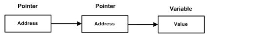

C语言教程(简单的学习c语言,第三篇)
##前言
这一篇主要是C指针的问题。C指针对于C语言的学习是一个特别重要的问题。
##任务
理解C指针。
##C指针
正如您所知道的，每一个变量都有一个内存位置，每一个内存位置都定义了可使用连字号（&）运算符访问的地址，它表示了在内存中的一个地址。请看下面的实例，它将输出定义的变量地址：
```groovy
#include <stdio.h>
 
int main ()
{
   int  var1;
   char var2[10];
 
   printf("var1 变量的地址： %p\n", &var1  );
   printf("var2 变量的地址： %p\n", &var2  );
 
   return 0;
}
```
当上面的代码被编译和执行时，它会产生下列结果：
> var1 变量的地址： 0x7fff5cc109d4
var2 变量的地址： 0x7fff5cc109de

上面的实例，我们了解了什么是内存地址以及如何访问它。
#####什么是指针？
指针是一个变量，其值为另一个变量的地址，即，内存位置的直接地址。就像其他变量或常量一样，您必须在使用指针存储其他变量地址之前，对其进行声明。指针变量声明的一般形式为：
> type *var-name;

在这里，**type** 是指针的基类型，它必须是一个有效的 C 数据类型，**var-name** 是指针变量的名称。用来声明指针的星号 * 与乘法中使用的星号是相同的。但是，在这个语句中，星号是用来指定一个变量是指针。以下是有效的指针声明：
```groovy
int    *ip;    /* 一个整型的指针 */
double *dp;    /* 一个 double 型的指针 */
float  *fp;    /* 一个浮点型的指针 */
char   *ch;     /* 一个字符型的指针 */
```
所有指针的值的实际数据类型，不管是整型、浮点型、字符型，还是其他的数据类型，都是一样的，都是一个代表内存地址的长的十六进制数。不同数据类型的指针之间唯一的不同是，指针所指向的变量或常量的数据类型不同。
#####如何使用指针？
使用指针时会频繁进行以下几个操作：定义一个指针变量、把变量地址赋值给指针、访问指针变量中可用地址的值。这些是通过使用一元运算符 * 来返回位于操作数所指定地址的变量的值。下面的实例涉及到了这些操作：
```groovy
#include <stdio.h>

int main ()
{
   int  var = 20;   /* 实际变量的声明 */
   int  *ip;        /* 指针变量的声明 */

   ip = &var;  /* 在指针变量中存储 var 的地址 */

   printf("Address of var variable: %x\n", &var  );

   /* 在指针变量中存储的地址 */
   printf("Address stored in ip variable: %x\n", ip );

   /* 使用指针访问值 */
   printf("Value of *ip variable: %d\n", *ip );

   return 0;
}
```
当上面的代码被编译和执行时，它会产生下列结果：
```groovy
Address of var variable: bffd8b3c
Address stored in ip variable: bffd8b3c
Value of *ip variable: 20
```
#####C中的NULL指针
在变量声明的时候，如果没有确切的地址可以赋值，为指针变量赋值一个NULL值是一个良好的编程习惯。赋为NULL值的指针被称为空指针。
NULL指针是一个定义在标准库中的值为零的常量。请看下面的程序：
```groovy
#include <stdio.h>

int main ()
{
   int  *ptr = NULL;

   printf("ptr 的值是 %x\n", ptr  );

   return 0;
}
```
当上面的代码被编译和执行时，它会产生下列结果：
> ptr 的值是 0

在大多数的操作系统上，程序不允许访问地址为 0 的内存，因为该内存是操作系统保留的。然而，内存地址 0 有特别重要的意义，它表明该指针不指向一个可访问的内存位置。但按照惯例，如果指针包含空值（零值），则假定它不指向任何东西。
如需检查一个空指针，您可以使用 if 语句，如下所示：
```groovy
if(ptr)     /* 如果 p 非空，则完成 */
if(!ptr)    /* 如果 p 为空，则完成 */
```
####C指针详解
#####**指针的算术运算**
C 指针是一个用数值表示的地址。因此，您可以对指针执行算术运算。可以对指针进行四种算术运算：++、--、+、-。
假设 **ptr** 是一个指向地址 1000 的整型指针，是一个 32 位的整数，让我们对该指针执行下列的算术运算：
> ptr++

在执行完上述的运算之后，ptr 将指向位置 1004，因为 ptr 每增加一次，它都将指向下一个整数位置，即当前位置往后移 4 个字节。这个运算会在不影响内存位置中实际值的情况下，移动指针到下一个内存位置。如果 ptr 指向一个地址为 1000 的字符，上面的运算会导致指针指向位置 1001，因为下一个字符位置是在 1001。
######递增一个指针
我们喜欢在程序中使用指针代替数组，因为变量指针可以递增，而数组不能递增，因为数组是一个常量指针。下面的程序递增变量指针，以便顺序访问数组中的每一个元素：
```groovy
#include <stdio.h>

const int MAX = 3;

int main ()
{
   int  var[] = {10, 100, 200};
   int  i, *ptr;

   /* 指针中的数组地址 */
   ptr = var;
   for ( i = 0; i < MAX; i++)
   {

      printf("存储地址：var[%d] = %x\n", i, ptr );
      printf("存储值：var[%d] = %d\n", i, *ptr );

      /* 移动到下一个位置 */
      ptr++;
   }
   return 0;
}
```
当上面的代码被编译和执行时，它会产生下列结果：
```groovy
存储地址：var[0] = bf882b30
存储值：var[0] = 10
存储地址：of var[1] = bf882b34
存储值： var[1] = 100
存储地址：of var[2] = bf882b38
存储值：var[2] = 200
```
上面的MAX也可以是4，不会报错存储地址会继续按照规律相加，但是存储值是0。
######递减一个指针
同样地，对指针进行递减运算，即把值减去其数据类型的字节数，效果和上面的递增是类似的。下面就不做演示了。
######指针的比较
指针可以用关系运算符进行比较，如 ==、< 和 >。如果 p1 和 p2 指向两个相关的变量，比如同一个数组中的不同元素，则可对 p1 和 p2 进行大小比较。
下面的程序修改了上面的实例，只要变量指针所指向的地址小于或等于数组的最后一个元素的地址 &var[MAX - 1]，则把变量指针进行递增：
```groovy
#include <stdio.h>

const int MAX = 3;

int main ()
{
   int  var[] = {10, 100, 200};
   int  i, *ptr;

   /* 指针中第一个元素的地址 */
   ptr = var;
   i = 0;
   while ( ptr <= &var[MAX - 1] )
   {

      printf("Address of var[%d] = %x\n", i, ptr );
      printf("Value of var[%d] = %d\n", i, *ptr );

      /* 指向上一个位置 */
      ptr++;
      i++;
   }
   return 0;
}
```
当上面的代码被编译和执行时，它会产生下列结果：
```groovy
Address of var[0] = bfdbcb20
Value of var[0] = 10
Address of var[1] = bfdbcb24
Value of var[1] = 100
Address of var[2] = bfdbcb28
Value of var[2] = 200
```
问题分析：
上面可以这么使用是因为`ptr=var`这行代码。因为这行代码就是证明指针的位置是从第一个开始的。那么说明`while ( ptr <= &var[MAX - 1] )`是可以使用的。
当上面的代码被编译和执行时，它会产生下列结果：
```groovy
Address of var[0] = bfdbcb20
Value of var[0] = 10
Address of var[1] = bfdbcb24
Value of var[1] = 100
Address of var[2] = bfdbcb28
Value of var[2] = 200
```
#####指针数组
就是说这是一个数组，这个数组的类型是指针。
在我们讲解指针数组的概念之前，先让我们来看一个实例，它用到了一个由 3 个整数组成的数组：
```groovy
#include <stdio.h>
 
const int MAX = 3;
 
int main ()
{
   int  var[] = {10, 100, 200};
   int i;
 
   for (i = 0; i < MAX; i++)
   {
      printf("Value of var[%d] = %d\n", i, var[i] );
   }
   return 0;
}
```
当上面的代码被编译和执行时，它会产生下列结果：
```groovy
Value of var[0] = 10
Value of var[1] = 100
Value of var[2] = 200
```
可能有一种情况，我们想要让数组存储指向 int 或 char 或其他数据类型的指针。下面是一个指向整数的指针数组的声明：
>int *ptr[MAX];

在这里，把 **ptr** 声明为一个数组，由 MAX 个整数指针组成。因此，ptr 中的每个元素，都是一个指向 int 值的指针。下面的实例用到了三个整数，它们将存储在一个指针数组中，如下所示：
```groovy
#include <stdio.h>

const int MAX = 3;

int main ()
{
   int  var[] = {10, 100, 200};
   int i, *ptr[MAX];

   for ( i = 0; i < MAX; i++)
   {
      ptr[i] = &var[i]; /* 赋值为整数的地址 */
   }
   for ( i = 0; i < MAX; i++)
   {
      printf("Value of var[%d] = %d\n", i, *ptr[i] );
   }
   return 0;
}
```
当上面的代码被编译和执行时，它会产生下列结果：
```groovy
Value of var[0] = 10
Value of var[1] = 100
Value of var[2] = 200
```
您也可以用一个指向字符的指针数组来存储一个字符串列表，如下：
```groovy
#include <stdio.h>

const int MAX = 4;

int main ()
{
   char *names[] = {
                   "Zara Ali",
                   "Hina Ali",
                   "Nuha Ali",
                   "Sara Ali",
   };
   int i = 0;

   for ( i = 0; i < MAX; i++)
   {
      printf("Value of names[%d] = %s\n", i, names[i] );
   }
   return 0;
}
```
当上面的代码被编译和执行时，它会产生下列结果：
```groovy
Value of names[0] = Zara Ali
Value of names[1] = Hina Ali
Value of names[2] = Nuha Ali
Value of names[3] = Sara Ali
```
>注意：与上面单独的指针的区别，
>初始化：单独的指针是int *ptr1；而指针数组是int *ptr[MAX]；
>赋值：
>```groovy
>//指针
>ptr1=var；
>//指针数组
> for ( i = 0; i < MAX; i++)
   {
      ptr[i] = &var[i]; /* 赋值为整数的地址 */
   }
   ```
   输出：
   ```groovy
   //指针
   for ( i = 0; i < MAX; i++)
   {
      printf("存储地址：var[%d] = %x\n", i, ptr );
      printf("存储值：var[%d] = %d\n", i, *ptr );
      /* 移动到下一个位置 */
      ptr++;
   }
   //指针数组,有种一个一个找到的感觉
    for ( i = 0; i < MAX; i++)
   {
      printf("Value of var[%d] = %d\n", i, *ptr[i] );
   }
   ```

 #####指向指针的指针
 指向指针的指针是一种多级间接寻址的形式，或者说是一个指针链。通常，一个指针包含一个变量的地址。当我们定义一个指向指针的指针时，第一个指针包含了第二个指针的地址，第二个指针指向包含实际值的位置。
 
 一个指向指针的指针变量必须如下声明，即在变量名前放置两个星号。例如，下面声明了一个指向 int 类型指针的指针：
 > int **var;

 当一个目标值被一个指针间接指向到另一个指针时，访问这个值需要使用两个星号运算符，如下面实例所示：
 ```groovy
 #include <stdio.h>

int main ()
{
   int  var;
   int  *ptr;
   int  **pptr;

   var = 3000;

   /* 获取 var 的地址 */
   ptr = &var;

   /* 使用运算符 & 获取 ptr 的地址 */
   pptr = &ptr;

   /* 使用 pptr 获取值 */
   printf("Value of var = %d\n", var );
   printf("Value available at *ptr = %d\n", *ptr );
   printf("Value available at **pptr = %d\n", **pptr);

   return 0;
}
 ```
 当上面的代码被编译和执行时，它会产生下列结果：
 ```groovy
Value of var = 3000
Value available at *ptr = 3000
Value available at **pptr = 3000
 ```
 > 问题解析：
 > ```groovy
 >  //让ptr获取var的值，用的下面的操作：
 >  ptr = &var;
 >  如果var是数组。则是
 >  ptr=var；
 >  //让pptr使用运算符获取ptr的值
 >   pptr = &ptr;
 >  ```
 >  注意：在获取地址的时候，前面的*没有什么事情。赋值还需要&来配合。变量前面加&来获取到地址的。

#####传递指针给函数
C 语言允许您传递指针给函数，只需要简单地声明函数参数为指针类型即可。
下面的实例中，我们传递一个无符号的 long 型指针给函数，并在函数内改变这个值：
```groovy
#include <stdio.h>
#include <time.h>
 
void getSeconds(unsigned long *par);

int main ()
{
   unsigned long sec;


   getSeconds( &sec );

   /* 输出实际值 */
   printf("Number of seconds: %ld\n", sec );

   return 0;
}

void getSeconds(unsigned long *par)
{
   /* 获取当前的秒数 */
   *par = time( NULL );
   return;
}
```
上面的代码被编译和执行时，它会产生下列结果：
> Number of seconds :1294450468

能接受指针作为参数的函数，也能接受数组作为参数，如下图所示：
```groovy
#include <stdio.h>
 
/* 函数声明 */
double getAverage(int *arr, int size);
 
int main ()
{
   /* 带有 5 个元素的整型数组  */
   int balance[5] = {1000, 2, 3, 17, 50};
   double avg;

   /* 传递一个指向数组的指针作为参数 */
   avg = getAverage( balance, 5 ) ;

   /* 输出返回值  */
   printf("Average value is: %f\n", avg );

   return 0;
}

double getAverage(int *arr, int size)
{
  int    i, sum = 0;
  double avg;

  for (i = 0; i < size; ++i)
  {
    sum += arr[i];
  }

  avg = (double)sum / size;

  return avg;
}
```
当上面的代码被编译和执行时，它会产生下列结果：
> Average value is: 214.40000
> 上面的结果显示就是函数可以接受指针，所以函数接受指针的位置传参的时候使用数组也是可以的。

#####从函数返回指针
在上一章中，我们已经了解了 C 语言中如何从函数返回数组，类似地，C 允许您从函数返回指针。为了做到这点，您必须声明一个返回指针的函数，如下所示：
```groovy
int * myFunction()
{
.
.
.
}
```
另外，C 不支持在函数外返回局部变量的地址，除非定义局部变量为 static 变量。
现在，让我们来看下面的函数，它会生成 10 个随机数，并使用表示指针的数组名（即第一个数组元素的地址）来返回它们，具体如下：
```groovy
#include <stdio.h>
#include <time.h>
#include <stdlib.h> 

/* 要生成和返回随机数的函数 */
int * getRandom( )
{
   static int  r[10];
   int i;

   /* 设置种子 */
   srand( (unsigned)time( NULL ) );
   for ( i = 0; i < 10; ++i)
   {
      r[i] = rand();
      printf("%d\n", r[i] );
   }

   return r;
}

/* 要调用上面定义函数的主函数 */
int main ()
{
   /* 一个指向整数的指针 */
   int *p;
   int i;

   p = getRandom();
   for ( i = 0; i < 10; i++ )
   {
       printf("*(p + [%d]) : %d\n", i, *(p + i) );
   }

   return 0;
}
```
当上面的代码被编译和执行时，它会产生下列结果：
```groovy
1523198053
1187214107
1108300978
430494959
1421301276
930971084
123250484
106932140
1604461820
149169022
*(p + [0]) : 1523198053
*(p + [1]) : 1187214107
*(p + [2]) : 1108300978
*(p + [3]) : 430494959
*(p + [4]) : 1421301276
*(p + [5]) : 930971084
*(p + [6]) : 123250484
*(p + [7]) : 106932140
*(p + [8]) : 1604461820
*(p + [9]) : 149169022
```
##函数指针
函数指针是指向函数的指针变量。
通常我们说的指针变量是指向一个整型变、字符型或数组等变量，而函数指针是指向函数。
函数指针可以像一般函数一样，用于调用函数、传递参数。
函数指针变量的声明：
> typedef int (*fun_ptr)(int,int); // 声明一个指向同样参数、返回值的函数指针变量

实战：
以下实例声明了函数指针变量 p，指向函数 max：
```groovy
#include <stdio.h>

int max(int x, int y)
{
    return x > y ? x : y;
}

int main(void)
{
    /* p 是函数指针 */
    int (* p)(int, int) = & max; // &可以省略
    int a, b, c, d;

    printf("请输入三个数字:");
    scanf("%d %d %d", & a, & b, & c);

    /* 与直接调用函数等价，d = max(max(a, b), c) */
    d = p(p(a, b), c); 

    printf("最大的数字是: %d\n", d);

    return 0;
}
```
编译执行，输出结果如下：
```groovy
请输入三个数字:1 2 3
最大的数字是: 3
```
> 问题分析：上面最重要的一句话就是
>  int (* p)(int, int) = & max; // &可以省略
>  这样一来你就可以使用p(int,int)来替代max(int,int)进行相关操作了。

#####回调函数
######函数指针作为某个函数的参数
函数指针变量可以作为某个函数的参数来使用的，回调函数就是一个通过函数指针调用的函数。
简单讲：回调函数是由别人的函数执行时调用你实现的函数。
> 以下是自知乎作者常溪玲的解说：
你到一个商店买东西，刚好你要的东西没有货，于是你在店员那里留下了你的电话，过了几天店里有货了，店员就打了你的电话，然后你接到电话后就到店里去取了货。在这个例子里，你的电话号码就叫回调函数，你把电话留给店员就叫登记回调函数，店里后来有货了叫做触发了回调关联的事件，店员给你打电话叫做调用回调函数，你到店里去取货叫做响应回调事件。

实例
实例中 populate_array 函数定义了三个参数，其中第三个参数是函数的指针，通过该函数来设置数组的值。
实例中我们定义了回调函数 getNextRandomValue，它返回一个随机值，它作为一个函数指针传递给 populate_array 函数。
populate_array 将调用 10 次回调函数，并将回调函数的返回值赋值给数组。
```groovy
#include <stdlib.h>
#include <stdio.h>

// 回调函数
void populate_array(int *array, size_t arraySize, int (*getNextValue)(void))
{
    for (size_t i=0; i<arraySize; i++)
        array[i] = getNextValue();
}

// 获取随机值
int getNextRandomValue(void)
{
    return rand();
}

int main(void)
{
    int myarray[10];
    populate_array(myarray, 10, getNextRandomValue);
    for(int i = 0; i < 10; i++) {
        printf("%d ", myarray[i]);
    }
    printf("\n");
    return 0;
}
```
编译执行，输出结果如下：
```groovy
16807 282475249 1622650073 984943658 1144108930 470211272 101027544 1457850878 1458777923 2007237709 
````