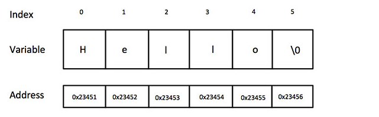

C语言教程(简单的学习c语言,第四篇)
##前言
这一篇是C语言中字符串的使用问题，结构体，共用体。
##任务
区分C中的字符串与java中的字符串，学习结构体和共用体。
##C中的字符串
**在 C 语言中，字符串实际上是使用 null 字符 '\0' 终止的一维字符数组。因此，一个以 null 结尾的字符串，包含了组成字符串的字符。**
下面的声明和初始化创建了一个 "Hello" 字符串。由于在数组的末尾存储了空字符，所以字符数组的大小比单词 "Hello" 的字符数多一个。
 > char greeting[6] = {'H', 'e', 'l', 'l', 'o', '\0'};

依据数组初始化规则，您可以把上面的语句写成以下语句：
> char greeting[] = "Hello";

以下是 C/C++ 中定义的字符串的内存表示：

其实，您不需要把 null 字符放在字符串常量的末尾。C 编译器会在初始化数组时，自动把 '\0' 放在字符串的末尾。让我们尝试输出上面的字符串：
```groovy
#include <stdio.h>

int main ()
{
   char greeting[6] = {'H', 'e', 'l', 'l', 'o', '\0'};

   printf("Greeting message: %s\n", greeting );

   return 0;
}
```
当上面的代码被编译和执行时，它会产生下列结果：
> Greeting message: Hello

C 中有大量操作字符串的函数：
序号	|函数 & 目的
-----|
1	| 	strcpy(s1, s2);<br>复制字符串 s2 到字符串 s1。
2	|	strcat(s1, s2);<br>连接字符串 s2 到字符串 s1 的末尾。<br>如果是strcat(s1,s1);这样是没有结果的。
3	|	strlen(s1);<br>返回字符串 s1 的长度。
4	|	strcmp(s1, s2);<br>如果 s1 和 s2 是相同的，则返回 0；如果 s1<s2 则返回小于 0；如果 s1>s2 则返回大于 0。
5	|	strchr(s1, ch);<br>返回一个指针，指向字符串 s1 中字符 ch 的第一次出现的位置。
6	|	strstr(s1, s2);<br>返回一个指针，指向字符串 s1 中字符串 s2 的第一次出现的位置。
##结构体
C 数组允许定义可存储相同类型数据项的变量，结构是 C 编程中另一种用户自定义的可用的数据类型，它允许您存储不同类型的数据项。
结构用于表示一条记录，假设您想要跟踪图书馆中书本的动态，您可能需要跟踪每本书的下列属性：
- Title
- Author
- Subject
- Book ID
> 分析：有一种构造函数的感觉。上面还是属性。

#####定义结构
为了定义结构，您必须使用 struct 语句。struct 语句定义了一个包含多个成员的新的数据类型，struct 语句的格式如下：
```groovy
struct [structure tag]
{
   member definition;
   member definition;
   ...
   member definition;
} [one or more structure variables];
```
**structure tag** 是可选的，每个 member definition 是标准的变量定义，比如 int i; 或者 float f; 或者其他有效的变量定义。在结构定义的末尾，最后一个分号之前，您可以指定一个或多个结构变量，这是可选的。下面是声明 Book 结构的方式：
```groovy
struct Books
{
   char  title[50];
   char  author[50];
   char  subject[100];
   int   book_id;
} book;
```
#####访问结构成员
为了访问结构的成员，我们使用成员访问运算符（.）。成员访问运算符是结构变量名称和我们要访问的结构成员之间的一个句号。您可以使用 struct 关键字来定义结构类型的变量。
下面的实例演示了结构的用法：
```groovy
#include <stdio.h>
#include <string.h>
 
struct Books
{
   char  title[50];
   char  author[50];
   char  subject[100];
   int   book_id;
};
 
int main( )
{
   struct Books Book1;        /* 声明 Book1，类型为 Books */
   struct Books Book2;        /* 声明 Book2，类型为 Books */
 
   /* Book1 详述 */
   strcpy( Book1.title, "C Programming");
   strcpy( Book1.author, "Nuha Ali"); 
   strcpy( Book1.subject, "C Programming Tutorial");
   Book1.book_id = 6495407;
 
   /* Book2 详述 */
   strcpy( Book2.title, "Telecom Billing");
   strcpy( Book2.author, "Zara Ali");
   strcpy( Book2.subject, "Telecom Billing Tutorial");
   Book2.book_id = 6495700;
 
   /* 输出 Book1 信息 */
   printf( "Book 1 title : %s\n", Book1.title);
   printf( "Book 1 author : %s\n", Book1.author);
   printf( "Book 1 subject : %s\n", Book1.subject);
   printf( "Book 1 book_id : %d\n", Book1.book_id);
 
   /* 输出 Book2 信息 */
   printf( "Book 2 title : %s\n", Book2.title);
   printf( "Book 2 author : %s\n", Book2.author);
   printf( "Book 2 subject : %s\n", Book2.subject);
   printf( "Book 2 book_id : %d\n", Book2.book_id);
 
   return 0;
}
```
当上面的代码被编译和执行时，它会产生下列结果：
```groovy
Book 1 title : C Programming
Book 1 author : Nuha Ali
Book 1 subject : C Programming Tutorial
Book 1 book_id : 6495407
Book 2 title : Telecom Billing
Book 2 author : Zara Ali
Book 2 subject : Telecom Billing Tutorial
Book 2 book_id : 6495700
```

> 问题分析：
> 结构体可以作为函数参数。如下：
>/* 函数声明 */
>void printBook( struct Books book );
>在运行上面的函数时就是直接就把对象放进去。
>
>在使用的时候还有要注意的一点：没有新建new...这么一说，上来就是声明，声明完成就可以使用。如下：
>```groovy
> /* 声明 Book1，类型为 Books */
> struct Books Book1;
>  /* Book1 详述,可以理解为赋值 */
   strcpy( Book1.title, "C Programming");
   strcpy( Book1.author, "Nuha Ali"); 
   strcpy( Book1.subject, "C Programming Tutorial");
   Book1.book_id = 6495407;
    /* 输出 Book1 信息 */
   printBook( Book1 );
> ```

#####指向结构的指针
您可以定义指向结构的指针，方式与定义指向其他类型变量的指针相似，如下所示：
> struct Books *struct_pointer;

现在，您可以在上述定义的指针变量中存储结构变量的地址。为了查找结构变量的地址，请把 & 运算符放在结构名称的前面，如下所示：
> struct_pointer = &Book1;

为了使用指向该结构的指针访问结构的成员，您必须使用 -> 运算符，如下所示：
> struct_pointer->title;
> 使用起来还是不一样的。

让我们使用结构指针来重写上面的实例，这将有助于您理解结构指针的概念：
```groovy
#include <stdio.h>
#include <string.h>
 
struct Books
{
   char  title[50];
   char  author[50];
   char  subject[100];
   int   book_id;
};
 
/* 函数声明 */
void printBook( struct Books *book );
int main( )
{
   struct Books Book1;        /* 声明 Book1，类型为 Books */
   struct Books Book2;        /* 声明 Book2，类型为 Books */
 
   /* Book1 详述 */
   strcpy( Book1.title, "C Programming");
   strcpy( Book1.author, "Nuha Ali"); 
   strcpy( Book1.subject, "C Programming Tutorial");
   Book1.book_id = 6495407;
 
   /* Book2 详述 */
   strcpy( Book2.title, "Telecom Billing");
   strcpy( Book2.author, "Zara Ali");
   strcpy( Book2.subject, "Telecom Billing Tutorial");
   Book2.book_id = 6495700;
 
   /* 通过传 Book1 的地址来输出 Book1 信息 */
   printBook( &Book1 );
 
   /* 通过传 Book2 的地址来输出 Book2 信息 */
   printBook( &Book2 );
 
   return 0;
}
void printBook( struct Books *book )
{
   printf( "Book title : %s\n", book->title);
   printf( "Book author : %s\n", book->author);
   printf( "Book subject : %s\n", book->subject);
   printf( "Book book_id : %d\n", book->book_id);
}
```
当上面的代码被编译和执行时，它会产生下列结果：
```groovy
Book title : C Programming
Book author : Nuha Ali
Book subject : C Programming Tutorial
Book book_id : 6495407
Book title : Telecom Billing
Book author : Zara Ali
Book subject : Telecom Billing Tutorial
Book book_id : 6495700
```
> 注意：
> 与上面的问题一块分析可以看到下列不同：
> ```groovy
> /* 函数声明 */
> //上面的
>void printBook( struct Books book );
> //此处的
> void printBook( struct Books *book );
> /*函数调用*/
> //上面的
> printBook( Book1 );
> //此处的，通过传 Book1 的地址来输出 Book1 信息
> printBook( &Book1 );
> /*函数方法里面的具体使用*/
> //上面的
> void printBook( struct Books book )
{
   printf( "Book title : %s\n", book.title);
   printf( "Book author : %s\n", book.author);
   printf( "Book subject : %s\n", book.subject);
   printf( "Book book_id : %d\n", book.book_id);
}
> //此处的
> void printBook( struct Books *book )
{
   printf( "Book title : %s\n", book->title);
   printf( "Book author : %s\n", book->author);
   printf( "Book subject : %s\n", book->subject);
   printf( "Book book_id : %d\n", book->book_id);
}
> ```

#####位域
有些信息在存储时，并不需要占用一个完整的字节，而只需占几个或一个二进制位。例如在存放一个开关量时，只有 0 和 1 两种状态，用 1 位二进位即可。为了节省存储空间，并使处理简便，C 语言又提供了一种数据结构，称为"位域"或"位段"。
所谓"位域"是把一个字节中的二进位划分为几个不同的区域，并说明每个区域的位数。每个域有一个域名，允许在程序中按域名进行操作。这样就可以把几个不同的对象用一个字节的二进制位域来表示。
典型的实例：
- 用 1 位二进位存放一个开关量时，只有 0 和 1 两种状态。
- 读取外部文件格式——可以读取非标准的文件格式。例如：9 位的整数。

######位域的定义和位域变量的说明
位域定义与结构定义相仿，其形式为：
```groovy
struct 位域结构名
{

 位域列表

};
```
其中位域列表的形式为：
> 类型说明符 位域名: 位域长度 

例如：
```groovy
struct bs{
    int a:8;
    int b:2;
    int c:6;
}data;
```
说明 data 为 bs 变量，共占两个字节。其中位域 a 占 8 位，位域 b 占 2 位，位域 c 占 6 位。
让我们再来看一个实例：
```groovy
struct packed_struct {
  unsigned int f1:1;
  unsigned int f2:1;
  unsigned int f3:1;
  unsigned int f4:1;
  unsigned int type:4;
  unsigned int my_int:9;
} pack;


在这里，packed_struct 包含了 6 个成员：四个 1 位的标识符 f1..f4、一个 4 位的 type 和一个 9 位的 my_int。
```
######对于位域的定义尚有以下几点说明：
- 一个位域必须存储在同一个字节中，不能跨两个字节。如一个字节所剩空间不够存放另一位域时，应从下一单元起存放该位域。也可以有意使某位域从下一单元开始。例如：
```groovy
struct bs{
    unsigned a:4;
    unsigned  :4;    /* 空域 */
    unsigned b:4;    /* 从下一单元开始存放 */
    unsigned c:4
}
在这个位域定义中，a 占第一字节的 4 位，后 4 位填 0 表示不使用，b 从第二字节开始，占用 4 位，c 占用 4 位。
```
- 由于位域不允许跨两个字节，因此位域的长度不能大于一个字节的长度，也就是说不能超过8位二进位。如果最大长度大于计算机的整数字长，一些编译器可能会允许域的内存重叠，另外一些编译器可能会把大于一个域的部分存储在下一个字中。
- 位域可以是无名位域，这时它只用来作填充或调整位置。无名的位域是不能使用的。例如：
```groovy
struct k{
    int a:1;
    int  :2;    /* 该 2 位不能使用 */
    int b:3;
    int c:2;
};
```
注意：从以上分析可以看出，位域在本质上就是一种结构类型，不过其成员是按二进位分配的。

#####位域的使用
位域的使用和结构成员的使用相同，其一般形式为：
> 位域变量名.位域名
位域变量名->位域名

位域允许用各种格式输出。
请看下面的实例：
```groovy
main(){
    struct bs{
        unsigned a:1;
        unsigned b:3;
        unsigned c:4;
    } bit,*pbit;
    bit.a=1;    /* 给位域赋值（应注意赋值不能超过该位域的允许范围） */
    bit.b=7;    /* 给位域赋值（应注意赋值不能超过该位域的允许范围） */
    bit.c=15;    /* 给位域赋值（应注意赋值不能超过该位域的允许范围） */
    printf("%d,%d,%d\n",bit.a,bit.b,bit.c);    /* 以整型量格式输出三个域的内容 */
    pbit=&bit;    /* 把位域变量 bit 的地址送给指针变量 pbit */
    pbit->a=0;    /* 用指针方式给位域 a 重新赋值，赋为 0 */
    pbit->b&=3;    /* 使用了复合的位运算符 "&="，相当于：pbit->b=pbit->b&3，位域 b 中原有值为 7，与 3 作按位与运算的结果为 3（111&011=011，十进制值为 3） */
    pbit->c|=1;    /* 使用了复合位运算符"|="，相当于：pbit->c=pbit->c|1，其结果为 15 */
    printf("%d,%d,%d\n",pbit->a,pbit->b,pbit->c);    /* 用指针方式输出了这三个域的值 */
}
```
上例程序中定义了位域结构 bs，三个位域为 a、b、c。说明了 bs 类型的变量 bit 和指向 bs 类型的指针变量 pbit。这表示位域也是可以使用指针的。
##共用体
共用体是一种特殊的数据类型，允许您在相同的内存位置存储不同的数据类型。您可以定义一个带有多成员的共用体，但是任何时候只能有一个成员带有值。共用体提供了一种使用相同的内存位置的有效方式。
#####定义共用体
为了定义共用体，您必须使用 union 语句，方式与定义结构类似。union 语句定义了一个新的数据类型，带有多个成员。
和结构体还是类似的。就是里面有不同的类型。。
union 语句的格式如下：
```groovy
union [union tag]
{
   member definition;
   member definition;
   ...
   member definition;
} [one or more union variables];
```
**union tag** 是可选的，每个 member definition 是标准的变量定义，比如 int i; 或者 float f; 或者其他有效的变量定义。在共用体定义的末尾，最后一个分号之前，您可以指定一个或多个共用体变量，这是可选的。
下面定义一个名为 Data 的共用体类型，有三个成员 i、f 和 str：
```groovy
union Data
{
   int i;
   float f;
   char  str[20];
} data;
```
现在，Data 类型的变量可以存储一个整数、一个浮点数，或者一个字符串。这意味着一个变量（相同的内存位置）可以存储多个多种类型的数据。您可以根据需要在一个共用体内使用任何内置的或者用户自定义的数据类型。
共用体占用的内存应足够存储共用体中最大的成员。
例如，在上面的实例中，Data 将占用 20 个字节的内存空间，因为在各个成员中，字符串所占用的空间是最大的。下面的实例将显示上面的共用体占用的总内存大小：
```groovy
#include <stdio.h>
#include <string.h>

union Data
{
   int i;
   float f;
   char  str[20];
};

int main( )
{
   union Data data;

   printf( "Memory size occupied by data : %d\n", sizeof(data));

   return 0;
}
```
当上面的代码被编译和执行时，它会产生下列结果：
> Memory size occupied by data : 20

#####访问共用体成员
为了访问共用体的成员，我们使用成员访问运算符（.）。成员访问运算符是共用体变量名称和我们要访问的共用体成员之间的一个句号。您可以使用 union 关键字来定义共用体类型的变量。下面的实例演示了共用体的用法：
```groovy
#include <stdio.h>
#include <string.h>
 
union Data
{
   int i;
   float f;
   char  str[20];
};
 
int main( )
{
   union Data data;
 
   data.i = 10;
   data.f = 220.5;
   strcpy( data.str, "C Programming");
 
   printf( "data.i : %d\n", data.i);
   printf( "data.f : %f\n", data.f);
   printf( "data.str : %s\n", data.str);
 
   return 0;
}
```
当上面的代码被编译和执行时，它会产生下列结果：
```groovy
data.i : 1917853763
data.f : 4122360580327794860452759994368.000000
data.str : C Programming
```
在这里，我们可以看到共用体的 i 和 f 成员的值有损坏，因为最后赋给变量的值占用了内存位置，这也是 str 成员能够完好输出的原因。现在让我们再来看一个相同的实例，这次我们在同一时间只使用一个变量，这也演示了使用共用体的主要目的：
```groovy
#include <stdio.h>
#include <string.h>

union Data
{
   int i;
   float f;
   char  str[20];
};

int main( )
{
   union Data data;

   data.i = 10;
   printf( "data.i : %d\n", data.i);

   data.f = 220.5;
   printf( "data.f : %f\n", data.f);

   strcpy( data.str, "C Programming");
   printf( "data.str : %s\n", data.str);

   return 0;
}
```
当上面的代码被编译和执行时，它会产生下列结果：
```groovy
data.i : 10
data.f : 220.500000
data.str : C Programming
```
在这里，所有的成员都能完好输出，因为同一时间只用到一个成员。
> 注意问题：在使用的时候，里面的值，只是对最后一个感兴趣。
> 也就是说只会完整的保留最后一个，前面的可能丢失数值。

##位域
`上面有了一个位域，这里又有一个，关键点就是节省空间`
如果程序的结构中包含多个开关量，只有 TRUE/FALSE 变量，如下：
```groovy
struct
{
  unsigned  int  widthValidated;
  unsigned  int  heightValidated;
} status
```
这种结构需要 8 字节的内存空间，但在实际上，在每个变量中，我们只存储 0 或 1。在这种情况下，C 语言提供了一种更好的利用内存空间的方式。如果您在结构内使用这样的变量，您可以定义变量的宽度来告诉编译器，您将只使用这些字节。
例如，上面的结构可以重写成：
```groovy
struct
{
  unsigned int widthValidated : 1;
  unsigned int heightValidated : 1;
} status;
```
现在，上面的结构中，status 变量将占用 4 个字节的内存空间，但是只有 2 位被用来存储值。如果您用了 32 个变量，每一个变量宽度为 1 位，那么 status 结构将使用 4 个字节，但只要您再多用一个变量，如果使用了 33 个变量，那么它将分配内存的下一段来存储第 33 个变量，这个时候就开始使用 8 个字节。让我们看看下面的实例来理解这个概念：
```groovy
#include <stdio.h>
#include <string.h>

/* 定义简单的结构 */
struct
{
  unsigned int widthValidated;
  unsigned int heightValidated;
} status1;

/* 定义位域结构 */
struct
{
  unsigned int widthValidated : 1;
  unsigned int heightValidated : 1;
} status2;
 
int main( )
{
   printf( "Memory size occupied by status1 : %d\n", sizeof(status1));
   printf( "Memory size occupied by status2 : %d\n", sizeof(status2));

   return 0;
}
```
当上面的代码被编译和执行时，它会产生下列结果：
```groovy
Memory size occupied by status1 : 8
Memory size occupied by status2 : 4
```
> 注意：上面定义位域结构，后面的1，就是说明只是用一个字节。所以上面的输出结果也证明他需要的空间比较小。

#####位域声明
在结构内声明位域的形式如下：
```groovy
struct
{
  type [member_name] : width ;
};
```
下面是有关位域中变量元素的描述：
元素	|	描述
----|
type	|	整数类型，决定了如何解释位域的值。类型可以是整型、有符号整型、无符号整型。
member_name	|	位域的名称。
width	|	位域中位的数量。宽度必须小于或等于指定类型的位宽度。
带有预定义宽的变量被称为**位域**。
位域可以存储多余1位的数，例如，需要一个变量来存储从0到7的值，您可以定义一个宽度为3位的位域，如下：
```groovy
struct
{
  unsigned int age : 3;
} Age;
```
上面的结构指示C编译器，age变量将只使用3位来存储这个值，如果您试图超过3位，则无法完成。让我们来看下面的实例：
```groovy
#include <stdio.h>
#include <string.h>

struct
{
  unsigned int age : 3;
} Age;

int main( )
{
   Age.age = 4;
   printf( "Sizeof( Age ) : %d\n", sizeof(Age) );
   printf( "Age.age : %d\n", Age.age );

   Age.age = 7;
   printf( "Age.age : %d\n", Age.age );

   Age.age = 8;
   printf( "Age.age : %d\n", Age.age );

   return 0;
}
```
当上面的代码被编译时，它会带有警告，当上面的代码被执行时，它会产生下列结果：
```groovy
Sizeof( Age ) : 4
Age.age : 4
Age.age : 7
Age.age : 0
```

##typedef
C语言提供了**typedef**关键字，您可以使用它来为类型取一个新的名字。下面的实例为单字节数字定义了一个术语**BYTE**：
> typedef unsigned char BYTE;

在这个类型定义之后，标识符BYTE可作为类型**unsigned char**的缩写，例如：
> BYTE b1,b2;

按照惯例，定义时会大写字母，以便提醒用户类型名称是一个象征性的缩写，但你也可以使用小写字母，如下：
> typedef unsigned char byte;

您也可以使用 typedef 来为用户自定义的数据类型取一个新的名字。
例如，您可以对结构体使用 typedef 来定义一个新的数据类型名字，然后使用这个新的数据类型来直接定义结构变量，如下：
```groovy
#include <stdio.h>
#include <string.h>
 
typedef struct Books
{
   char  title[50];
   char  author[50];
   char  subject[100];
   int   book_id;
} Book;
 
int main( )
{
   Book book;
 
   strcpy( book.title, "C 教程");
   strcpy( book.author, "Runoob"); 
   strcpy( book.subject, "编程语言");
   book.book_id = 12345;
 
   printf( "书标题 : %s\n", book.title);
   printf( "书作者 : %s\n", book.author);
   printf( "书类目 : %s\n", book.subject);
   printf( "书 ID : %d\n", book.book_id);
 
   return 0;
}
```
当上面的代码被编译和执行时，它会产生下列结果：
```groovy
书标题 : C 教程
书作者 : Runoob
书类目 : 编程语言
书 ID : 12345
```
#####typedef vs #define
\#define 是 C 指令，用于为各种数据类型定义别名，与 typedef 类似，但是它们有以下几点不同：
- typedef 仅限于为类型定义符号名称，#define 不仅可以为类型定义别名，也能为数值定义别名，比如您可以定义 1 为 ONE。
- typedef 是由编译器执行解释的，#define 语句是由预编译器进行处理的。

下面是 #define 的最简单的用法：
```groovy
#include <stdio.h>
 
#define TRUE  1
#define FALSE 0
 
int main( )
{
   printf( "TRUE 的值: %d\n", TRUE);
   printf( "FALSE 的值: %d\n", FALSE);

   return 0;
}
```
当上面的代码被编译和执行时，它会产生下列结果：
```groovy
TRUE 的值: 1
FALSE 的值: 0
```