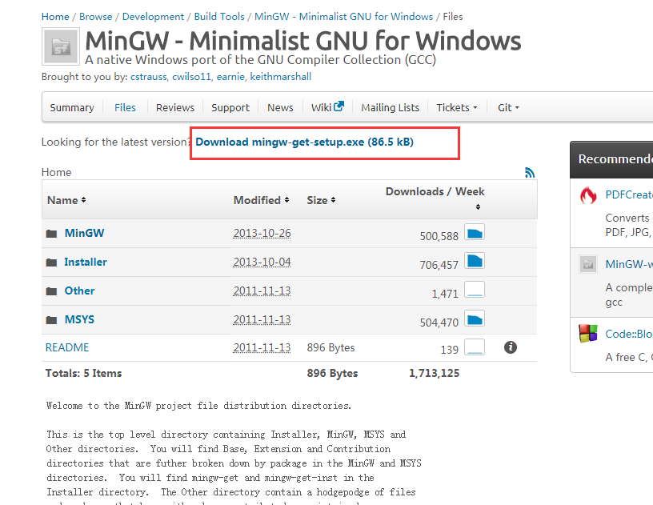
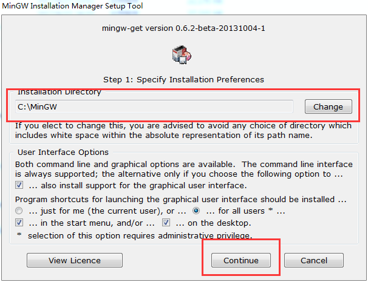
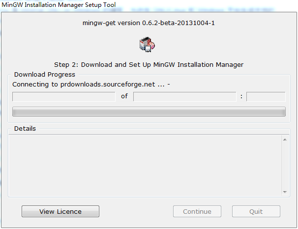
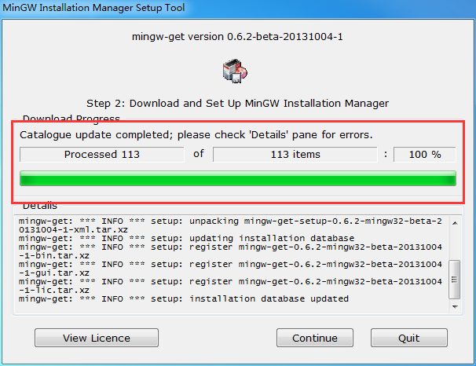
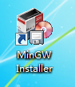
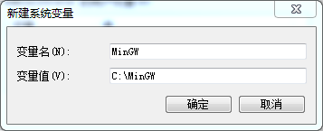
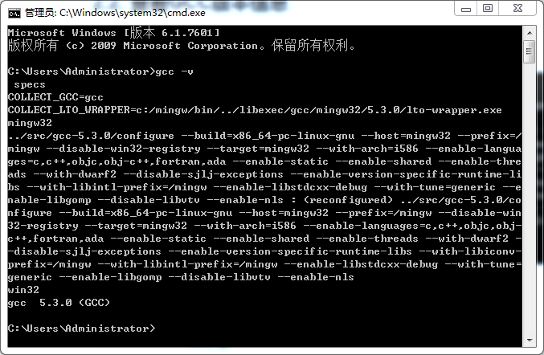
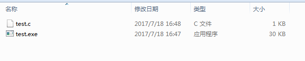
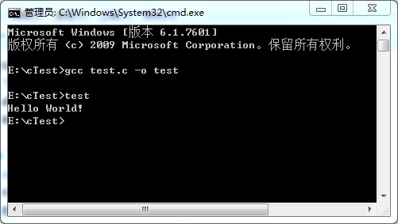

C语言环境的配置(Windows 环境下使用 GCC)
##前言
第一次配置环境做一个记录。
##任务
安装MinGw，并且配置环境变量。
##Windows 环境下使用 GCC
MinGw 是 Minimal GNU on Windows 的缩写，允许在 GNU/Linux 和 Windows 平台生成本地的 Windows 程序而不需要第三方运行时库。
本文主要介绍 MinGw 的安装和使用。

####安装
 1.下载 min-gw 安装程序，链接为：http://sourceforge.net/projects/mingw/files/ ，下载 Download mingw-get-setup.exe (84.5 kB)
如下图所示：

点击下载，会下载下来 Download mingw-get-setup.exe文件。

 2..运行 Download mingw-get-setup.exe  ,点击"运行"，continue等，注意记住安装的目录，如 C:\MinGw,下面修改环境变量时还会用到。
我们直接安装在c盘。如下图

点击Continue，会进入到下图。

这个页面会持续一段时间。
######注意：我在执行这个操作的时候不知道是什么原因，一直不成功，我就一直重复的试。所以遇到下载不完成的情况，就重复的安装Download mingw-get-setup.exe
最终终于出现如下的界面：

继续点击continue，你会发现桌面出现下面的图标。

这只是个安装器，需要在线下载真正的安装内容,下载一个安装器就累哭了，那么下载真正的安装内容呢？？？？想想都是泪啊！！
还是上吧！！！
 3.配置环境变量
鼠标右键“我的电脑”->“属性”，选择“高级”选项卡下的“环境变量”，在系统变量里点“新建”，之后填写MinGW的安装路径，如下：

之后找到Path，在最前面添加下面这段声明，之后点击确定。安装完成后，在MinGW\bin的目录下，会有一个名为gcc.exe的可执行文件。看到这个说明安装成功。
```groovy
%MinGW%\bin;
```
注意查看path路径的最后有没有“;”,win10不用管了，主要是win7和win8。
 4.安装GCC
在开始菜单中，点击"运行"，输入 cmd,打开命令行:输入 `mingw-get`,如果弹出 MinGw installation manager 窗口，说明安装正常。此时，关闭 MinGw installation manager 窗口，否则接下来的步骤会报错

在cmd中输入命令 `mingw-get install gcc`,等待一会，gcc 就安装成功了。
如果想安装 g\++ ,gdb,只要输入命令 `mingw-get install g++` 和 `mingw-get install gdb`
 5.验证是否安装成功
打开命令行，输入`gcc -v`查看编译器版本。如下图：


 ####MinGW使用
1.测试编译
我是在E盘新建一个test.c文件，代码如下：
```groovy
#include <stdio.h>

void main() {
        printf("Hello World!");
}
```
经典的`Hello World!`啊。
2.编译test,首先要切换到你的test.c所在的文件夹下，我的在E盘。
编译命令如下：
```groovy
gcc test.c -o test
```
输出结果是：test.exe.如下图：
	
3.执行
输入test回车，结果如下：

上面也可以这么操作：
在 cmd 中输入命令 gcc test.c 
在当前目录下会生成 a.exe 的可执行文件，在 cmd 中输入 a.exe （或者直接输入a）就可以执行程序了。

好了，配置完成了！！！！


