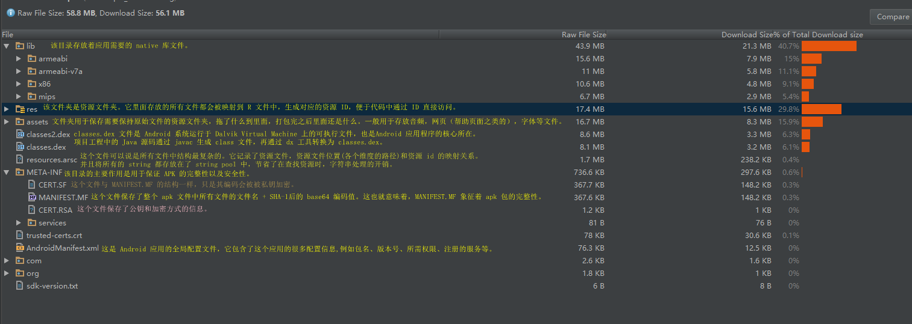
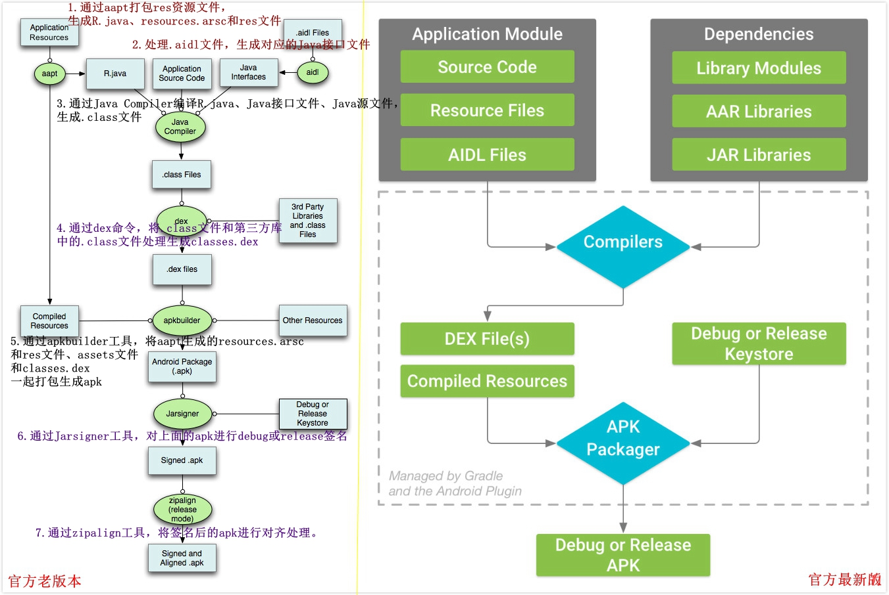

Android反编译工具的使用
##前言
处理反编译，首先先要了解apk文件的结构，然后是编译过程，最后是反编译。
反编译Apk的目的就是Apk拆成我们可以阅读的文件。通过反编译，我们一般想要得到里面的AndroidManifest.xml文件、res文件和java代码。
##任务
了解apk文件的结构，怎样编译，最后要会简单的反编译一些Apk.

##了解apk文件
首先来简单的说明下Apk文件本质上其实是一个zip包。直接拿解压工具解压就可以看到其中包含了什么。
为了方便看apk的目录，我们引入我们的第一个工具`Android Studio`,没错就是我们的官方编译工具。

Android Studio 自带的 **APK Analyzer** 可直接查看APK内的 图片，xml内容，dex结构，文件尺寸等，还可以比较两个apk的差异。
虽然不能导出资源有点可惜，但已经很强大方便了。
用法：将 apk 拖入 AndroidStudio 的窗口就好了。
参考：[安卓官方文档](https://developer.android.com/studio/build/apk-analyzer.html)

下面是自己拖入的一个APK：

上图很详细的说明了各个文件的作用。

##Android 打包流程（编译过程）
在了解了 apk 文件的结构后，我们开始分析 Android 的打包流程。

通常有2种打包方式：
- Android Studio图形界面 点击run按钮
- 命令行方式 gradlew assembleDebug, gradlew assembleRelease

方式1使用自动生成的debug keystore签名；方式2如果是Release包使用release keystore签名，如果是Debug包则使用debug keystore签名。

下面展示最基本的打包流程：

上图是Android官方提供的打包简略流程图。清晰地展示了一个Android Project经过编译和打包后生成apk文件，然后再经过签名，就可以安装到设备上。

下面我们分析一下详细流程，最好的还是看图：

我们先分析新版本：
典型 Android 应用模块的构建流程通常依循下列步骤：(下面是官方文档)

1. 编译器将您的源代码转换成 DEX（Dalvik Executable) 文件（其中包括运行在 Android 设备上的字节码），将所有其他内容转换成已编译资源。

2. APK 打包器将 DEX 文件和已编译资源合并成单个 APK。不过，必须先签署 APK，才能将应用安装并部署到 Android 设备上。
3. APK 打包器使用调试或发布密钥库签署您的 APK：

   a. 如果您构建的是调试版本的应用（即专用于测试和分析的应用），打包器会使用调试密钥库签署您的应用。Android Studio 自动使用调试密钥库配置新项目。

   b. 如果您构建的是打算向外发布的发布版本应用，打包器会使用发布密钥库签署您的应用。要创建发布密钥库，请阅读在 Android Studio 中签署您的应用。
4. 在生成最终 APK 之前，打包器会使用 zipalign 工具对应用进行优化，减少其在设备上运行时的内存占用。

构建流程结束时，您将获得可用来进行部署、测试的调试 APK，或者可用来发布给外部用户的发布 APK。

下面是分块的总结：：：
1. 资源
Android 打包流程的第一步，是处理资源文件。
在这个步骤中，起主要作用的是 aapt。
刚刚提及的 AndroidManifest.xml, res 文件夹，resource.arsc 文件的生成都与其有关，简单来说，aapt 解析项目代码中的 AndroidManifest.xml，收集项目中 res 文件夹的资源文件及 xml 文件，对其做压缩以及编译的处理。在此过程中，分配了资源 id 并生成了 R.java 文件 以及 arsc 文件。
2. 代码
上一步得到了 R.java 文件后，将其与项目代码一起编译得到 .class文件，然后打包为 jar 包。这个过程中，还会有混淆代码这一步骤。之后，再通过 dx 工具，将生成的 jar 包与第三方库的 jar 包一起编译为 dex 文件。这个过程中，如果是 5.0 以前的系统且超过了 65535 方法数的限制，需要人为的分 dex，5.0 以后则由 dx 工具包办。
到这一步，实际上 apk 所需要的主要内容已经大致齐全了。只需要把上面生成的 AndroidManifest.xml，classes.dex，res文件夹，resource.arsc 打包进 apk，并且将项目工程中的 assets 以及 lib 目录一并放入，就有了一个未经签名的 Android 安装包了。 
3. 签名
接下来还缺简单但是却关键的最后一步，那便是 apk 包的签名，这一步在之前对 META-INF 的介绍中，实际已有提及。只需要按步骤生成 MANIFEST.MF, CERT.RSA，CERT.SF 并放入META-INF 文件夹即可。

在网上找到一个更详细的流程图：[链接](http://mouxuejie.com/blog/2016-08-04/build-and-package-flow-introduction/)

##APK反编译工具
####1.利用ApkTool，获取AndroidManifest和res等资源文件
工具地址： https://ibotpeaches.github.io/Apktool/
进入官网有详细的使用过程：https://ibotpeaches.github.io/Apktool/install/
放入：运行`java -jar apktool.jar d no.apk`

####2.dex2jar反编译dex文件，得到java源代码

####3.jd-gui 可视化反编译查看 .jar 文件
官网：http://jd.benow.ca/
下载：http://jd.benow.ca/#jd-gui-download

####4.android-classyshark全自动的反编译工具
下载：https://github.com/google/android-classyshark/releases
使用：直接打开，拖拽apk进入就可以。