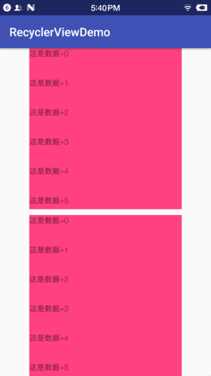

RecyclerView系列二：RecyclerView.ItemDecoration的详解使用
##前言
在很早很早以前（long long ago），ListView鼎盛的时代有一个属性叫做divider。但是在RecycleView上面就是找不到他，那怎么办呢？？？直到后来有一天发现他变身了，变成了ItemDecoration。实在是扯不下去了，直接开始吧！
这篇博客酝酿了好长时间，希望不会让各位看官失望。
##任务
了解ItemDecoration的原理，自己可以添加分割线，每个 ItemView 上叠加一个角标，自定义 RecyclerView 中的头部或者是粘性头部。

##分析和实战
####1.具体的使用
RecyclerView的简单使用可以参考前一篇[RecyclerView系列一：简单使用](https://www.jianshu.com/p/565daef18007)
我们在页面中放两个RecyclerView，上面一个下面一个，用来对比。如下图所示：

现在开始处理：写TextItemDecoration类让他继承RecyclerView.ItemDecoration，主要的代码如下所示：
```groovy
    class TextItemDecoration extends RecyclerView.ItemDecoration {

        //设置ItemView的内嵌偏移长度（inset）
        @Override
        public void getItemOffsets(Rect outRect, View view, RecyclerView parent, RecyclerView.State state) {
            super.getItemOffsets(outRect, view, parent, state);
        }

        // 在子视图上设置绘制范围，并绘制内容
        // 绘制图层在ItemView以下，所以如果绘制区域与ItemView区域相重叠，会被遮挡
        @Override
        public void onDraw(Canvas c, RecyclerView parent, RecyclerView.State state) {
            super.onDraw(c, parent, state);
        }

        //同样是绘制内容，但与onDraw（）的区别是：绘制在图层的最上层
        @Override
        public void onDrawOver(Canvas c, RecyclerView parent, RecyclerView.State state) {
            super.onDrawOver(c, parent, state);
        }
    }
```
####2.分析方法getItemOffsets
添加完依赖之后，就开始写代码了，与ListView用法类似，也是先在xml布局文件中创建一个RecyclerView的布局：

####3.创建完布局之后在MainActivity中获取这个RecyclerView，并声明LayoutManager与Adapter，代码如下：
```groovy
        mRecyclerView = findViewById(R.id.recycler_view);
        //创建默认的线性LayoutManager
        LinearLayoutManager linearLayoutManager = new LinearLayoutManager(this);
        linearLayoutManager.setOrientation(LinearLayoutManager.VERTICAL);
        mRecyclerView.setLayoutManager(linearLayoutManager);
        //创建并设置Adapter
        mRecyclerView.setAdapter(new MyAdapter(myDatas));
```
####3.Adapter的创建问题，是要继承RecyclerView.Adapter这个类的。代码如下：
```groovy

    public class MyAdapter extends RecyclerView.Adapter {
        public String[] datas = null;

        public MyAdapter(String[] datas) {
            this.datas = datas;
        }

        @Override
        public RecyclerView.ViewHolder onCreateViewHolder(ViewGroup parent, int viewType) {
            View view = LayoutInflater.from(parent.getContext()).inflate(R.layout.item_recycler, parent, false);
            ViewHolder vh = new ViewHolder(view);
            return vh;
        }

        @Override
        public void onBindViewHolder(RecyclerView.ViewHolder holder, int position) {
            if (holder instanceof ViewHolder) {
                ((ViewHolder) holder).mTextView.setText(datas[position]);
            }
        }

        @Override
        public int getItemCount() {
            return datas.length;
        }


        //自定义的ViewHolder，持有每个Item的的所有界面元素
        class ViewHolder extends RecyclerView.ViewHolder {
            public TextView mTextView;

            public ViewHolder(View view) {
                super(view);
                mTextView = view.findViewById(R.id.tv_recycler);
            }
        }

    }
```
主要的就是3个方法：
**a) onCreateViewHolder()**
这个方法主要生成为每个Item inflater出一个View，但是该方法返回的是一个ViewHolder。该方法把View直接封装在ViewHolder中，然后我们面向的是ViewHolder这个实例，当然这个ViewHolder需要我们自己去编写。直接省去了当初的convertView.setTag(holder)和convertView.getTag()这些繁琐的步骤。

**b) onBindViewHolder()**
这个方法主要用于适配渲染数据到View中。方法提供给你了一viewHolder而不是原来的convertView。

**c) getItemCount()**
这个方法就类似于BaseAdapter的getCount方法了，即总共有多少个条目。
####4.运行
写完这些代码这个例子既可以跑起来了
##总结
本节介绍的是一个最最简单的RecyclerView的使用方法，后面将介绍一些更高级的用法。小伙伴们都会用了吧！