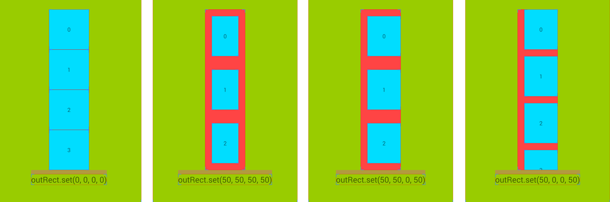
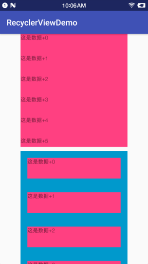
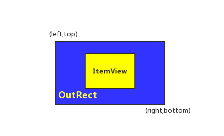
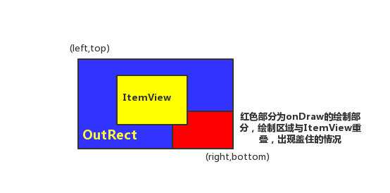
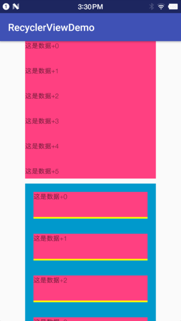
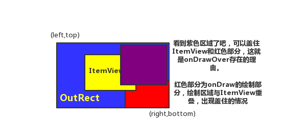
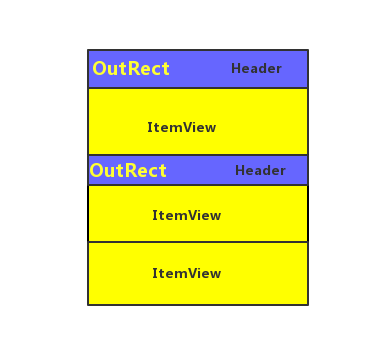
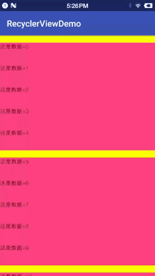
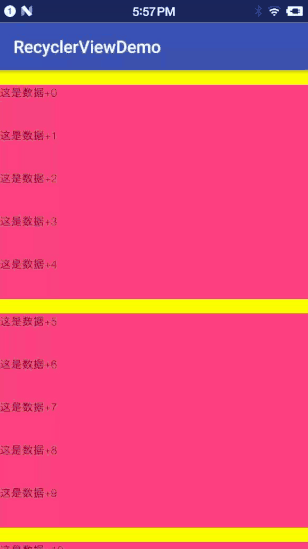

RecyclerView系列二：RecyclerView.ItemDecoration的详解使用
##前言
在很早很早以前（long long ago），ListView鼎盛的时代有一个属性叫做divider。但是在RecycleView上面就是找不到他，那怎么办呢？？？直到后来有一天发现他变身了，变成了ItemDecoration。实在是扯不下去了，直接开始吧！
这篇博客酝酿了好长时间，希望不会让各位看官失望。
##任务
了解ItemDecoration的原理，自己可以添加分割线，每个 ItemView 上叠加一个角标，自定义 RecyclerView 中的头部或者是粘性头部。

##分析和实战
####1.具体的使用
RecyclerView的简单使用可以参考前一篇[RecyclerView系列一：简单使用](https://www.jianshu.com/p/565daef18007)
我们在页面中放两个RecyclerView，上面一个下面一个，用来对比。如下图所示：

现在开始处理：写TextItemDecoration类让他继承RecyclerView.ItemDecoration，主要的代码如下所示：
```groovy
    class TextItemDecoration extends RecyclerView.ItemDecoration {

        //设置ItemView的内嵌偏移长度（inset）
        @Override
        public void getItemOffsets(Rect outRect, View view, RecyclerView parent, RecyclerView.State state) {
            super.getItemOffsets(outRect, view, parent, state);
        }

        // 在子视图上设置绘制范围，并绘制内容
        // 绘制图层在ItemView以下，所以如果绘制区域与ItemView区域相重叠，会被遮挡
        @Override
        public void onDraw(Canvas c, RecyclerView parent, RecyclerView.State state) {
            super.onDraw(c, parent, state);
        }

        //同样是绘制内容，但与onDraw（）的区别是：绘制在图层的最上层
        @Override
        public void onDrawOver(Canvas c, RecyclerView parent, RecyclerView.State state) {
            super.onDrawOver(c, parent, state);
        }
    }
```
####2.分析方法getItemOffsets()
分析这里的时候，我们先来盗个图，如下：

我们所有的分析这个图就可以概括了。现在我们开始分析这个方法，在Android Studio中看`super.getItemOffsets(outRect, view, parent, state);`这个方法，最终我们在`RecyclerView`看到`outRect.set(0, 0, 0, 0);`这一行代码。
那么我们就拿`outRect`开刀。`TextItemDecoration`中代码如下：
```java
        //设置ItemView的内嵌偏移长度（inset）
        @Override
        public void getItemOffsets(Rect outRect, View view, RecyclerView parent, RecyclerView.State state) {
            super.getItemOffsets(outRect, view, parent, state);
            //只是添加下面这一行代码
            outRect.set(50, 50, 50, 50);
        }

```
把这个·ItemDecoration·放在下面的`RecyclerView`上面，代码如下：
```java
 recyclerView2.addItemDecoration(new TextItemDecoration());
```
运行效果，如下图所示：

再来一张单独的图片，如下所示：

- 如上图所示，RecyclerView 中的 ItemView 外面会包裹着一个矩形（outRect）。
- 内嵌偏移长度：该矩形（outRect）与 ItemView的间隔.
- 默认的情况下，top、left、right、bottom都是0，所以矩形和ItemView就重叠了。

#####2.1源码分析（直接上源码）：
>下面的代码都是在RecyclerView中，可以在RecyclerView里面找到源码：

```java
	//测量所有的子view的宽和高，得到这个子view的Rect。然后就能得到这一块真正的宽和高。
	//注意还有padding的值。
    public void measureChild(View child, int widthUsed, int heightUsed) {
        final LayoutParams lp = (LayoutParams) child.getLayoutParams(); 
        final Rect insets = mRecyclerView.getItemDecorInsetsForChild(child);
        widthUsed += insets.left + insets.right;
        heightUsed += insets.top + insets.bottom;
        final int widthSpec = getChildMeasureSpec(getWidth(), getWidthMode(),
                getPaddingLeft() + getPaddingRight() + widthUsed, lp.width,
                canScrollHorizontally());
        final int heightSpec = getChildMeasureSpec(getHeight(), getHeightMode(),
                getPaddingTop() + getPaddingBottom() + heightUsed, lp.height,
                canScrollVertically());
        if (shouldMeasureChild(child, widthSpec, heightSpec, lp)) {
            child.measure(widthSpec, heightSpec);
        }
    }

    //得到每个子view相应的Rect，
    //mItemDecorations.get(i).getItemOffsets(mTempRect, child, this, mState);
    //上面的代码就是设置相应的四个值，就和我们的TextItemDecoration类里面的代码对应起来了。
    Rect getItemDecorInsetsForChild(View child) {
        final LayoutParams lp = (LayoutParams) child.getLayoutParams();
        if (!lp.mInsetsDirty) {
            return lp.mDecorInsets;
        }

        if (mState.isPreLayout() && (lp.isItemChanged() || lp.isViewInvalid())) {
            // changed/invalid items should not be updated until they are rebound.
            return lp.mDecorInsets;
        }
        final Rect insets = lp.mDecorInsets;
        insets.set(0, 0, 0, 0);
        final int decorCount = mItemDecorations.size();
        for (int i = 0; i < decorCount; i++) {
            mTempRect.set(0, 0, 0, 0);
            mItemDecorations.get(i).getItemOffsets(mTempRect, child, this, mState);
            //下面就是详细的赋值
            insets.left += mTempRect.left;
            insets.top += mTempRect.top;
            insets.right += mTempRect.right;
            insets.bottom += mTempRect.bottom;
        }
        lp.mInsetsDirty = false;
        return insets;
    }


```


####3.onDraw()
我们先来看看我们自定义的TextItemDecoration类里面的onDraw()代码，如下所示：
```groovy
        @Override
        public void onDraw(Canvas c, RecyclerView parent, RecyclerView.State state) {
            super.onDraw(c, parent, state);
        }
```
很明显上面传递了一个Canvas 参数对象，所以它拥有了绘制的能力。
>注意： 1.getItemOffsets 是针对每一个 ItemView，而 onDraw 方法却是针对 RecyclerView 本身，所以在 onDraw 方法中需要遍历屏幕上可见的 ItemView，分别获取它们的位置信息，然后分别的绘制对应的分割线。
>2.Itemdecoration的onDraw()绘制会先于ItemView的onDraw()绘制，

第二点会出现如下的情况：

出现上面的问题解决方案是getItemOffsets（）与onDraw()一块使用。说的我一愣一愣的，最主要的问题onDrow()的时候，是怎样得到相应的点。

英雄莫怕，请看上面的代码`onDraw(Canvas c, RecyclerView parent, RecyclerView.State state)`：
```java
看第二个参数：RecyclerView parent 这就是我们的突破点。（这里有一个疑问点？？？我们第4节处理。）
  int childCount = parent.getChildCount();
  View child = parent.getChildAt(i);
  上面的代码就能解决我们的问题。
```
上代码实战：要实现的效果如下：

代码实现如下：
```java
    class TextItemDecoration extends RecyclerView.ItemDecoration {
        private Paint mPaint;

        public TextItemDecoration() {
            this.mPaint = new Paint();
            mPaint.setColor(Color.YELLOW);
            // 画笔颜色设置为黄色
        }

        //设置ItemView的内嵌偏移长度（inset）
        @Override
        public void getItemOffsets(Rect outRect, View view, RecyclerView parent, RecyclerView.State state) {
            super.getItemOffsets(outRect, view, parent, state);
            outRect.set(50, 50, 50, 50);
        }

        // 在子视图上设置绘制范围，并绘制内容
        // 绘制图层在ItemView以下，所以如果绘制区域与ItemView区域相重叠，会被遮挡
        @Override
        public void onDraw(Canvas c, RecyclerView parent, RecyclerView.State state) {
            super.onDraw(c, parent, state);
            // 获取RecyclerView的Child view的个数
            int childCount = parent.getChildCount();
            // 遍历每个Item，分别获取它们的位置信息，然后再绘制对应的分割线
            for (int i = 0; i < childCount; i++) {
                // 获取每个Item的位置
                final View child = parent.getChildAt(i);
                // 设置矩形(分割线)的宽度为10px
                final int mDivider = 10;
                // 矩形左上顶点 = (ItemView的左边界,ItemView的下边界)
                final int left = child.getLeft();
                final int top = child.getBottom();
                // 矩形右下顶点 = (ItemView的右边界,矩形的下边界)
                final int right = child.getRight();
                final int bottom = top + mDivider;
                // 通过Canvas绘制矩形（分割线）
                c.drawRect(left, top, right, bottom, mPaint);
            }
        }


        //同样是绘制内容，但与onDraw（）的区别是：绘制在图层的最上层
        @Override
        public void onDrawOver(Canvas c, RecyclerView parent, RecyclerView.State state) {
            super.onDrawOver(c, parent, state);
        }
    }

```


####3.onDrawOver()
我们先来看看我们自定义的TextItemDecoration类里面的onDrawOver()代码，如下所示：
```groovy
        @Override
        public void onDrawOver(Canvas c, RecyclerView parent, RecyclerView.State state) {
            super.onDrawOver(c, parent, state);
        }
```
很明显onDrawOver里面的参数和onDraw里面的参数一模一样，那还要onDrawOver有什么用呢？？？。请看下图：

最主要的就是紫色区域，onDrawOver的使用方法和onDraw类似。现在我们在每一个条目的右上角加一个图标。效果如下：

代码实现如下：
```groovy
    class TextItemDecoration extends RecyclerView.ItemDecoration {
        private Paint mPaint;
        private Bitmap bitmap;

        public TextItemDecoration() {
            this.mPaint = new Paint();
            mPaint.setColor(Color.YELLOW);
            // 画笔颜色设置为黄色
            bitmap = BitmapFactory.decodeResource(getResources(), R.mipmap.email);
        }

        //设置ItemView的内嵌偏移长度（inset）
        @Override
        public void getItemOffsets(Rect outRect, View view, RecyclerView parent, RecyclerView.State state) {
            super.getItemOffsets(outRect, view, parent, state);
            outRect.set(50, 50, 50, 50);
        }

        // 在子视图上设置绘制范围，并绘制内容
        // 绘制图层在ItemView以下，所以如果绘制区域与ItemView区域相重叠，会被遮挡
        @Override
        public void onDraw(Canvas c, RecyclerView parent, RecyclerView.State state) {
            super.onDraw(c, parent, state);
            // 获取RecyclerView的Child view的个数
            int childCount = parent.getChildCount();
            // 遍历每个Item，分别获取它们的位置信息，然后再绘制对应的分割线
            for (int i = 0; i < childCount; i++) {
                // 获取每个Item的位置
                final View child = parent.getChildAt(i);
                // 设置矩形(分割线)的宽度为10px
                final int mDivider = 10;
                // 矩形左上顶点 = (ItemView的左边界,ItemView的下边界)
                final int left = child.getLeft();
                final int top = child.getBottom();
                // 矩形右下顶点 = (ItemView的右边界,矩形的下边界)
                final int right = child.getRight();
                final int bottom = top + mDivider;
                // 通过Canvas绘制矩形（分割线）
                c.drawRect(left, top, right, bottom, mPaint);
            }
        }


        //同样是绘制内容，但与onDraw（）的区别是：绘制在图层的最上层
        @Override
        public void onDrawOver(Canvas c, RecyclerView parent, RecyclerView.State state) {
            super.onDrawOver(c, parent, state);
            int childCount = parent.getChildCount();
            for (int i = 0; i < childCount; i++) {
                View child = parent.getChildAt(i);
                final int left = child.getRight() - bitmap.getWidth();
                final int top = child.getTop();
                c.drawBitmap(bitmap, left, top, mPaint);
            }
        }
    }
```
####4.自定义 RecyclerView 中的头部或者是粘性头部
具体的思路如下图所示：

我们的操作在OutRect里面处理。下面我们用假数据处理，页面中只保留一个RecyclerView。我们只分析`TextItemDecoration`里面的代码。代码如下：
```java
    class TextItemDecoration extends RecyclerView.ItemDecoration {
        private Paint mPaint;

        public TextItemDecoration() {
            this.mPaint = new Paint();
            // 画笔颜色设置为黄色
            mPaint.setColor(Color.YELLOW);
        }

        //设置ItemView的内嵌偏移长度（inset）
        @Override
        public void getItemOffsets(Rect outRect, View view, RecyclerView parent, RecyclerView.State state) {
            super.getItemOffsets(outRect, view, parent, state);
            int position = parent.getChildAdapterPosition(view);
            if (position % 5 == 0) {
                outRect.set(0, 50, 0, 0);
            }
        }

        // 在子视图上设置绘制范围，并绘制内容
        // 绘制图层在ItemView以下，所以如果绘制区域与ItemView区域相重叠，会被遮挡
        @Override
        public void onDraw(Canvas c, RecyclerView parent, RecyclerView.State state) {
            super.onDraw(c, parent, state);
            // 获取RecyclerView的Child view的个数
            int childCount = parent.getChildCount();
            // 遍历每个Item，分别获取它们的位置信息，然后再绘制对应的分割线
            for (int i = 0; i < childCount; i++) {
                if (i % 5 == 0) {
                    View child = parent.getChildAt(i);
                    int left = 0;
                    int top = child.getTop() - 50;
                    int right = child.getRight();
                    int bottom = child.getTop();
                    c.drawRect(left, top, right, bottom, mPaint);
                }
            }
        }


        //同样是绘制内容，但与onDraw（）的区别是：绘制在图层的最上层
        @Override
        public void onDrawOver(Canvas c, RecyclerView parent, RecyclerView.State state) {
            super.onDrawOver(c, parent, state);
        }
    }
```
效果图如下：

黄条才是我要的真爱，这怎么乱套了？？问题就出在如下的代码里面
```java
        @Override
        public void onDraw(Canvas c, RecyclerView parent, RecyclerView.State state) {
            super.onDraw(c, parent, state);
            // 获取RecyclerView的Child view的个数
            int childCount = parent.getChildCount();
            // 遍历每个Item，分别获取它们的位置信息，然后再绘制对应的分割线
            for (int i = 0; i < childCount; i++) {
                if (i % 5 == 0) {
                    View child = parent.getChildAt(i);
                    int left = 0;
                    int top = child.getTop() - 50;
                    int right = child.getRight();
                    int bottom = child.getTop();
                    c.drawRect(left, top, right, bottom, mPaint);
                }
            }
        }

```
>上面就是有问题的代码：
int childCount = parent.getChildCount();
得到的是这一屏幕有多少个孩子。不是说得到的总的孩子的数目。


我们修改一下onDraw里面的代码，如下：
```java
        @Override
        public void onDraw(Canvas c, RecyclerView parent, RecyclerView.State state) {
            super.onDraw(c, parent, state);
            // 获取RecyclerView的Child view的个数
            int childCount = parent.getChildCount();
            // 遍历每个Item，分别获取它们的位置信息，然后再绘制对应的分割线
            for (int i = 0; i < childCount; i++) {
                View child = parent.getChildAt(i);
                int index = parent.getChildAdapterPosition(child);
                if (index % 5 == 0) {
                    int left = 0;
                    int top = child.getTop() - 50;
                    int right = child.getRight();
                    int bottom = child.getTop();
                    c.drawRect(left, top, right, bottom, mPaint);
                }
            }
        }
```
效果图如下：

这距离我们想要的效果越来跃进了。能不能在黄条在最上面的时候停留呢？？还有就是推上去？？不出所料所有的操作都是在这里面了。
下面我们直接上代码，思考留给我亲爱的读者：
```java
        @Override
        public void onDrawOver(Canvas c, RecyclerView parent, RecyclerView.State state) {
            super.onDrawOver(c, parent, state);

            // 获取RecyclerView的Child view的个数
            int childCount = parent.getChildCount();
            // 遍历每个Item，分别获取它们的位置信息，然后再绘制对应的分割线
            for (int i = 0; i < childCount; i++) {
                View child = parent.getChildAt(i);
                int index = parent.getChildAdapterPosition(child);
                if (index % 5 == 0) {
                    int item = (index) / 5;
                    if (i < 5) {
                        if (i == 1 && child.getTop() < 100) {
                            int left = 0;
                            int top = child.getTop() - 100;
                            int right = child.getRight();
                            int bottom = child.getTop() - 50;
                            c.drawRect(left, top, right, bottom, mPaint);
                            c.drawText("这是条目" + item + "视图i是+" + i + "顶部的高低" + child.getTop() + "index++" + index, left, top + 50, textPaint);
                        } else {
                            int left = 0;
                            int top = 0;
                            int right = child.getRight();
                            int bottom = 50;
                            c.drawRect(left, top, right, bottom, mPaint);
                            if (i == 0) {
                                c.drawText("这是条目" + (item + 1) + "视图i是+" + i + "顶部的高低" + child.getTop() + "index++" + index, left, top + 50, textPaint);
                            } else {
                                c.drawText("这是条目" + (item) + "视图i是+" + i + "顶部的高低" + child.getTop() + "index++" + index, left, top + 50, textPaint);
                            }
                        }

                    }
                    if (i != 0) {
                        int left = 0;
                        int top = child.getTop() - 50;
                        int right = child.getRight();
                        int bottom = child.getTop();
                        c.drawRect(left, top, right, bottom, mPaint);
                        c.drawText("这是条目" + item + "视图i是+" + i + "顶部的高低" + child.getTop() + "index++" + index, left, top + 50, textPaint);
                    }
                }
            }
        }

```
我们的效果图如下：

我把要打印的都给小伙伴们打印出来了。具体的优化看自己的需求优化就可以了。
##总结
本篇文章介绍了RecyclerView.ItemDecoration的使用，还有它的原理。其实还是挺简单的。我相信简单的自定义小伙伴应该都会了。