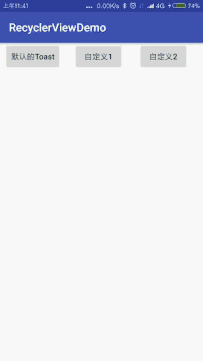

小米手机Toast自带应用名
##前言
目前使用的是小米6。在使用手机的时候，发现有的应用Toast时候带有应用名，有的应用没有应用名。反而我认为带有应用名是一个很好的事情，但是测试说了不行。
##任务
在小米6手机弹出Toast的时候去除应用名。

##分析问题和实战
####1.Toast的具体的使用
Toast的具体使用可以参考[android toast几种使用方法](http://www.cnblogs.com/draem0507/archive/2013/06/08/3126652.html)这篇文章。
看完上面的文章我认为你应该知道怎么解决了。你也可以继续向下看。
####2.Toast的默认使用和修改
#####2.1 Toast的默认使用方式：直接上代码：
```java
 Toast.makeText(this, "默认的Toast", Toast.LENGTH_SHORT).show();
```
没毛病老铁，就是一行代码。如果你是这写的代码：恭喜你，你的Toast前面会有应用名。
#####2.2 Toast的自定义1：我们简单的放一个TextView，直接上代码：
```java
	    Toast toast = new Toast(this);
        TextView textView = new TextView(this);
        textView.setText("自定义1");
        toast.setView(textView);
        toast.show();
```
你会发现和原生的不太一样，你也可以给TextView设置背景色，但是就怕手机定制的问题。
#####2.3 Toast的自定义2：我喜欢这种方式，直接上代码：
```java
        View view = Toast.makeText(this, "", Toast.LENGTH_SHORT).getView();
        Toast sToast = new Toast(this);
        sToast.setView(view);
        sToast.setText("自定义2");
        sToast.setDuration(Toast.LENGTH_SHORT);
        sToast.show();
```
你会发现和原生的一毛一样，我是这么认为的。
上面的代码你是可以放在Utils类里面的：如下：(只是一个例子)
```java
	//传入要显示的内容和显示时间，getContext()是Utils类里面定义的方法，就是你要使用的上下文环境
    public static void updateToast(String res, int duration) {
        if (sToast == null) {
            View v = Toast.makeText(getContext(), "", Toast.LENGTH_SHORT).getView();
            sToast = new Toast(getContext());
            sToast.setView(v);
        }
        sToast.setText(res);
        sToast.setDuration(duration);
        sToast.show();
    }
```
具体的效果图，如下所示：

这就是相应的效果图。
